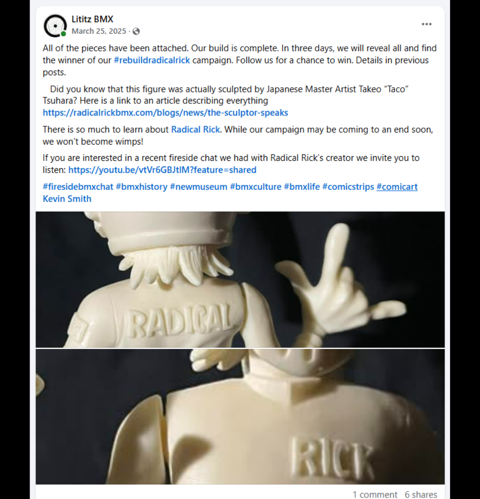
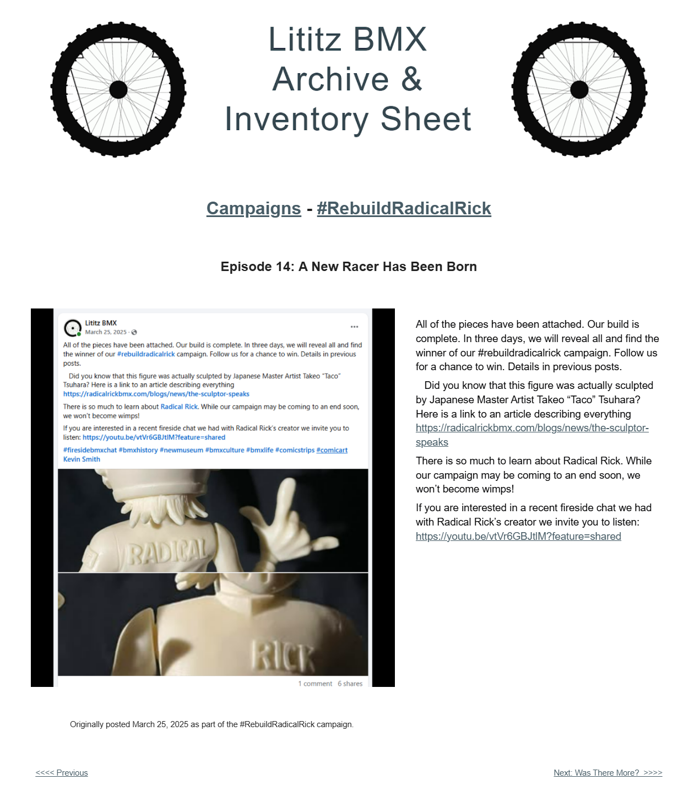

# Episode 14: A New Racer Has Been Born

[← Episode 13](episode-13-more-than-the-character.md) | [Episode index](README.md) | [Episode 15 →](episode-15-the-lost-episode.md)

## Episode Identification

**Campaign:** #RebuildRadicalRick  
**Official episode number:** 14  
**Official title:** A New Racer Has Been Born  
**Publication date:** March 25, 2025  
**Chronological position:** 15  
**Record status:** Verified  
**Original platform:** Facebook  
**Produced by:** Lititz BMX  
**Archive display version:** 1.1

---

## Resource Structure

1. Preserved original social-media post image
2. Original published campaign text
3. Normalized episode summary and archival context
4. Full public archive-page capture
5. Source documentation and verification notes

---

## Public Archive Page

[View Episode 14 in the Lititz BMX Archive](https://sites.google.com/view/lititzbmxinventorylist/campaigns/rebuild-radical-rick-campaigns/episode-14-rebuild-radical-rick-campaigns)

**Original social-media post:** Not yet recovered as a stable direct-post permalink

---

## Episode Summary

Episode 14 announced that every component had been attached and that the reconstruction of the 40th Anniversary Radical Rick figure was complete.

The accompanying images presented close views of the completed figure, including the “RADICAL” lettering across its back, the “RICK” lettering on its chest, the attached head, and the extended hand.

The post also connected the completed figure with sculptor Takeo “Taco” Tsuhara and directed readers to an article discussing the creation of the anniversary figure.

Although the physical reconstruction was finished, the campaign’s final reveal and giveaway announcement were still several days away.

---

## Published Social-Media Source Image

*The screenshot above is preserved as the visual source record for the published campaign post. The transcription below remains separate so the wording is searchable and accessible.*

---

## Original Published Text

> All of the pieces have been attached. Our build is complete. In three days, we will reveal all and find the winner of our #rebuildradicalrick campaign. Follow us for a chance to win. Details in previous posts.
>
> Did you know that this figure was actually sculpted by Japanese Master Artist Takeo “Taco” Tsuhara? Here is a link to an article describing everything https://radicalrickbmx.com/blogs/news/the-sculptor-speaks
>
> There is so much to learn about Radical Rick. While our campaign may be coming to an end soon, we won’t become wimps!
>
> If you are interested in a recent fireside chat we had with Radical Rick’s creator we invite you to listen: https://youtu.be/vtVr6GBJtlM?feature=shared

The wording above is preserved from the verified campaign page and supplied source screenshot.

---

## Archival Context

Episode 14 marked the completion of the figure’s physical reconstruction.

Earlier episodes documented the original body component, introduced separate pieces, and showed the first attachment. By Episode 14, the head and remaining components had been joined, producing the first documented views of the assembled 40th Anniversary Radical Rick figure.

The title, **A New Racer Has Been Born**, framed the completed assembly as more than a repair. The campaign presented the moment as the return of a recognizable BMX character and the culmination of the serialized build.

The post also expanded the historical record by identifying Takeo “Taco” Tsuhara as the figure’s sculptor and directing readers to “The Sculptor Speaks,” an article on the Radical Rick website.

The campaign attributed Tsuhara’s role and description to the linked source. That attribution is preserved without independently expanding beyond the surviving post and referenced article title.

Although the build itself was complete, the campaign continued through additional clues, the final reveal, the giveaway result, and the retrospective video.

---

## Related Subjects

- Radical Rick
- Damian X. Fulton
- Takeo “Taco” Tsuhara
- 40th Anniversary Radical Rick figure
- Completed figure reconstruction
- Collectible figure sculpture
- Radical Rick character history
- Campaign giveaway
- BMX comic history
- Fireside BMX Chat
- Serialized social-media storytelling
- Lititz BMX

---

## Related Media and Resources

- [View the complete public campaign](https://sites.google.com/view/lititzbmxinventorylist/campaigns/rebuild-radical-rick-campaigns)
- [Read “The Sculptor Speaks”](https://radicalrickbmx.com/blogs/news/the-sculptor-speaks)
- [Watch the Fireside BMX Chat featuring Damian X. Fulton](https://youtu.be/vtVr6GBJtlM?feature=shared)
- [Visit the Radical Rick website](https://radicalrickbmx.com/)

---

## Preserved Public Archive Page Capture

*This full-page capture preserves the public Lititz BMX presentation, including layout, image placement, campaign text, and navigation as supplied during the July 2026 archive build.*

---

## Source Documentation

**Campaign ledger:**  
[Rebuild Radical Rick Campaign Ledger](../ledger/Rebuild-Radical-Rick-Campaign-Ledger-v1.0.md)

**Published-post screenshot:** [Open preserved source image](../source-images/episode-14-facebook-post.png)  
**Public-page capture:** [Open preserved page capture](../page-captures/episode-14-page-capture.png)  
**Image-evidence status:** Verified and visibly presented in this record

**Source-text status:** Verified from the supplied screenshot, campaign-page transcription, and public archive page

---

## Verification Notes

- The official episode number, title, publication date, image, and published text have been verified.
- Episode 14 was published on March 25, 2025.
- Episode 14 is the fourteenth officially numbered episode but fifteenth in verified publication chronology.
- Episode 17 was published before Episode 14 despite its later official episode number.
- The images show the assembled figure with its head and arm-and-hand components attached.
- The figure’s back displays “RADICAL,” while its chest displays “RICK.”
- The campaign identified Takeo “Taco” Tsuhara as the sculptor of the figure and linked to an article titled “The Sculptor Speaks.”
- The description “Japanese Master Artist” is preserved as original campaign language.
- The episode announced completion of the physical build but did not yet present the final campaign reveal or giveaway result.
- A stable direct permalink to the original Facebook post has not yet been recovered.
- No missing wording has been invented or reconstructed.

---

## Preservation Note

This episode record separates original campaign language from later archival explanation.

The verified post wording is preserved in the **Original Published Text** section.

The episode summary and archival context were written later to explain the reconstruction milestone, chronology, and surviving source material. They do not replace or alter the original campaign record.

---

[← Episode 13](episode-13-more-than-the-character.md) | [Episode index](README.md) | [Episode 15 →](episode-15-the-lost-episode.md)
