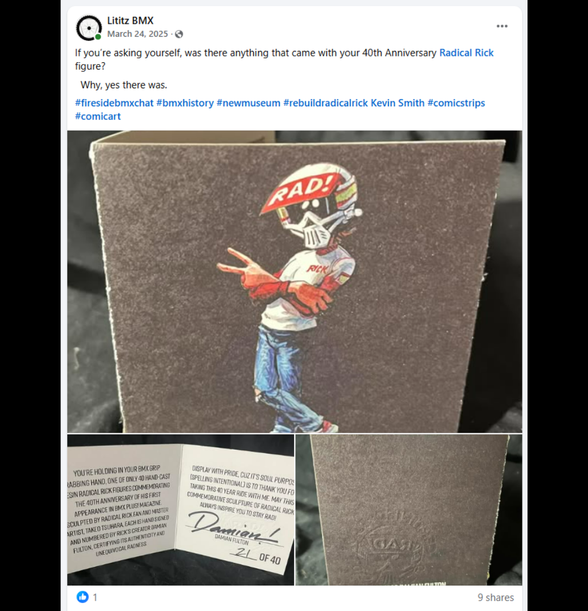
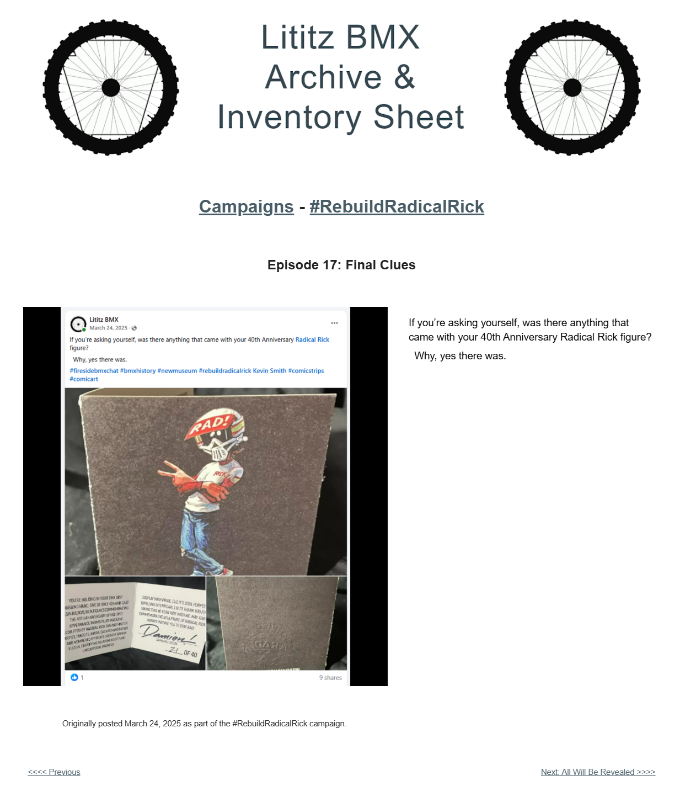

# Episode 17: Final Clues

[← Episode 16](episode-16-the-build-is-complete.md) | [Episode index](README.md) | [Episode 18 →](episode-18-all-will-be-revealed.md)

## Episode Identification

**Campaign:** #RebuildRadicalRick  
**Official episode number:** 17  
**Official title:** Final Clues  
**Publication date:** March 24, 2025  
**Chronological position:** 14  
**Record status:** Verified  
**Original platform:** Facebook  
**Produced by:** Lititz BMX  
**Archive display version:** 1.1

---

## Resource Structure

1. Preserved original social-media post image
2. Original published campaign text
3. Normalized episode summary and archival context
4. Full public archive-page capture
5. Source documentation and verification notes

---

## Public Archive Page

[View Episode 17 in the Lititz BMX Archive](https://sites.google.com/view/lititzbmxinventorylist/campaigns/rebuild-radical-rick-campaigns/episode-17-rebuild-radical-rick-campaigns)

**Original social-media post:** Not yet recovered as a stable direct-post permalink

---

## Episode Summary

Episode 17 shifted attention from the figure itself to the original materials that accompanied the 40th Anniversary Radical Rick release.

The accompanying image collage documented multiple views of the presentation materials, including Radical Rick artwork on the exterior, an interior signed and numbered insert, and an embossed surface associated with the package.

The post revealed that the figure had arrived with additional contextual and commemorative material, providing another clue about the limited anniversary release before the reconstruction was formally completed.

---

## Published Social-Media Source Image

*The screenshot above is preserved as the visual source record for the published campaign post. The transcription below remains separate so the wording is searchable and accessible.*

---

## Original Published Text

> If you’re asking yourself, was there anything that came with your 40th Anniversary Radical Rick figure?
>
> Why, yes there was.

The wording above is preserved from the verified campaign page and supplied source screenshot.

---

## Archival Context

Episode 17 expanded the campaign’s documentation beyond the reconstruction components.

Earlier episodes concentrated on the figure body, separate pieces, printed Radical Rick history, and the gradual assembly process. Episode 17 documented the packaging and accompanying materials connected with the 40th Anniversary Radical Rick figure.

The surviving image collage shows several distinct elements:

- exterior presentation artwork featuring Radical Rick;
- an interior informational insert;
- a Damian Fulton signature;
- numbering marked **21 of 40**;
- an embossed section of the presentation material.

These details establish that the object was presented as a limited commemorative release rather than as an isolated, unaccompanied figure.

The episode’s brief wording withheld a full explanation and instead functioned as another campaign clue. Its publication on March 24 also demonstrates that the official episode numbering did not match publication-date order.

---

## Related Subjects

- Radical Rick
- Damian Fulton
- 40th Anniversary Radical Rick figure
- Limited-edition collectible
- Numbered edition
- Signed insert
- Original packaging
- Presentation materials
- BMX comic history
- Collectible documentation
- Archival preservation
- Serialized social-media storytelling
- Lititz BMX

---

## Related Media and Resources

- [View the complete public campaign](https://sites.google.com/view/lititzbmxinventorylist/campaigns/rebuild-radical-rick-campaigns)
- [Watch the Fireside BMX Chat featuring Damian X. Fulton](https://youtu.be/vtVr6GBJtlM?feature=shared)
- [Visit the Radical Rick website](https://radicalrickbmx.com/)

---

## Preserved Public Archive Page Capture

*This full-page capture preserves the public Lititz BMX presentation, including layout, image placement, campaign text, and navigation as supplied during the July 2026 archive build.*

---

## Source Documentation

**Campaign ledger:**  
[Rebuild Radical Rick Campaign Ledger](../ledger/Rebuild-Radical-Rick-Campaign-Ledger-v1.0.md)

**Published-post screenshot:** [Open preserved source image](../source-images/episode-17-facebook-post.png)  
**Public-page capture:** [Open preserved page capture](../page-captures/episode-17-page-capture.png)  
**Image-evidence status:** Verified and visibly presented in this record

**Source-text status:** Verified from the supplied screenshot, campaign-page transcription, and public archive page

---

## Verification Notes

- The official episode number, title, publication date, image, and published text have been verified.
- Episode 17 was published on March 24, 2025.
- Episode 17 is the seventeenth officially numbered episode but fourteenth in verified publication chronology.
- Episode 17 was published before Episodes 14, 18, and 16 despite its later official episode number.
- The image collage documents materials associated with the 40th Anniversary Radical Rick figure.
- The visible insert bears a Damian Fulton signature and is numbered **21 of 40**.
- The exterior material features Radical Rick artwork.
- An embossed section of the presentation material is visible in the supplied image.
- The surviving post does not provide a complete written inventory of everything included with the figure.
- The pictured materials have therefore been described only to the extent supported by the image.
- A stable direct permalink to the original Facebook post has not yet been recovered.
- No missing wording or package contents have been invented or reconstructed.

---

## Preservation Note

This episode record separates original campaign language from later archival explanation.

The complete verified post wording is preserved in the **Original Published Text** section.

The episode summary and archival context were written later to explain the accompanying materials, limited-edition details, and the episode’s place within the campaign chronology. They do not replace or alter the original campaign record.

---

[← Episode 16](episode-16-the-build-is-complete.md) | [Episode index](README.md) | [Episode 18 →](episode-18-all-will-be-revealed.md)
