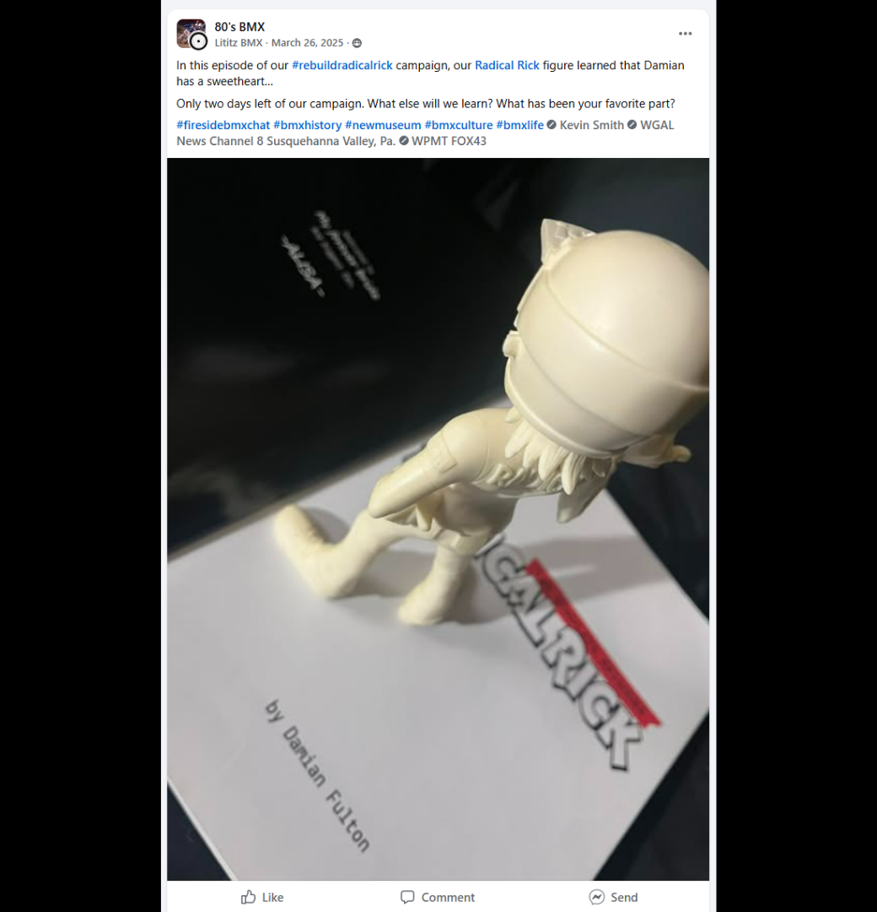
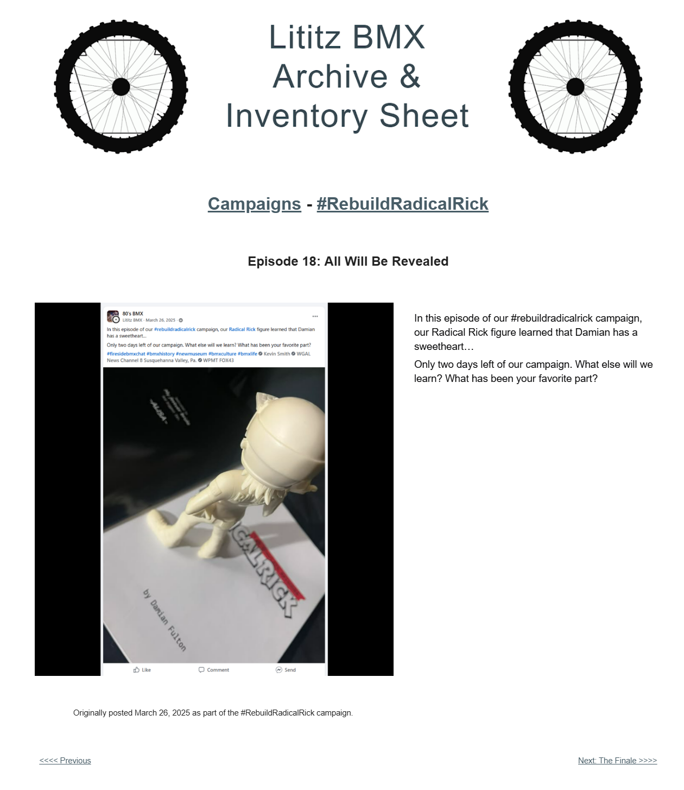

# Episode 18: All Will Be Revealed

[← Episode 17](episode-17-final-clues.md) | [Episode index](README.md) | [Episode 19 →](episode-19-the-finale.md)

## Episode Identification

**Campaign:** #RebuildRadicalRick  
**Official episode number:** 18  
**Official title:** All Will Be Revealed  
**Publication date:** March 26, 2025  
**Chronological position:** 16  
**Record status:** Verified  
**Original platform:** Facebook  
**Produced by:** Lititz BMX  
**Archive display version:** 1.1

---

## Resource Structure

1. Preserved original social-media post image
2. Original published campaign text
3. Normalized episode summary and archival context
4. Full public archive-page capture
5. Source documentation and verification notes

---

## Public Archive Page

[View the complete #RebuildRadicalRick campaign](https://sites.google.com/view/lititzbmxinventorylist/campaigns/rebuild-radical-rick-campaigns)

**Separate Episode 18 archive-page URL:** Not yet recorded  
**Original social-media post:** Not yet recovered as a stable direct-post permalink

---

## Episode Summary

Episode 18 continued the final countdown toward the conclusion of the #RebuildRadicalRick campaign.

The accompanying image showed the completed Radical Rick figure positioned over a copy of *Radical Rick: The Complete Episodes*. The post personified the figure as continuing to learn about Damian Fulton and the history surrounding the character.

With two days remaining before the finale, the episode invited followers to reflect on what they had learned and identify their favorite part of the campaign.

---

## Published Social-Media Source Image

*The screenshot above is preserved as the visual source record for the published campaign post. The transcription below remains separate so the wording is searchable and accessible.*

---

## Original Published Text

> In this episode of our #rebuildradicalrick campaign, our Radical Rick figure learned that Damian has a sweetheart…
>
> Only two days left of our campaign. What else will we learn? What has been your favorite part?

The wording above is preserved from the verified campaign page and supplied source screenshot.

---

## Archival Context

Episode 18 was published after the completed figure had been documented but before the final campaign reveal.

Episode 14 announced completion of the physical reconstruction on March 25. Episode 18 followed on March 26 and continued the campaign’s practice of positioning the figure with printed Radical Rick material as though the character were learning about his own history.

The reference to Damian having “a sweetheart” reflected information encountered through the publication shown in the image. The surviving post did not identify the person or reproduce the underlying passage, so no additional identity or context has been inferred.

The episode also served as a retrospective prompt. Rather than introducing another reconstruction component, it asked followers to consider the campaign as a complete experience and share which part had been most meaningful or enjoyable.

Although officially numbered Episode 18, it was published before Episode 16. The numbered sequence and publication chronology are therefore preserved separately.

---

## Related Subjects

- Radical Rick
- Damian Fulton
- 40th Anniversary Radical Rick figure
- *Radical Rick: The Complete Episodes*
- Completed figure reconstruction
- Radical Rick character history
- Creator history
- Campaign countdown
- Community participation
- BMX comic history
- Serialized social-media storytelling
- Lititz BMX

---

## Related Media and Resources

- [View the complete public campaign](https://sites.google.com/view/lititzbmxinventorylist/campaigns/rebuild-radical-rick-campaigns)
- [Watch the Fireside BMX Chat featuring Damian X. Fulton](https://youtu.be/vtVr6GBJtlM?feature=shared)
- [Visit the Radical Rick website](https://radicalrickbmx.com/)

---

## Preserved Public Archive Page Capture

*This full-page capture preserves the public Lititz BMX presentation, including layout, image placement, campaign text, and navigation as supplied during the July 2026 archive build.*

---

## Source Documentation

**Campaign ledger:**  
[Rebuild Radical Rick Campaign Ledger](../ledger/Rebuild-Radical-Rick-Campaign-Ledger-v1.0.md)

**Published-post screenshot:** [Open preserved source image](../source-images/episode-18-facebook-post.png)  
**Public-page capture:** [Open preserved page capture](../page-captures/episode-18-page-capture.png)  
**Image-evidence status:** Verified and visibly presented in this record

**Source-text status:** Verified from the supplied screenshot and campaign-page transcription

---

## Verification Notes

- The official episode number, title, publication date, image, and published text have been verified.
- Episode 18 was published on March 26, 2025.
- Episode 18 is the eighteenth officially numbered episode but sixteenth in verified publication chronology.
- Episode 18 was published one day before Episode 16 despite its later official episode number.
- Episode 14 had already announced completion of the physical reconstruction on March 25.
- The image shows the completed Radical Rick figure positioned over *Radical Rick: The Complete Episodes*.
- The original post states that the figure learned Damian had “a sweetheart.”
- The surviving episode does not identify the person referenced or reproduce the underlying publication passage.
- No identity or additional relationship details have been inferred.
- The episode functioned as both a two-day countdown and an invitation for audience reflection.
- A stable direct permalink to the original Facebook post has not yet been recovered.
- The exact URL of the separate Episode 18 public archive page has not yet been recorded and has not been guessed.
- No missing wording has been invented or reconstructed.

---

## Preservation Note

This episode record separates original campaign language from later archival explanation.

The complete verified post wording is preserved in the **Original Published Text** section.

The episode summary and archival context were written later to explain the image, countdown, chronology, and audience-reflection prompt. They do not replace or alter the original campaign record.

---

[← Episode 17](episode-17-final-clues.md) | [Episode index](README.md) | [Episode 19 →](episode-19-the-finale.md)
