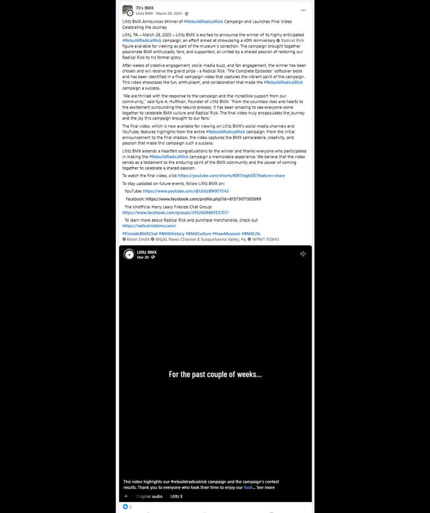
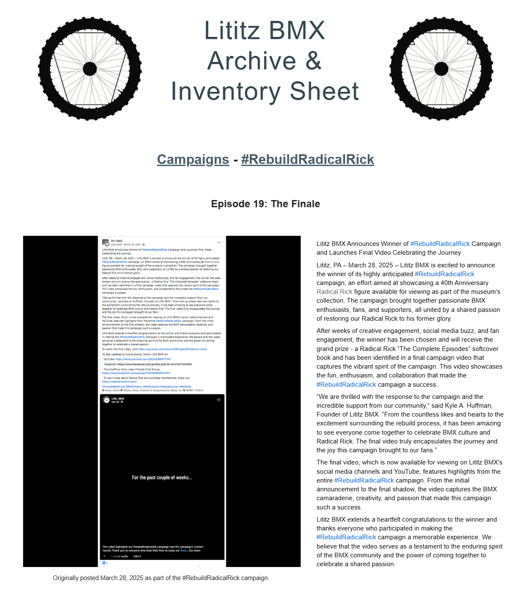

# Episode 19: The Finale

[← Episode 18](episode-18-all-will-be-revealed.md) | [Episode index](README.md) | [Campaign overview →](../README.md)

## Episode Identification

**Campaign:** #RebuildRadicalRick  
**Official episode number:** 19  
**Official title:** The Finale  
**Publication date:** March 28, 2025  
**Chronological position:** 18  
**Record status:** Verified  
**Original platform:** Facebook  
**Produced by:** Lititz BMX  
**Archive display version:** 1.1

---

## Resource Structure

1. Preserved original social-media post image
2. Original published campaign text
3. Normalized episode summary and archival context
4. Full public archive-page capture
5. Source documentation and verification notes

---

## Public Archive Page

[View Episode 19 in the Lititz BMX Archive](https://sites.google.com/view/lititzbmxinventorylist/campaigns/rebuild-radical-rick-campaigns/episode-19-rebuild-radical-rick-campaigns)

**Original social-media post:** Not yet recovered as a stable direct-post permalink  
**Final campaign video:** A stable direct-video URL has not yet been recorded in this repository

---

## Episode Summary

Episode 19 concluded the #RebuildRadicalRick campaign with the announcement that the giveaway winner had been selected and identified in a final campaign video.

The episode recapped the reconstruction of the 40th Anniversary Radical Rick figure, thanked the participating community, and presented the completed campaign as a celebration of BMX history, comic culture, preservation, and shared enthusiasm.

The grand prize was a copy of *Radical Rick: The Complete Episodes*. The supplied campaign-page text does not identify the winner by name, so that information remains subject to verification through the final video.

---

## Published Social-Media Source Image

*The screenshot above is preserved as the visual source record for the published campaign post. The transcription below remains separate so the wording is searchable and accessible.*

---

## Original Published Text

> Lititz BMX Announces Winner of #RebuildRadicalRick Campaign and Launches Final Video Celebrating the Journey
>
> Lititz, PA – March 28, 2025 – Lititz BMX is excited to announce the winner of its highly anticipated #RebuildRadicalRick campaign, an effort aimed at showcasing a 40th Anniversary Radical Rick figure available for viewing as part of the museum’s collection. The campaign brought together passionate BMX enthusiasts, fans, and supporters, all united by a shared passion of restoring our Radical Rick to his former glory.
>
> After weeks of creative engagement, social media buzz, and fan engagement, the winner has been chosen and will receive the grand prize - a Radical Rick “The Complete Episodes” softcover book and has been identified in a final campaign video that captures the vibrant spirit of the campaign. This video showcases the fun, enthusiasm, and collaboration that made the #RebuildRadicalRick campaign a success.
>
> “We are thrilled with the response to the campaign and the incredible support from our community,” said Kyle A. Huffman, Founder of Lititz BMX. “From the countless likes and hearts to the excitement surrounding the rebuild process, it has been amazing to see everyone come together to celebrate BMX culture and Radical Rick. The final video truly encapsulates the journey and the joy this campaign brought to our fans.”
>
> The final video, which is now available for viewing on Lititz BMX's social media channels and YouTube, features highlights from the entire #RebuildRadicalRick campaign. From the initial announcement to the final shadow, the video captures the BMX camaraderie, creativity, and passion that made this campaign such a success.
>
> Lititz BMX extends a heartfelt congratulations to the winner and thanks everyone who participated in making the #RebuildRadicalRick campaign a memorable experience. We believe that the video serves as a testament to the enduring spirit of the BMX community and the power of coming together to celebrate a shared passion.

The wording above is preserved from the verified campaign page and supplied source screenshot.

---

## Archival Context

Episode 19 completed the serialized campaign and shifted the record from reconstruction updates to a retrospective account of the entire project.

Earlier episodes introduced the disassembled figure, documented its individual components, connected those components with Radical Rick history, and followed the figure through assembly. The final episode presented the campaign as a complete preservation and community-storytelling project.

The episode also announced the conclusion of the associated giveaway. The prize was a softcover copy of *Radical Rick: The Complete Episodes*, and the winner was reportedly identified in the final campaign video.

Because the winner’s name does not appear in the supplied campaign-page transcription, it has not been inferred or added to this record. Confirmation requires review of the surviving final video.

The original text states that the retrospective video covered the campaign “from the initial announcement to the final shadow.” That wording is preserved exactly. Whether “final shadow” was intentional or was meant to read “final reveal” remains unverified and has not been silently corrected.

The episode’s press-release format also documented Kyle A. Huffman’s role as Founder of Lititz BMX and recorded the organization’s stated appreciation for the BMX community’s participation.

---

## Related Subjects

- Radical Rick
- Damian X. Fulton
- Kyle A. Huffman
- Lititz BMX
- 40th Anniversary Radical Rick figure
- *Radical Rick: The Complete Episodes*
- Completed figure reconstruction
- Campaign giveaway
- Final campaign video
- BMX comic history
- BMX preservation
- Community participation
- Serialized social-media storytelling
- Archival documentation

---

## Related Media and Resources

- [View the complete public campaign](https://sites.google.com/view/lititzbmxinventorylist/campaigns/rebuild-radical-rick-campaigns)
- [Watch the Fireside BMX Chat featuring Damian X. Fulton](https://youtu.be/vtVr6GBJtlM?feature=shared)
- [Visit the Radical Rick website](https://radicalrickbmx.com/)
- [Visit the Lititz BMX YouTube channel](https://youtube.com/@lititzbmx17543)

---

## Preserved Public Archive Page Capture

*This full-page capture preserves the public Lititz BMX presentation, including layout, image placement, campaign text, and navigation as supplied during the July 2026 archive build.*

---

## Source Documentation

**Campaign ledger:**  
[Rebuild Radical Rick Campaign Ledger](../ledger/Rebuild-Radical-Rick-Campaign-Ledger-v1.0.md)

**Published-post screenshot:** [Open preserved source image](../source-images/episode-19-facebook-post.png)  
**Public-page capture:** [Open preserved page capture](../page-captures/episode-19-page-capture.png)  
**Image-evidence status:** Verified and visibly presented in this record

**Source-text status:** Verified from the supplied screenshot, campaign-page transcription, and public archive page

**Final-video verification status:** Pending recovery or confirmation of the stable final-video URL

---

## Verification Notes

- The official episode number, title, publication date, image, and published text have been verified.
- Episode 19 was published on March 28, 2025.
- Episode 19 is the nineteenth officially numbered position and eighteenth in verified publication chronology.
- Episode 15 is excluded from the verified chronological count because its original source and publication date have not been recovered.
- Episode 19 is the final officially numbered episode of the campaign.
- The episode announced that the giveaway winner had been selected.
- The grand prize was a softcover copy of *Radical Rick: The Complete Episodes*.
- The winner’s name does not appear in the supplied campaign-page text.
- The winner reportedly appears in the final campaign video, which has not yet been independently reviewed for this record.
- The wording “from the initial announcement to the final shadow” is preserved exactly from the surviving campaign text.
- Whether “final shadow” was intentional or meant to read “final reveal” remains unverified.
- A stable direct permalink to the original Facebook post has not yet been recovered.
- A stable direct URL for the final campaign video has not yet been recorded in this repository.
- No winner, missing wording, or intended correction has been invented or reconstructed.

---

## Preservation Note

This episode record separates original campaign language from later archival explanation.

The complete verified campaign-page wording is preserved in the **Original Published Text** section, including its original grammar, punctuation, and the phrase “final shadow.”

The episode summary, archival context, and verification notes were written later to explain the finale, giveaway, unresolved winner verification, and campaign chronology. They do not replace or alter the original campaign record.

---

[← Episode 18](episode-18-all-will-be-revealed.md) | [Episode index](README.md) | [Campaign overview →](../README.md)
