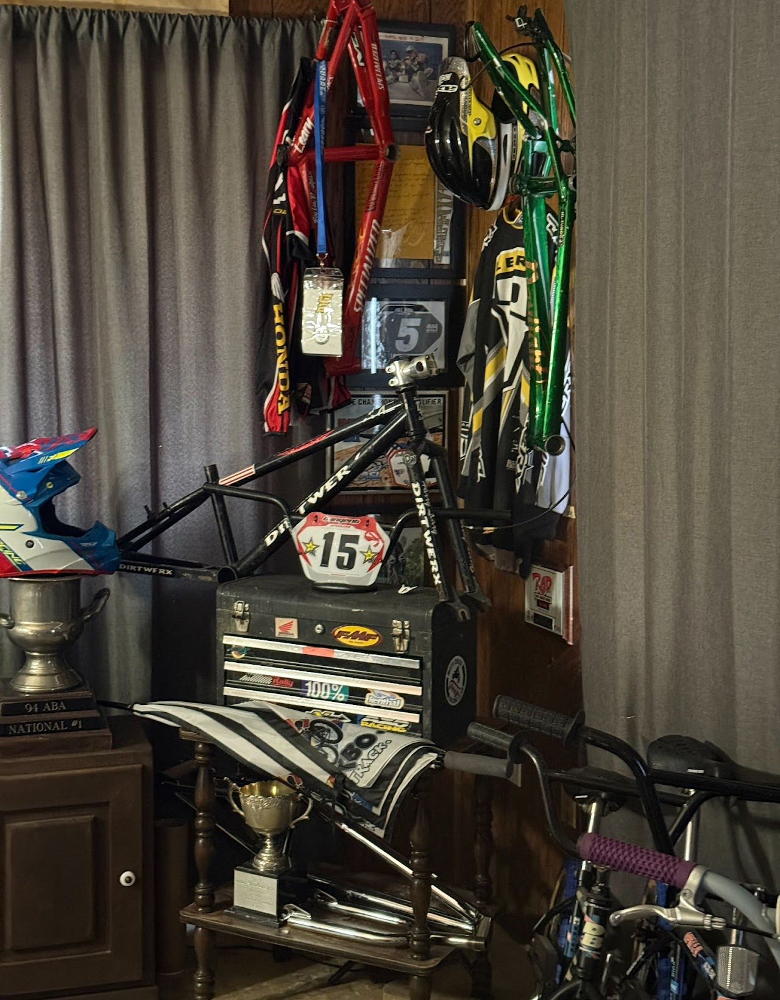
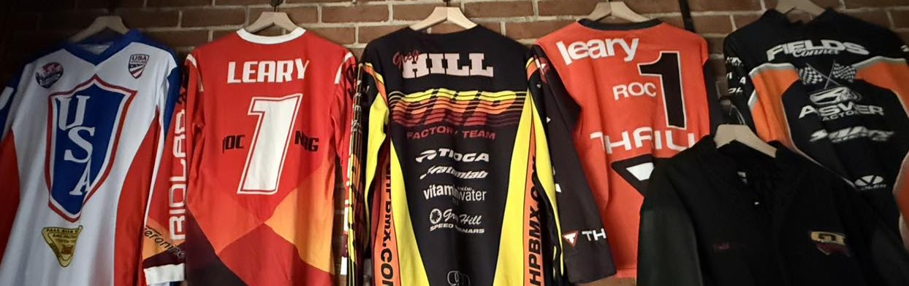

# Lititz BMX Collections

Museum-style visual collections organizing related artifacts, provenance, learning context and public access records.

[Return to the repository home](../README.md)

---

## Harry’s Room — The Harry Leary Collection

**Harry’s Room** integrates 28 unique accession records into a single digital exhibit organized as a trophy case, rider’s wardrobe, workshop bench and memory wall. Two original source pages remain preserved in the provenance layer, but the public collection is presented as one expandable room.

[Enter Harry’s Room](harrys-room/)

---

## The Digital Jersey Wall

The **Lititz BMX Jersey Collection** preserves 22 accessioned jerseys and five additional transfer, gift, return and charitable-disposition records. The wall documents riders, factory teams, brands, international exchange, memorial activity and the continuing movement of BMX history between people.

[Explore the complete Digital Jersey Wall](jersey-collection/)
