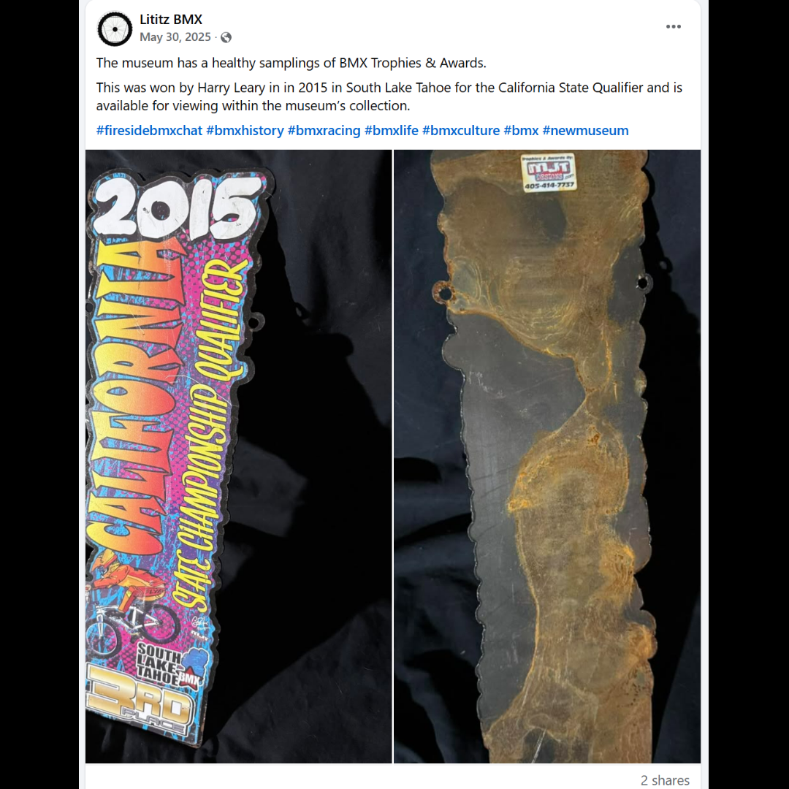

# 26.0013 — 2015 California State Qualifier, South Lake Tahoe, Third-Place Tin

[← 26.0034](../26-0034-2003-world-4-stroke-mx-championship-second-place-award/) · [Harry’s Room](../../README.md) · [26.0030 →](../26-0030-harry-leary-2017-uci-worlds-championship-helmet/)

## The Trophy Case

Championships, recognition and public service.

## Artifact record

| Field | Record |
|---|---|
| Artifact ID | **26.0013** |
| Legacy ID | None recorded |
| Record type | award |
| Holding status | Current holding as presented in the supplied LititzBMX.com collection pages |
| Room location | The Trophy Case |
| Claim status | mixed-source |
| People | Harry Leary |
| Organizations / brands | South Lake Tahoe BMX |

## Interpretive note

A 2015 California State Championship Qualifier award from South Lake Tahoe BMX, identified by the collection as Harry Leary’s third-place tin.

## Provenance summary

Presented as part of the Harry Leary Collection; acquisition detail was not supplied in this source package.

## Evidence and qualification

- The event, year and South Lake Tahoe BMX wording are visible on the object.
- The third-place result and Harry Leary attribution are preserved from the supplied collection description.

## Source trail

- [Original LititzBMX.com collection source B](https://sites.google.com/view/lititzbmxinventorylist/collections/the-harry-leary-collection-1/harry-leary-collection-2)
- Preserved source image: [`26-0013-2015-california-state-qualifier-third-place-tin.png`](../../source/artifact-images/26-0013-2015-california-state-qualifier-third-place-tin.png)

## Related objects in Harry’s Room

- [26.0028 — 2000 ABA Third-Place Plaque](../26-0028-2000-aba-third-place-vet-pro-plaque/)
- [26.0037 — Cactus Park BMX State Qualifier “1st” Place Radical Rick Plaque](../26-0037-cactus-park-state-qualifier-radical-rick-plaque/)
- [26.0050 — Harry Leary Fall Risk Racing 2023 Number-Plate Decal](../26-0050-harry-leary-fall-risk-racing-2023-number-plate-decal/)

---

[← 26.0034](../26-0034-2003-world-4-stroke-mx-championship-second-place-award/) · [Harry’s Room](../../README.md) · [26.0030 →](../26-0030-harry-leary-2017-uci-worlds-championship-helmet/)
