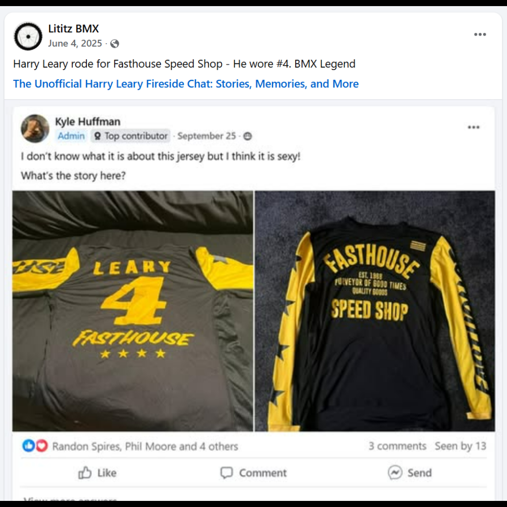

# 26.0025 — Harry Leary Fasthouse “4” Jersey

[← 26.0023](../26-0023-harry-leary-biolab-peak-performance-roc-1-jersey/) · [Harry’s Room](../../README.md) · [26.0063 →](../26-0063-harry-leary-dirtwerx-jersey/)

## The Rider’s Wardrobe

Jerseys, helmets and race identity.

## Artifact record

| Field | Record |
|---|---|
| Artifact ID | **26.0025** |
| Legacy ID | None recorded |
| Record type | jersey |
| Holding status | Current holding as presented in the supplied LititzBMX.com collection pages |
| Room location | The Rider’s Wardrobe |
| Claim status | source-supported |
| People | Harry Leary |
| Organizations / brands | Fasthouse Speed Shop |

## Interpretive note

A black and yellow Fasthouse Speed Shop jersey marked “LEARY” and number 4. It preserves a distinct team and visual chapter within the room’s rider-identity display.

## Provenance summary

From the Leary Locker, as documented in the Digital Jersey Wall record.

## Evidence and qualification

- The rider name, number and Fasthouse branding are visible in the supplied image.

## Source trail

- [Original LititzBMX.com collection source B](https://sites.google.com/view/lititzbmxinventorylist/collections/the-harry-leary-collection-1/harry-leary-collection-2)
- Preserved source image: [`26-0025-harry-leary-fasthouse-4-jersey.png`](../../source/artifact-images/26-0025-harry-leary-fasthouse-4-jersey.png)

## Cross-collection record

- [Digital Jersey Wall record for 26.0025](../../../jersey-collection/records/26-0025-leary-fasthouse-4-jersey/)

## Related objects in Harry’s Room

- [26.0075 — BIOLAB “Leary 4” Zeronine Jersey](../26-0075-biolab-leary-4-zeronine-jersey/)
- [26.0063 — Harry Leary DIRTWERX Jersey](../26-0063-harry-leary-dirtwerx-jersey/)
- [26.0018 — Harry Leary “Leary 81” Redman Jersey](../26-0018-harry-leary-leary-81-redman-jersey/)

---

[← 26.0023](../26-0023-harry-leary-biolab-peak-performance-roc-1-jersey/) · [Harry’s Room](../../README.md) · [26.0063 →](../26-0063-harry-leary-dirtwerx-jersey/)
