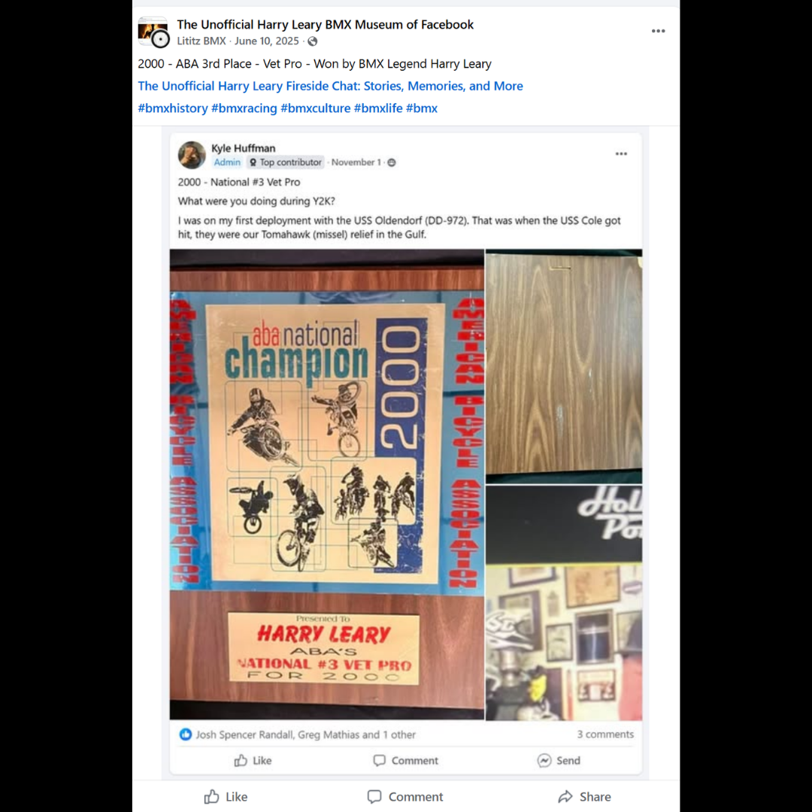

# 26.0028 — 2000 ABA Third-Place Plaque

[← 26.0033](../26-0033-supercross-of-bmx-top-money-winner-plaque/) · [Harry’s Room](../../README.md) · [26.0053 →](../26-0053-race-against-drugs-harry-leary-plaque/)

## The Trophy Case

Championships, recognition and public service.

## Artifact record

| Field | Record |
|---|---|
| Artifact ID | **26.0028** |
| Legacy ID | None recorded |
| Record type | plaque |
| Holding status | Current holding as presented in the supplied LititzBMX.com collection pages |
| Room location | The Trophy Case |
| Claim status | inscription-supported |
| People | Harry Leary |
| Organizations / brands | American Bicycle Association (ABA) |

## Interpretive note

An ABA plaque identifying Harry Leary as National #3 Vet Pro for 2000. The record connects the room’s championship history to the turn of the millennium.

## Provenance summary

Presented as part of the Harry Leary Collection; acquisition detail was not supplied in this source package.

## Evidence and qualification

- The recipient, class and 2000 result are visible in the supplied photograph.

## Source trail

- [Original LititzBMX.com collection source A](https://sites.google.com/view/lititzbmxinventorylist/collections/the-harry-leary-collection-1)
- Preserved source image: [`26-0028-2000-aba-third-place-vet-pro-plaque.png`](../../source/artifact-images/26-0028-2000-aba-third-place-vet-pro-plaque.png)

## Related objects in Harry’s Room

- [26.0067 — 1994 ABA Vet Pro Title Trophy](../26-0067-1994-aba-vet-pro-title-trophy/)
- [26.0037 — Cactus Park BMX State Qualifier “1st” Place Radical Rick Plaque](../26-0037-cactus-park-state-qualifier-radical-rick-plaque/)
- [26.0013 — 2015 California State Qualifier, South Lake Tahoe, Third-Place Tin](../26-0013-2015-california-state-qualifier-third-place-tin/)

---

[← 26.0033](../26-0033-supercross-of-bmx-top-money-winner-plaque/) · [Harry’s Room](../../README.md) · [26.0053 →](../26-0053-race-against-drugs-harry-leary-plaque/)
