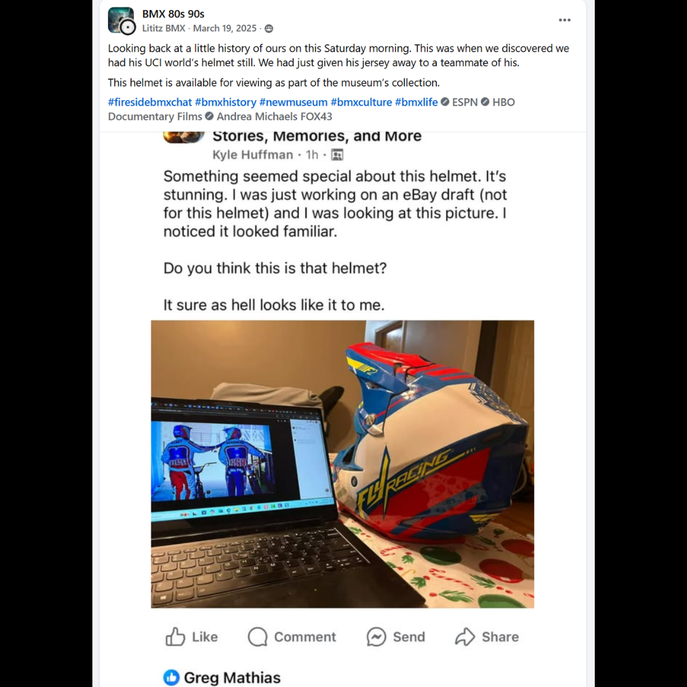

# 26.0030 — Harry Leary’s 2017 UCI Worlds Championship Helmet

[← 26.0013](../26-0013-2015-california-state-qualifier-third-place-tin/) · [Harry’s Room](../../README.md) · [26.0062 →](../26-0062-harry-leary-dirtwerx-helmet/)

## The Rider’s Wardrobe

Jerseys, helmets and race identity.

## Artifact record

| Field | Record |
|---|---|
| Artifact ID | **26.0030** |
| Legacy ID | None recorded |
| Record type | helmet |
| Holding status | Current holding as presented in the supplied LititzBMX.com collection pages |
| Room location | The Rider’s Wardrobe |
| Claim status | visual-comparison-attribution |
| People | Harry Leary, Greg Mathias |
| Organizations / brands | UCI, Fly Racing |

## Interpretive note

A Fly Racing full-face helmet attributed by the collection to Harry Leary’s 2017 UCI Worlds appearance. The supplied source post documents the visual-comparison process that led to the identification.

## Provenance summary

Presented as part of the Harry Leary Collection; acquisition detail was not supplied in this source package.

## Evidence and qualification

- The identification is a collection attribution based on visual comparison with footage or photographs, not an independent authentication.
- No separate manufacturer, event or rider documentation was supplied with this release.

## Source trail

- [Original LititzBMX.com collection source A](https://sites.google.com/view/lititzbmxinventorylist/collections/the-harry-leary-collection-1)
- Preserved source image: [`26-0030-harry-leary-2017-uci-worlds-championship-helmet.png`](../../source/artifact-images/26-0030-harry-leary-2017-uci-worlds-championship-helmet.png)

## Related objects in Harry’s Room

- [26.0062 — Harry Leary “Harry” DIRTWERX Helmet](../26-0062-harry-leary-dirtwerx-helmet/)
- [26.0040 — Harry Leary GT Judge Lanyard](../26-0040-harry-leary-gt-judge-lanyard/)
- [26.0050 — Harry Leary Fall Risk Racing 2023 Number-Plate Decal](../26-0050-harry-leary-fall-risk-racing-2023-number-plate-decal/)

---

[← 26.0013](../26-0013-2015-california-state-qualifier-third-place-tin/) · [Harry’s Room](../../README.md) · [26.0062 →](../26-0062-harry-leary-dirtwerx-helmet/)
