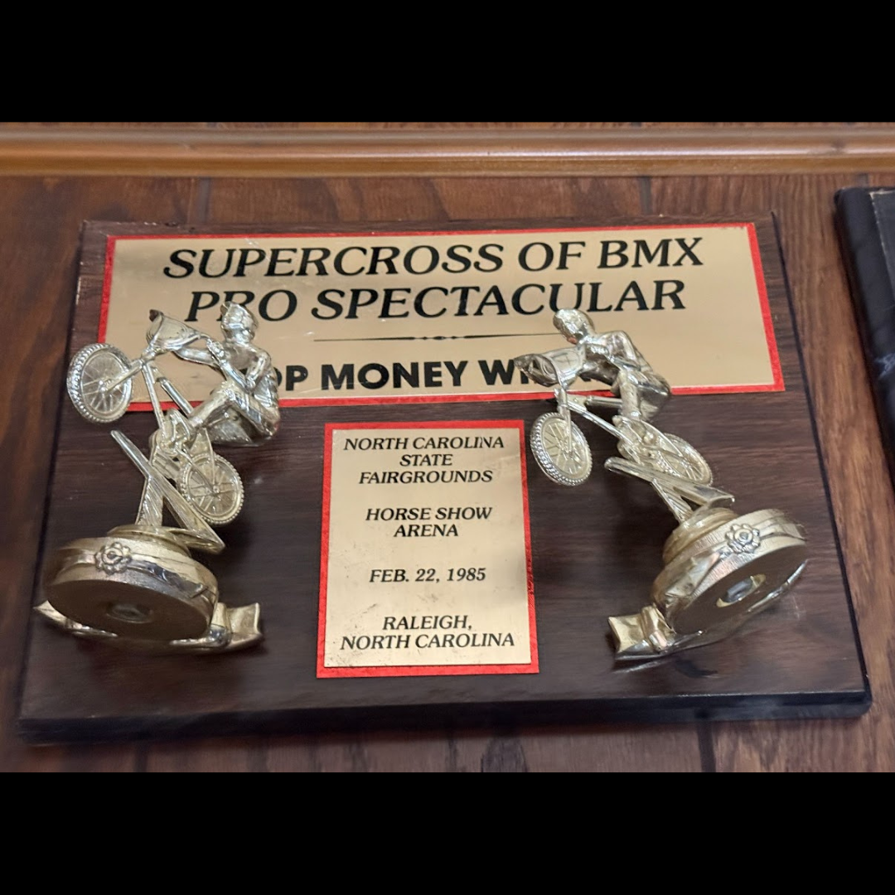

# 26.0033 — Supercross of BMX “Top Money Winner” Plaque

[← 26.0048](../26-0048-f1-challenge-trophy/) · [Harry’s Room](../../README.md) · [26.0028 →](../26-0028-2000-aba-third-place-vet-pro-plaque/)

## The Trophy Case

Championships, recognition and public service.

## Artifact record

| Field | Record |
|---|---|
| Artifact ID | **26.0033** |
| Legacy ID | None recorded |
| Record type | plaque |
| Holding status | Current holding as presented in the supplied LititzBMX.com collection pages |
| Room location | The Trophy Case |
| Claim status | inscription-supported |
| People | Harry Leary |
| Organizations / brands | Supercross of BMX, North Carolina State Fairgrounds |

## Interpretive note

A Supercross of BMX Pro Spectacular plaque marked “Top Money Winner,” North Carolina State Fairgrounds, Horse Show Arena, February 22, 1985.

## Provenance summary

Presented as part of the Harry Leary Collection; acquisition detail was not supplied in this source package.

## Evidence and qualification

- The event title, location, date and “Top Money Winner” wording are visible on the plaque.
- The connection to Harry Leary is based on its placement and description in the supplied collection.

## Source trail

- [Original LititzBMX.com collection source B](https://sites.google.com/view/lititzbmxinventorylist/collections/the-harry-leary-collection-1/harry-leary-collection-2)
- Preserved source image: [`26-0033-supercross-of-bmx-top-money-winner-plaque.png`](../../source/artifact-images/26-0033-supercross-of-bmx-top-money-winner-plaque.png)

## Related objects in Harry’s Room

- [26.0048 — The F-1 Challenge Trophy](../26-0048-f1-challenge-trophy/)
- [26.0067 — 1994 ABA Vet Pro Title Trophy](../26-0067-1994-aba-vet-pro-title-trophy/)
- [26.0034 — 2003 World 4-Stroke MX Championship Second-Place Award](../26-0034-2003-world-4-stroke-mx-championship-second-place-award/)

---

[← 26.0048](../26-0048-f1-challenge-trophy/) · [Harry’s Room](../../README.md) · [26.0028 →](../26-0028-2000-aba-third-place-vet-pro-plaque/)
