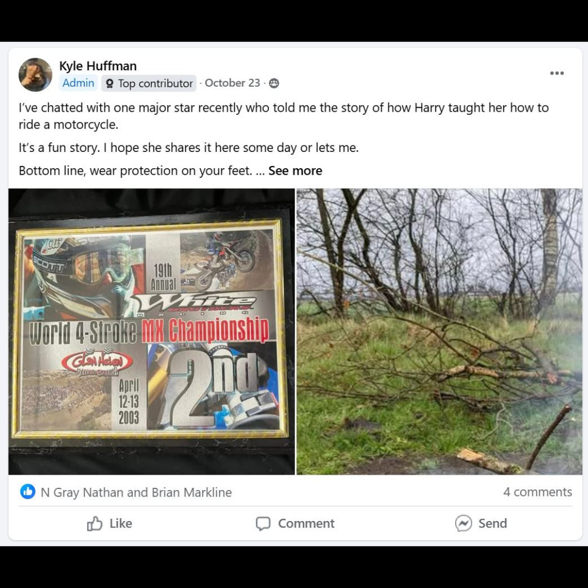

# 26.0034 — 2003 World 4-Stroke MX Championship Second-Place Award

[← 26.0053](../26-0053-race-against-drugs-harry-leary-plaque/) · [Harry’s Room](../../README.md) · [26.0013 →](../26-0013-2015-california-state-qualifier-third-place-tin/)

## The Trophy Case

Championships, recognition and public service.

## Artifact record

| Field | Record |
|---|---|
| Artifact ID | **26.0034** |
| Legacy ID | None recorded |
| Record type | award |
| Holding status | Current holding as presented in the supplied LititzBMX.com collection pages |
| Room location | The Trophy Case |
| Claim status | inscription-supported |
| People | Harry Leary |
| Organizations / brands | White Bros., World 4-Stroke MX Championship |

## Interpretive note

A framed second-place award for the 19th Annual White Bros. World 4-Stroke MX Championship, April 12–13, 2003. It broadens Harry’s Room beyond BMX into connected motorcycle activity.

## Provenance summary

Presented as part of the Harry Leary Collection; acquisition detail was not supplied in this source package.

## Evidence and qualification

- The event title, second-place result and April 12–13, 2003 dates are visible in the supplied image.
- The attribution to Harry Leary comes from the collection description.

## Source trail

- [Original LititzBMX.com collection source B](https://sites.google.com/view/lititzbmxinventorylist/collections/the-harry-leary-collection-1/harry-leary-collection-2)
- Preserved source image: [`26-0034-2003-world-4-stroke-mx-championship-second-place-award.png`](../../source/artifact-images/26-0034-2003-world-4-stroke-mx-championship-second-place-award.png)

## Related objects in Harry’s Room

- [26.0039 — Harry Leary’s Honda Jersey](../26-0039-harry-leary-honda-jersey/)
- [26.0033 — Supercross of BMX “Top Money Winner” Plaque](../26-0033-supercross-of-bmx-top-money-winner-plaque/)
- [26.0067 — 1994 ABA Vet Pro Title Trophy](../26-0067-1994-aba-vet-pro-title-trophy/)

---

[← 26.0053](../26-0053-race-against-drugs-harry-leary-plaque/) · [Harry’s Room](../../README.md) · [26.0013 →](../26-0013-2015-california-state-qualifier-third-place-tin/)
