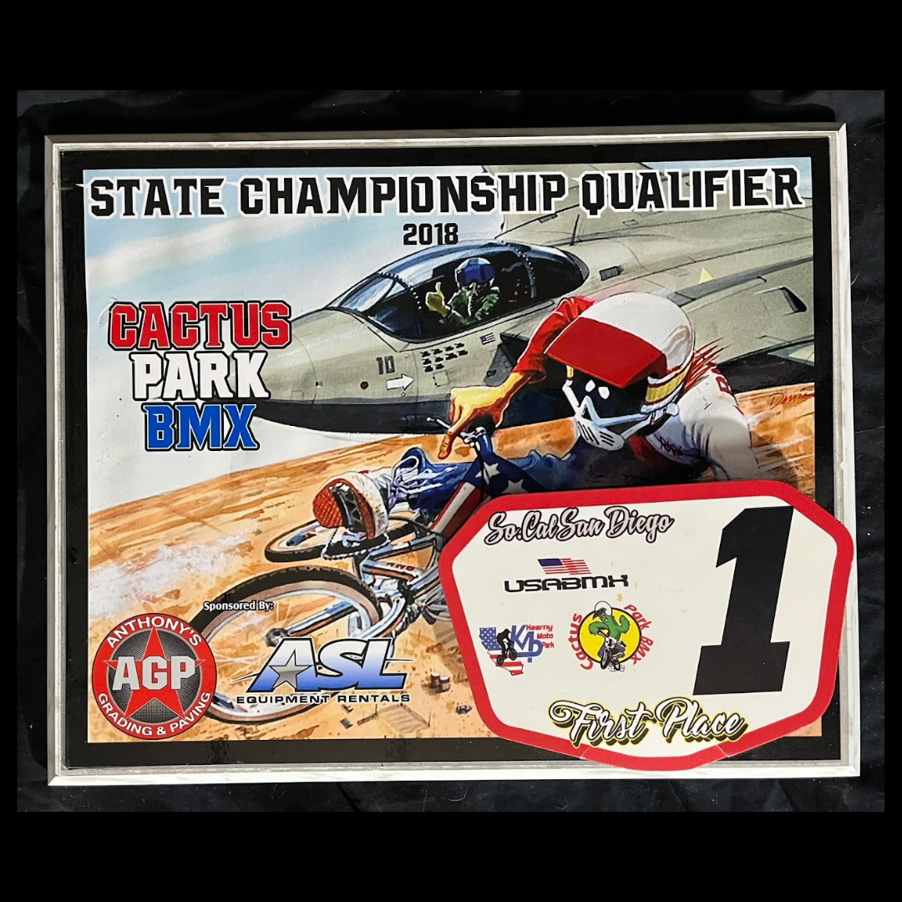

# 26.0037 — Cactus Park BMX State Qualifier “1st” Place Radical Rick Plaque

[← 26.0067](../26-0067-1994-aba-vet-pro-title-trophy/) · [Harry’s Room](../../README.md) · [26.0048 →](../26-0048-f1-challenge-trophy/)

## The Trophy Case

Championships, recognition and public service.

## Artifact record

| Field | Record |
|---|---|
| Artifact ID | **26.0037** |
| Legacy ID | None recorded |
| Record type | plaque |
| Holding status | Current holding as presented in the supplied LititzBMX.com collection pages |
| Room location | The Trophy Case |
| Claim status | source-supported |
| People | Harry Leary |
| Organizations / brands | Cactus Park BMX, Radical Rick |

## Interpretive note

A framed 2018 Cactus Park BMX State Championship Qualifier first-place plaque featuring Radical Rick artwork. The collection identifies it as the first of the Leary Locker purchases.

## Provenance summary

Identified by the collection as the first Leary Locker purchase.

## Evidence and qualification

- The event, year and first-place designation are visible in the supplied photograph.
- The “first Leary Locker purchase” statement is preserved from the collection description.

## Source trail

- [Original LititzBMX.com collection source A](https://sites.google.com/view/lititzbmxinventorylist/collections/the-harry-leary-collection-1)
- Preserved source image: [`26-0037-cactus-park-state-qualifier-radical-rick-plaque.png`](../../source/artifact-images/26-0037-cactus-park-state-qualifier-radical-rick-plaque.png)

## Related objects in Harry’s Room

- [26.0067 — 1994 ABA Vet Pro Title Trophy](../26-0067-1994-aba-vet-pro-title-trophy/)
- [26.0053 — Race Against Drugs “Harry Leary” Plaque](../26-0053-race-against-drugs-harry-leary-plaque/)
- [26.0013 — 2015 California State Qualifier, South Lake Tahoe, Third-Place Tin](../26-0013-2015-california-state-qualifier-third-place-tin/)

---

[← 26.0067](../26-0067-1994-aba-vet-pro-title-trophy/) · [Harry’s Room](../../README.md) · [26.0048 →](../26-0048-f1-challenge-trophy/)
