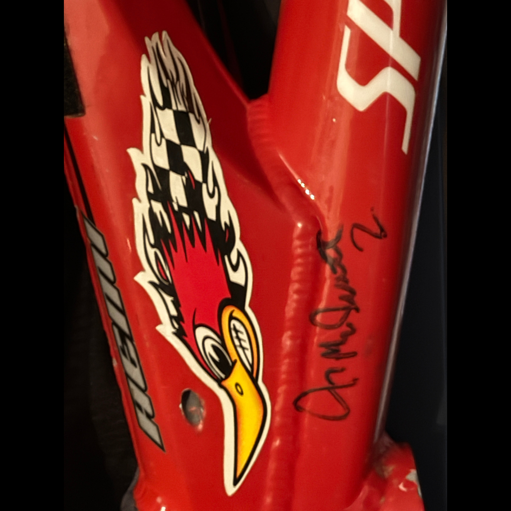

# 26.0038 — Harry Leary Specialized Hemi Frame Signed Twice by Jeremy McGrath

[← 26.0046](../26-0046-harry-leary-toolbox/) · [Harry’s Room](../../README.md) · [26.0052 →](../26-0052-damaged-daylight-hlt4-frame-last-hlt4/)

## The Workshop Bench

Frames, bars and tools.

## Artifact record

| Field | Record |
|---|---|
| Artifact ID | **26.0038** |
| Legacy ID | None recorded |
| Record type | bicycle frame |
| Holding status | Current holding as presented in the supplied LititzBMX.com collection pages |
| Room location | The Workshop Bench |
| Claim status | collection-attributed |
| People | Harry Leary, Jeremy McGrath |
| Organizations / brands | Specialized |

## Interpretive note

A red Specialized Hemi frame attributed to Harry Leary and described by the collection as signed twice by Jeremy McGrath. It connects BMX equipment with a broader action-sports relationship.

## Provenance summary

Presented as part of the Harry Leary Collection; acquisition detail was not supplied in this source package.

## Evidence and qualification

- The supplied image shows one close-up signature area; the collection description states that the frame was signed twice.
- The signatures have not been independently authenticated in this release.

## Source trail

- [Original LititzBMX.com collection source A](https://sites.google.com/view/lititzbmxinventorylist/collections/the-harry-leary-collection-1)
- Preserved source image: [`26-0038-harry-leary-specialized-hemi-frame-jeremy-mcgrath-signatures.png`](../../source/artifact-images/26-0038-harry-leary-specialized-hemi-frame-jeremy-mcgrath-signatures.png)

## Related objects in Harry’s Room

- [26.0046 — Harry Leary’s Toolbox](../26-0046-harry-leary-toolbox/)
- [26.0052 — Damaged Daylight HLT4 Frame — The Last HLT4](../26-0052-damaged-daylight-hlt4-frame-last-hlt4/)
- [26.0039 — Harry Leary’s Honda Jersey](../26-0039-harry-leary-honda-jersey/)

---

[← 26.0046](../26-0046-harry-leary-toolbox/) · [Harry’s Room](../../README.md) · [26.0052 →](../26-0052-damaged-daylight-hlt4-frame-last-hlt4/)
