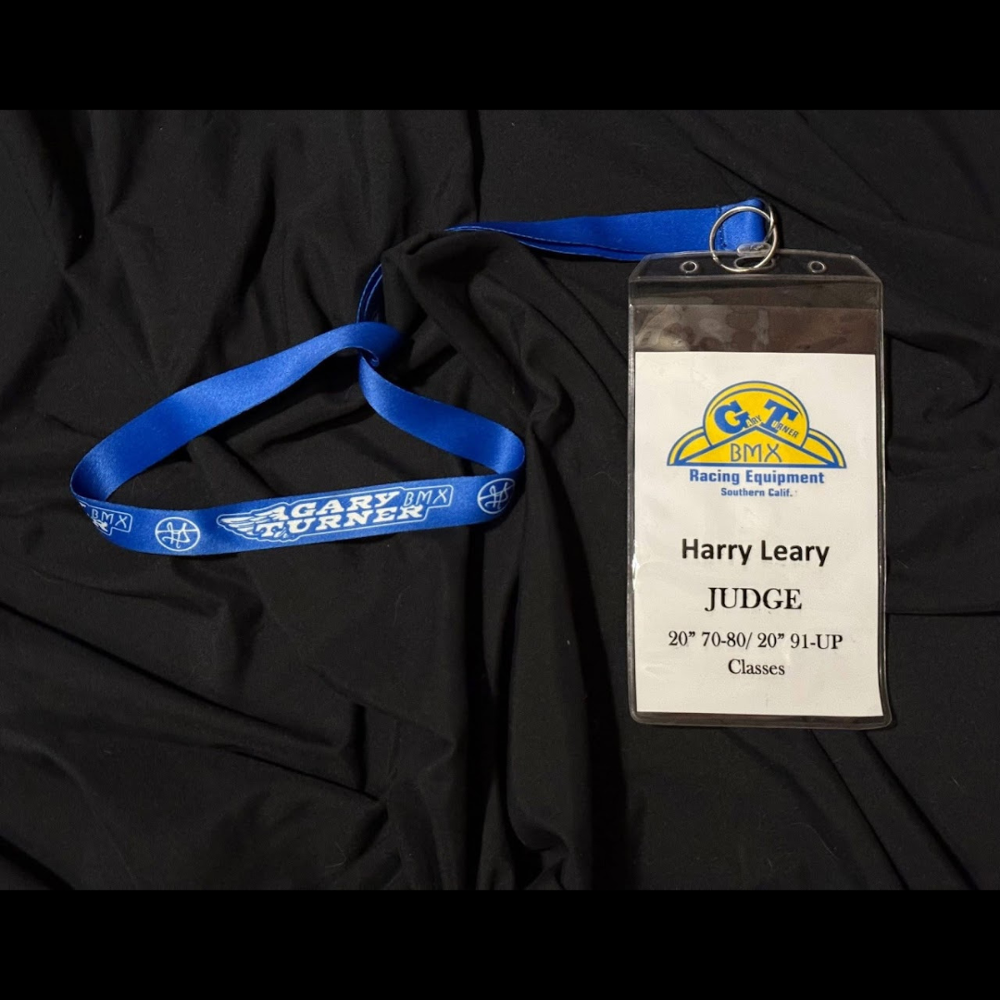

# 26.0040 — Harry Leary GT Judge Lanyard

[← 26.0064](../26-0064-tangent-beanie-smells-like-harry/) · [Harry’s Room](../../README.md) · [26.0050 →](../26-0050-harry-leary-fall-risk-racing-2023-number-plate-decal/)

## The Rider’s Wardrobe

Jerseys, helmets and race identity.

## Artifact record

| Field | Record |
|---|---|
| Artifact ID | **26.0040** |
| Legacy ID | None recorded |
| Record type | credential |
| Holding status | Current holding as presented in the supplied LititzBMX.com collection pages |
| Room location | The Rider’s Wardrobe |
| Claim status | inscription-supported |
| People | Harry Leary |
| Organizations / brands | Gary Turner BMX |

## Interpretive note

A Gary Turner BMX lanyard and judge credential issued to Harry Leary for 20-inch 70–80 and 91-up classes. It documents a role in BMX beyond riding and racing.

## Provenance summary

Presented as part of the Harry Leary Collection; acquisition detail was not supplied in this source package.

## Evidence and qualification

- The name, judge role and class ranges are visible on the credential.

## Source trail

- [Original LititzBMX.com collection source B](https://sites.google.com/view/lititzbmxinventorylist/collections/the-harry-leary-collection-1/harry-leary-collection-2)
- Preserved source image: [`26-0040-harry-leary-gt-judge-lanyard.png`](../../source/artifact-images/26-0040-harry-leary-gt-judge-lanyard.png)

## Related objects in Harry’s Room

- [26.0050 — Harry Leary Fall Risk Racing 2023 Number-Plate Decal](../26-0050-harry-leary-fall-risk-racing-2023-number-plate-decal/)
- [26.0030 — Harry Leary’s 2017 UCI Worlds Championship Helmet](../26-0030-harry-leary-2017-uci-worlds-championship-helmet/)
- [26.0064 — Tangent Beanie — “Smells Like Harry”](../26-0064-tangent-beanie-smells-like-harry/)

---

[← 26.0064](../26-0064-tangent-beanie-smells-like-harry/) · [Harry’s Room](../../README.md) · [26.0050 →](../26-0050-harry-leary-fall-risk-racing-2023-number-plate-decal/)
