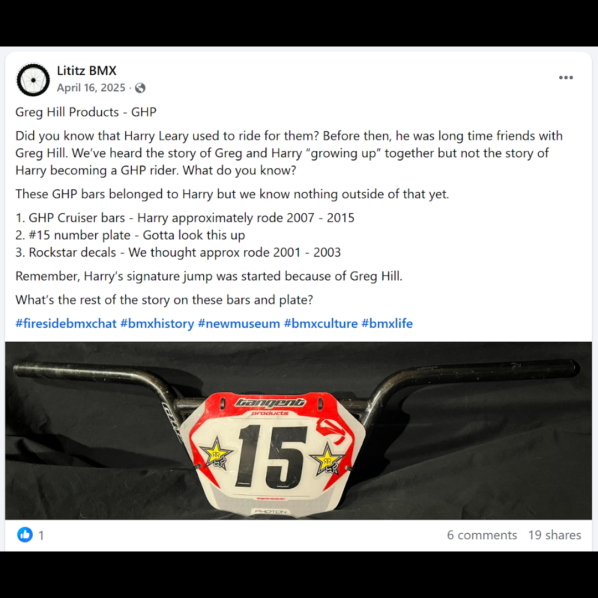

# 26.0045 — GHP Cruiser Bars with “15” Plate

[← 26.0052](../26-0052-damaged-daylight-hlt4-frame-last-hlt4/) · [Harry’s Room](../../README.md) · [26.0036 →](../26-0036-dottie-ellis-merki-letter-and-dirtwerx-decal/)

## The Workshop Bench

Frames, bars and tools.

## Artifact record

| Field | Record |
|---|---|
| Artifact ID | **26.0045** |
| Legacy ID | None recorded |
| Record type | handlebars and number plate |
| Holding status | Current holding as presented in the supplied LititzBMX.com collection pages |
| Room location | The Workshop Bench |
| Claim status | attributed-unresolved |
| People | Harry Leary, Greg Hill |
| Organizations / brands | GHP, Tangent |

## Interpretive note

Black GHP cruiser bars paired with a red and white number 15 plate, attributed by the collection as Harry Leary equipment. The source post preserves active research questions about when and how they were used.

## Provenance summary

Presented as part of the Harry Leary Collection; acquisition detail was not supplied in this source package.

## Evidence and qualification

- The source post includes approximate riding dates, team-history questions and a statement about the origin of “The Leary” jump. Those statements remain attributed and unresolved in this artifact record.
- The archive does not convert the research post’s questions or approximate dates into verified findings.

## Source trail

- [Original LititzBMX.com collection source B](https://sites.google.com/view/lititzbmxinventorylist/collections/the-harry-leary-collection-1/harry-leary-collection-2)
- Preserved source image: [`26-0045-ghp-cruiser-bars-with-15-plate.png`](../../source/artifact-images/26-0045-ghp-cruiser-bars-with-15-plate.png)

## Related objects in Harry’s Room

- [26.0052 — Damaged Daylight HLT4 Frame — The Last HLT4](../26-0052-damaged-daylight-hlt4-frame-last-hlt4/)
- [26.0046 — Harry Leary’s Toolbox](../26-0046-harry-leary-toolbox/)
- [26.0050 — Harry Leary Fall Risk Racing 2023 Number-Plate Decal](../26-0050-harry-leary-fall-risk-racing-2023-number-plate-decal/)

---

[← 26.0052](../26-0052-damaged-daylight-hlt4-frame-last-hlt4/) · [Harry’s Room](../../README.md) · [26.0036 →](../26-0036-dottie-ellis-merki-letter-and-dirtwerx-decal/)
