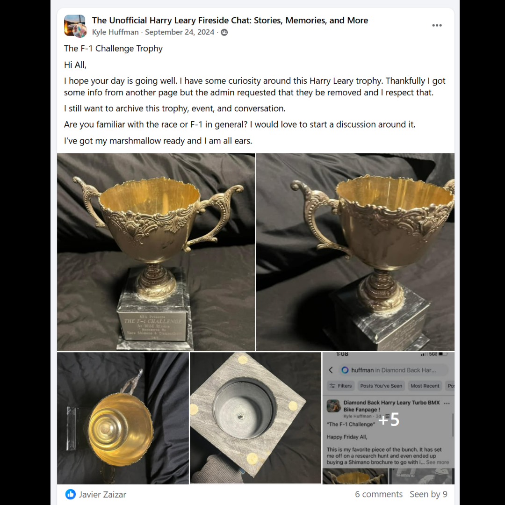

# 26.0048 — The F-1 Challenge Trophy

[← 26.0037](../26-0037-cactus-park-state-qualifier-radical-rick-plaque/) · [Harry’s Room](../../README.md) · [26.0033 →](../26-0033-supercross-of-bmx-top-money-winner-plaque/)

## The Trophy Case

Championships, recognition and public service.

## Artifact record

| Field | Record |
|---|---|
| Artifact ID | **26.0048** |
| Legacy ID | None recorded |
| Record type | trophy |
| Holding status | Current holding as presented in the supplied LititzBMX.com collection pages |
| Room location | The Trophy Case |
| Claim status | collection-attributed |
| People | Harry Leary |
| Organizations / brands | F-1 Challenge |

## Interpretive note

An ornate cup trophy presented in the source material as the 1986 title trophy for the 20-inch BMX format described as F1/F-1 racing. The same accession appeared on both original collection pages and is intentionally represented once in Harry’s Room.

## Provenance summary

Presented as part of the Harry Leary Collection; acquisition detail was not supplied in this source package.

## Evidence and qualification

- The source uses both “F1” and “F-1”; both forms are preserved.
- The two original Google Sites pages showed the same accession. Harry’s Room creates one record with two source-page references rather than duplicating the artifact.
- The characterization as a title trophy for a 20-inch geared BMX format is preserved from the supplied collection description.

## Source trail

- [Original LititzBMX.com collection source A](https://sites.google.com/view/lititzbmxinventorylist/collections/the-harry-leary-collection-1)
- [Original LititzBMX.com collection source B](https://sites.google.com/view/lititzbmxinventorylist/collections/the-harry-leary-collection-1/harry-leary-collection-2)
- Preserved source image: [`26-0048-f1-challenge-trophy-page-1.png`](../../source/artifact-images/26-0048-f1-challenge-trophy-page-1.png)
- Additional preserved source image: [`26-0048-f1-challenge-trophy-page-2.png`](../../source/artifact-images/26-0048-f1-challenge-trophy-page-2.png)

## Related objects in Harry’s Room

- [26.0067 — 1994 ABA Vet Pro Title Trophy](../26-0067-1994-aba-vet-pro-title-trophy/)
- [26.0033 — Supercross of BMX “Top Money Winner” Plaque](../26-0033-supercross-of-bmx-top-money-winner-plaque/)
- [26.0028 — 2000 ABA Third-Place Plaque](../26-0028-2000-aba-third-place-vet-pro-plaque/)

---

[← 26.0037](../26-0037-cactus-park-state-qualifier-radical-rick-plaque/) · [Harry’s Room](../../README.md) · [26.0033 →](../26-0033-supercross-of-bmx-top-money-winner-plaque/)
