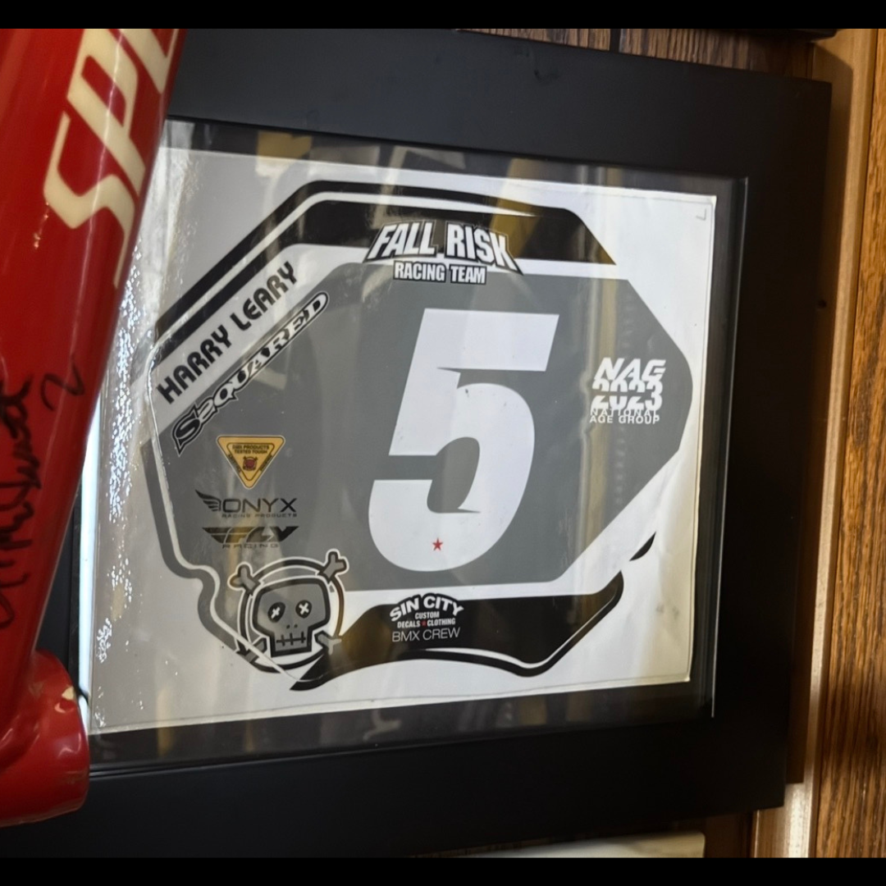

# 26.0050 — Harry Leary Fall Risk Racing 2023 Number-Plate Decal

[← 26.0040](../26-0040-harry-leary-gt-judge-lanyard/) · [Harry’s Room](../../README.md) · [26.0075 →](../26-0075-biolab-leary-4-zeronine-jersey/)

## The Rider’s Wardrobe

Jerseys, helmets and race identity.

## Artifact record

| Field | Record |
|---|---|
| Artifact ID | **26.0050** |
| Legacy ID | None recorded |
| Record type | number-plate decal |
| Holding status | Current holding as presented in the supplied LititzBMX.com collection pages |
| Room location | The Rider’s Wardrobe |
| Claim status | mixed-source |
| People | Harry Leary |
| Organizations / brands | Fall Risk Racing |

## Interpretive note

A framed Fall Risk Racing number-plate decal marked “Harry Leary” and number 5, identified by the supplied collection description as a 2023 record.

## Provenance summary

Presented as part of the Harry Leary Collection; acquisition detail was not supplied in this source package.

## Evidence and qualification

- The rider name, number and team branding are visible in the supplied image.
- The 2023 date is preserved from the collection description.

## Source trail

- [Original LititzBMX.com collection source B](https://sites.google.com/view/lititzbmxinventorylist/collections/the-harry-leary-collection-1/harry-leary-collection-2)
- Preserved source image: [`26-0050-harry-leary-fall-risk-racing-2023-number-plate-decal.png`](../../source/artifact-images/26-0050-harry-leary-fall-risk-racing-2023-number-plate-decal.png)

## Related objects in Harry’s Room

- [26.0040 — Harry Leary GT Judge Lanyard](../26-0040-harry-leary-gt-judge-lanyard/)
- [26.0013 — 2015 California State Qualifier, South Lake Tahoe, Third-Place Tin](../26-0013-2015-california-state-qualifier-third-place-tin/)
- [26.0030 — Harry Leary’s 2017 UCI Worlds Championship Helmet](../26-0030-harry-leary-2017-uci-worlds-championship-helmet/)

---

[← 26.0040](../26-0040-harry-leary-gt-judge-lanyard/) · [Harry’s Room](../../README.md) · [26.0075 →](../26-0075-biolab-leary-4-zeronine-jersey/)
