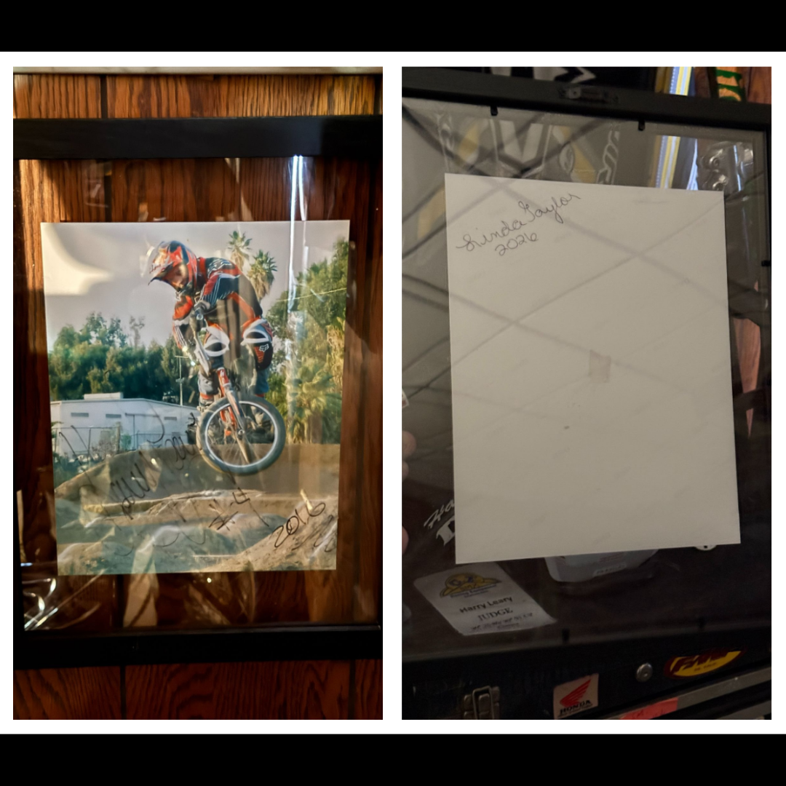

# 26.0051 — Linda and Harry Leary Signed Copy

[← 26.0065](../26-0065-harry-leary-eddy-king-nora-cup-photograph/) · [Harry’s Room](../../README.md)

## The Memory Wall

Correspondence, photographs and relationships.

## Artifact record

| Field | Record |
|---|---|
| Artifact ID | **26.0051** |
| Legacy ID | None recorded |
| Record type | signed photograph or copy |
| Holding status | Current holding as presented in the supplied LititzBMX.com collection pages |
| Room location | The Memory Wall |
| Claim status | collection-attributed |
| People | Harry Leary, Linda Leary Taylor |
| Organizations / brands | Not supplied |

## Interpretive note

A framed signed BMX action photograph or copy associated with Linda and Harry Leary. The source caption adds that the archive also owns the jersey and frame shown in the image, linking the photograph to surviving physical artifacts.

## Provenance summary

Presented as part of the Harry Leary Collection; the source caption associates the signed copy with Linda and Harry Leary.

## Evidence and qualification

- The source caption describes the object as a signed copy and states that the museum owns the related jersey and frame.
- The signatures and the relationship to the pictured equipment have not been independently authenticated in this release.

## Source trail

- [Original LititzBMX.com collection source A](https://sites.google.com/view/lititzbmxinventorylist/collections/the-harry-leary-collection-1)
- Preserved source image: [`26-0051-linda-and-harry-leary-signed-copy.png`](../../source/artifact-images/26-0051-linda-and-harry-leary-signed-copy.png)

## Related objects in Harry’s Room

- [26.0065 — Photograph of Harry Leary and Eddy King at the NORA Cup](../26-0065-harry-leary-eddy-king-nora-cup-photograph/)
- [26.0036 — Dottie Ellis-Merki Letter and DIRTWERX Decal](../26-0036-dottie-ellis-merki-letter-and-dirtwerx-decal/)
- [26.0038 — Harry Leary Specialized Hemi Frame Signed Twice by Jeremy McGrath](../26-0038-harry-leary-specialized-hemi-frame-jeremy-mcgrath-signatures/)

---

[← 26.0065](../26-0065-harry-leary-eddy-king-nora-cup-photograph/) · [Harry’s Room](../../README.md)
