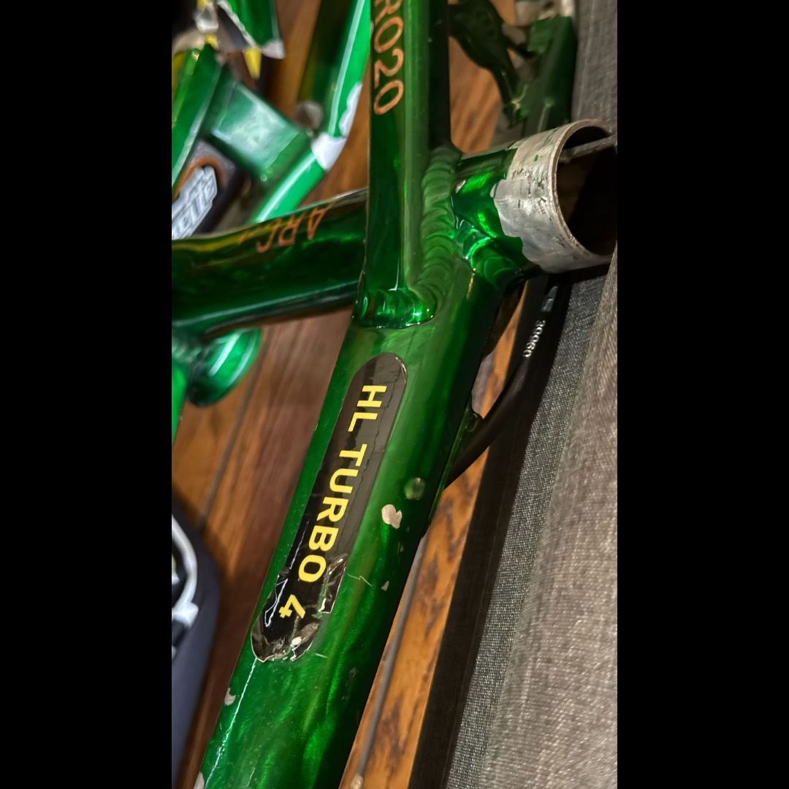

# 26.0052 — Damaged Daylight HLT4 Frame — The Last HLT4

[← 26.0038](../26-0038-harry-leary-specialized-hemi-frame-jeremy-mcgrath-signatures/) · [Harry’s Room](../../README.md) · [26.0045 →](../26-0045-ghp-cruiser-bars-with-15-plate/)

## The Workshop Bench

Frames, bars and tools.

## Artifact record

| Field | Record |
|---|---|
| Artifact ID | **26.0052** |
| Legacy ID | None recorded |
| Record type | bicycle frame |
| Holding status | Current holding as presented in the supplied LititzBMX.com collection pages |
| Room location | The Workshop Bench |
| Claim status | collection-attributed |
| People | Harry Leary |
| Organizations / brands | Daylight |

## Interpretive note

A damaged metallic green Daylight frame marked “HL TURBO 4,” presented by the collection as the last HLT4. Its damaged state is part of the preserved record rather than something concealed.

## Provenance summary

Presented as part of the Harry Leary Collection; acquisition detail was not supplied in this source package.

## Evidence and qualification

- The HL TURBO 4 marking and visible damage are present in the supplied image.
- “The Last HLT4” is a collection attribution; production documentation was not supplied with this release.

## Source trail

- [Original LititzBMX.com collection source B](https://sites.google.com/view/lititzbmxinventorylist/collections/the-harry-leary-collection-1/harry-leary-collection-2)
- Preserved source image: [`26-0052-damaged-daylight-hlt4-frame-last-hlt4.png`](../../source/artifact-images/26-0052-damaged-daylight-hlt4-frame-last-hlt4.png)

## Related objects in Harry’s Room

- [26.0038 — Harry Leary Specialized Hemi Frame Signed Twice by Jeremy McGrath](../26-0038-harry-leary-specialized-hemi-frame-jeremy-mcgrath-signatures/)
- [26.0045 — GHP Cruiser Bars with “15” Plate](../26-0045-ghp-cruiser-bars-with-15-plate/)
- [26.0046 — Harry Leary’s Toolbox](../26-0046-harry-leary-toolbox/)

---

[← 26.0038](../26-0038-harry-leary-specialized-hemi-frame-jeremy-mcgrath-signatures/) · [Harry’s Room](../../README.md) · [26.0045 →](../26-0045-ghp-cruiser-bars-with-15-plate/)
