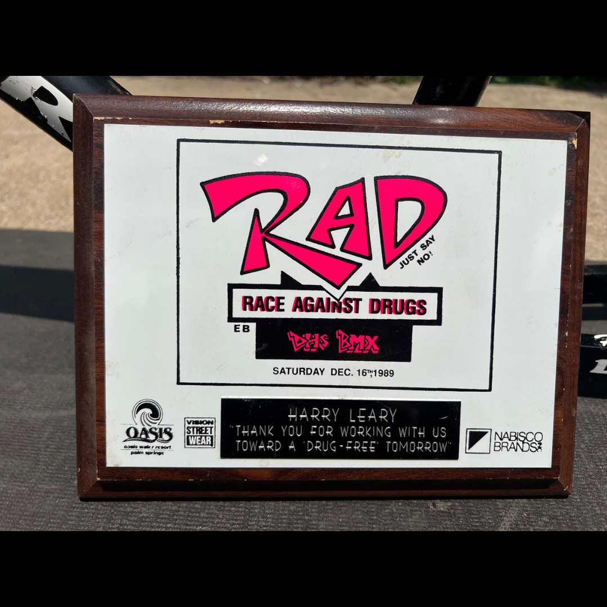

# 26.0053 — Race Against Drugs “Harry Leary” Plaque

[← 26.0028](../26-0028-2000-aba-third-place-vet-pro-plaque/) · [Harry’s Room](../../README.md) · [26.0034 →](../26-0034-2003-world-4-stroke-mx-championship-second-place-award/)

## The Trophy Case

Championships, recognition and public service.

## Artifact record

| Field | Record |
|---|---|
| Artifact ID | **26.0053** |
| Legacy ID | None recorded |
| Record type | plaque |
| Holding status | Current holding as presented in the supplied LititzBMX.com collection pages |
| Room location | The Trophy Case |
| Claim status | inscription-supported |
| People | Harry Leary |
| Organizations / brands | RAD — Race Against Drugs, OASIS, Nabisco Brands |

## Interpretive note

A framed RAD plaque dated Saturday, December 16, 1989. Its inscription thanks Harry Leary for working toward a drug-free tomorrow, preserving a public-service dimension of his story.

## Provenance summary

Presented as part of the Harry Leary Collection; acquisition detail was not supplied in this source package.

## Evidence and qualification

- The physical plaque reads “RACE AGAINST DRUGS.” The Google Sites caption used “Racers Against Drugs”; both forms are preserved.
- The source caption used “Article ID” rather than “Artifact ID.” The archive normalizes the field name while documenting the original typo.

## Source trail

- [Original LititzBMX.com collection source A](https://sites.google.com/view/lititzbmxinventorylist/collections/the-harry-leary-collection-1)
- Preserved source image: [`26-0053-race-against-drugs-harry-leary-plaque.png`](../../source/artifact-images/26-0053-race-against-drugs-harry-leary-plaque.png)

## Related objects in Harry’s Room

- [26.0037 — Cactus Park BMX State Qualifier “1st” Place Radical Rick Plaque](../26-0037-cactus-park-state-qualifier-radical-rick-plaque/)
- [26.0036 — Dottie Ellis-Merki Letter and DIRTWERX Decal](../26-0036-dottie-ellis-merki-letter-and-dirtwerx-decal/)
- [26.0065 — Photograph of Harry Leary and Eddy King at the NORA Cup](../26-0065-harry-leary-eddy-king-nora-cup-photograph/)

---

[← 26.0028](../26-0028-2000-aba-third-place-vet-pro-plaque/) · [Harry’s Room](../../README.md) · [26.0034 →](../26-0034-2003-world-4-stroke-mx-championship-second-place-award/)
