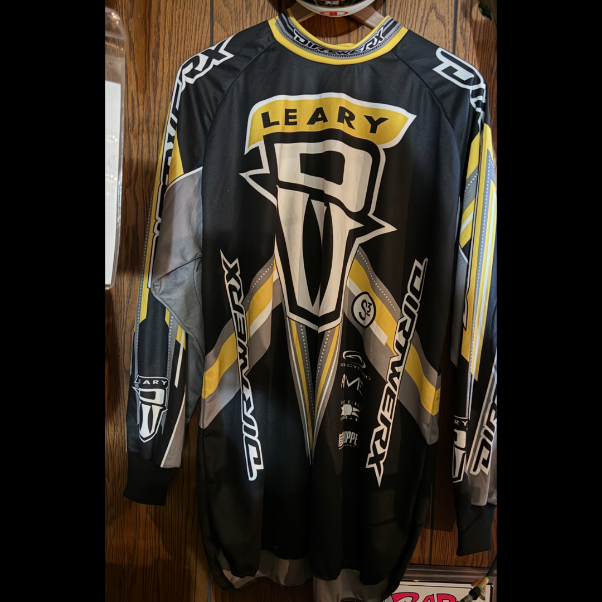

# 26.0063 — Harry Leary DIRTWERX Jersey

[← 26.0025](../26-0025-harry-leary-fasthouse-4-jersey/) · [Harry’s Room](../../README.md) · [26.0039 →](../26-0039-harry-leary-honda-jersey/)

## The Rider’s Wardrobe

Jerseys, helmets and race identity.

## Artifact record

| Field | Record |
|---|---|
| Artifact ID | **26.0063** |
| Legacy ID | None recorded |
| Record type | jersey |
| Holding status | Current holding as presented in the supplied LititzBMX.com collection pages |
| Room location | The Rider’s Wardrobe |
| Claim status | source-supported |
| People | Harry Leary |
| Organizations / brands | DIRTWERX |

## Interpretive note

A black, gray, yellow and white DIRTWERX jersey marked “LEARY.” It is a wearable link between Harry’s Room and the broader Operation DIRTWERX preservation record.

## Provenance summary

From the Leary Locker, as documented in the Digital Jersey Wall record.

## Evidence and qualification

- The rider name and DIRTWERX graphics are visible in the supplied image.

## Source trail

- [Original LititzBMX.com collection source B](https://sites.google.com/view/lititzbmxinventorylist/collections/the-harry-leary-collection-1/harry-leary-collection-2)
- Preserved source image: [`26-0063-harry-leary-dirtwerx-jersey.png`](../../source/artifact-images/26-0063-harry-leary-dirtwerx-jersey.png)

## Cross-collection record

- [Digital Jersey Wall record for 26.0063](../../../jersey-collection/records/26-0063-harry-leary-dirtwerx-jersey/)

## Related objects in Harry’s Room

- [26.0062 — Harry Leary “Harry” DIRTWERX Helmet](../26-0062-harry-leary-dirtwerx-helmet/)
- [26.0036 — Dottie Ellis-Merki Letter and DIRTWERX Decal](../26-0036-dottie-ellis-merki-letter-and-dirtwerx-decal/)
- [26.0025 — Harry Leary Fasthouse “4” Jersey](../26-0025-harry-leary-fasthouse-4-jersey/)

## Related archive

- [#OperationDIRTWERX — The Story](../../../../campaigns/operation-dirtwerx/)

---

[← 26.0025](../26-0025-harry-leary-fasthouse-4-jersey/) · [Harry’s Room](../../README.md) · [26.0039 →](../26-0039-harry-leary-honda-jersey/)
