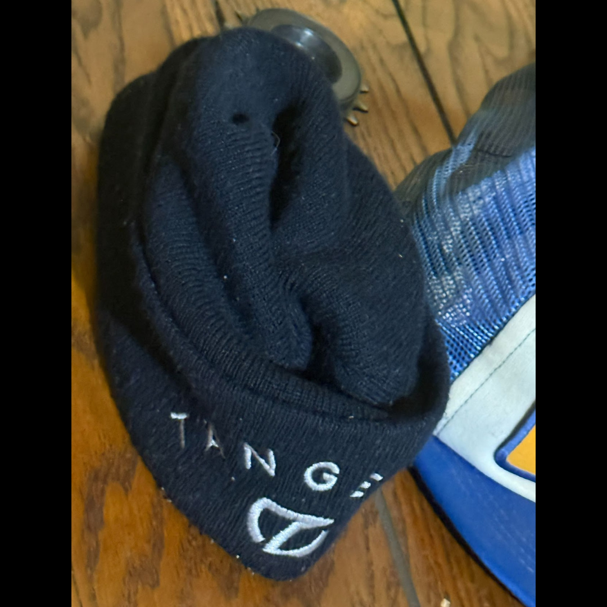

# 26.0064 — Tangent Beanie — “Smells Like Harry”

[← 26.0039](../26-0039-harry-leary-honda-jersey/) · [Harry’s Room](../../README.md) · [26.0040 →](../26-0040-harry-leary-gt-judge-lanyard/)

## The Rider’s Wardrobe

Jerseys, helmets and race identity.

## Artifact record

| Field | Record |
|---|---|
| Artifact ID | **26.0064** |
| Legacy ID | None recorded |
| Record type | beanie |
| Holding status | Current holding as presented in the supplied LititzBMX.com collection pages |
| Room location | The Rider’s Wardrobe |
| Claim status | collection-attributed |
| People | Harry Leary |
| Organizations / brands | Tangent |

## Interpretive note

A worn Tangent beanie retained as a personal-material record. The supplied collection title includes the sensory and intimate note “Smells like Harry,” preserving the curator’s original description.

## Provenance summary

Presented as part of the Harry Leary Collection; acquisition detail was not supplied in this source package.

## Evidence and qualification

- “Smells like Harry” is preserved as the collection’s descriptive wording, not presented as an independently verifiable material finding.

## Source trail

- [Original LititzBMX.com collection source B](https://sites.google.com/view/lititzbmxinventorylist/collections/the-harry-leary-collection-1/harry-leary-collection-2)
- Preserved source image: [`26-0064-tangent-beanie-smells-like-harry.png`](../../source/artifact-images/26-0064-tangent-beanie-smells-like-harry.png)

## Related objects in Harry’s Room

- [26.0039 — Harry Leary’s Honda Jersey](../26-0039-harry-leary-honda-jersey/)
- [26.0040 — Harry Leary GT Judge Lanyard](../26-0040-harry-leary-gt-judge-lanyard/)
- [26.0062 — Harry Leary “Harry” DIRTWERX Helmet](../26-0062-harry-leary-dirtwerx-helmet/)

---

[← 26.0039](../26-0039-harry-leary-honda-jersey/) · [Harry’s Room](../../README.md) · [26.0040 →](../26-0040-harry-leary-gt-judge-lanyard/)
