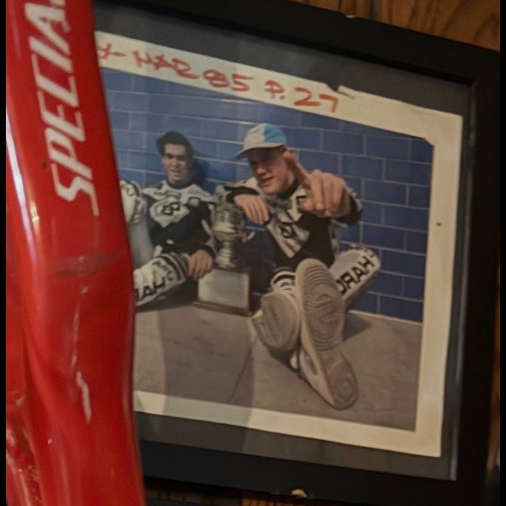

# 26.0065 — Photograph of Harry Leary and Eddy King at the NORA Cup

[← 26.0036](../26-0036-dottie-ellis-merki-letter-and-dirtwerx-decal/) · [Harry’s Room](../../README.md) · [26.0051 →](../26-0051-linda-and-harry-leary-signed-copy/)

## The Memory Wall

Correspondence, photographs and relationships.

## Artifact record

| Field | Record |
|---|---|
| Artifact ID | **26.0065** |
| Legacy ID | None recorded |
| Record type | photograph |
| Holding status | Current holding as presented in the supplied LititzBMX.com collection pages |
| Room location | The Memory Wall |
| Claim status | collection-attributed |
| People | Harry Leary, Eddy King |
| Organizations / brands | BMX Action NORA Cup |

## Interpretive note

A framed photograph identified by the collection as Harry Leary and Eddy King on the occasion when Eddy King won the NORA Cup. It preserves a shared moment rather than a solitary achievement.

## Provenance summary

Presented as part of the Harry Leary Collection; acquisition detail was not supplied in this source package.

## Evidence and qualification

- The identities and NORA Cup event context are preserved from the supplied collection caption.
- No independent event-date or photograph-authentication documentation was supplied with this release.

## Source trail

- [Original LititzBMX.com collection source A](https://sites.google.com/view/lititzbmxinventorylist/collections/the-harry-leary-collection-1)
- Preserved source image: [`26-0065-harry-leary-eddy-king-nora-cup-photograph.png`](../../source/artifact-images/26-0065-harry-leary-eddy-king-nora-cup-photograph.png)

## Related objects in Harry’s Room

- [26.0051 — Linda and Harry Leary Signed Copy](../26-0051-linda-and-harry-leary-signed-copy/)
- [26.0036 — Dottie Ellis-Merki Letter and DIRTWERX Decal](../26-0036-dottie-ellis-merki-letter-and-dirtwerx-decal/)
- [26.0053 — Race Against Drugs “Harry Leary” Plaque](../26-0053-race-against-drugs-harry-leary-plaque/)

---

[← 26.0036](../26-0036-dottie-ellis-merki-letter-and-dirtwerx-decal/) · [Harry’s Room](../../README.md) · [26.0051 →](../26-0051-linda-and-harry-leary-signed-copy/)
