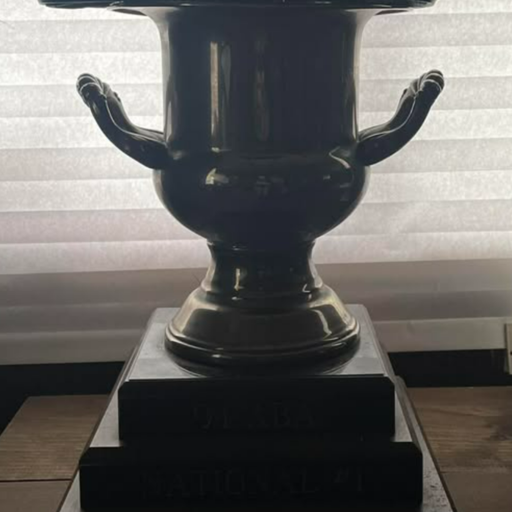

# 26.0067 — 1994 ABA Vet Pro Title Trophy

[Harry’s Room](../../README.md) · [26.0037 →](../26-0037-cactus-park-state-qualifier-radical-rick-plaque/)

## The Trophy Case

Championships, recognition and public service.

## Artifact record

| Field | Record |
|---|---|
| Artifact ID | **26.0067** |
| Legacy ID | 67 |
| Record type | trophy |
| Holding status | Current holding as presented in the supplied LititzBMX.com collection pages |
| Room location | The Trophy Case |
| Claim status | collection-attributed |
| People | Harry Leary |
| Organizations / brands | American Bicycle Association (ABA) |

## Interpretive note

A large trophy attributed by the collection to Harry Leary’s 1994 ABA Vet Pro title. It anchors the room’s championship case and represents a major later-career achievement.

## Provenance summary

Presented as part of the Harry Leary Collection; acquisition detail was not supplied in this source package.

## Evidence and qualification

- The canonical archive identifier is normalized as 26.0067; the Google Sites source displayed the legacy identifier “67”.
- The title and winner attribution come from the supplied collection description; the low-contrast inscription is not fully legible in the source photograph.

## Source trail

- [Original LititzBMX.com collection source A](https://sites.google.com/view/lititzbmxinventorylist/collections/the-harry-leary-collection-1)
- Preserved source image: [`26-0067-1994-aba-vet-pro-title-trophy.png`](../../source/artifact-images/26-0067-1994-aba-vet-pro-title-trophy.png)

## Related objects in Harry’s Room

- [26.0037 — Cactus Park BMX State Qualifier “1st” Place Radical Rick Plaque](../26-0037-cactus-park-state-qualifier-radical-rick-plaque/)
- [26.0028 — 2000 ABA Third-Place Plaque](../26-0028-2000-aba-third-place-vet-pro-plaque/)
- [26.0033 — Supercross of BMX “Top Money Winner” Plaque](../26-0033-supercross-of-bmx-top-money-winner-plaque/)

---

[Harry’s Room](../../README.md) · [26.0037 →](../26-0037-cactus-park-state-qualifier-radical-rick-plaque/)
