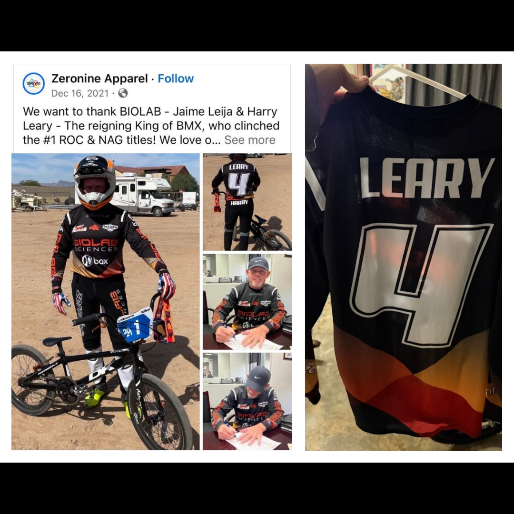

# 26.0075 — BIOLAB “Leary 4” Zeronine Jersey

[← 26.0050](../26-0050-harry-leary-fall-risk-racing-2023-number-plate-decal/) · [Harry’s Room](../../README.md) · [26.0076 →](../26-0076-biolab-harry-zeronine-pants/)

## The Rider’s Wardrobe

Jerseys, helmets and race identity.

## Artifact record

| Field | Record |
|---|---|
| Artifact ID | **26.0075** |
| Legacy ID | None recorded |
| Record type | jersey |
| Holding status | Current holding as presented in the supplied LititzBMX.com collection pages |
| Room location | The Rider’s Wardrobe |
| Claim status | source-supported |
| People | Harry Leary |
| Organizations / brands | BIOLAB Sciences, Zeronine Apparel |

## Interpretive note

A BIOLAB / Zeronine jersey marked “LEARY” and number 4. The collection pairs it with matching pants preserved as artifact 26.0076.

## Provenance summary

From the Leary Locker, as documented in the Digital Jersey Wall record.

## Evidence and qualification

- The rider name, number and BIOLAB/Zeronine design are visible in the supplied image.
- The paired-pants relationship is preserved from the supplied collection description.

## Source trail

- [Original LititzBMX.com collection source B](https://sites.google.com/view/lititzbmxinventorylist/collections/the-harry-leary-collection-1/harry-leary-collection-2)
- Preserved source image: [`26-0075-biolab-leary-4-zeronine-jersey.png`](../../source/artifact-images/26-0075-biolab-leary-4-zeronine-jersey.png)

## Cross-collection record

- [Digital Jersey Wall record for 26.0075](../../../jersey-collection/records/26-0075-biolab-leary-4-zeronine-jersey/)

## Related objects in Harry’s Room

- [26.0076 — BIOLAB “Harry” Zeronine Pants](../26-0076-biolab-harry-zeronine-pants/)
- [26.0023 — Harry Leary BIOLAB / Peak Performance ROC 1 Jersey](../26-0023-harry-leary-biolab-peak-performance-roc-1-jersey/)
- [26.0025 — Harry Leary Fasthouse “4” Jersey](../26-0025-harry-leary-fasthouse-4-jersey/)

---

[← 26.0050](../26-0050-harry-leary-fall-risk-racing-2023-number-plate-decal/) · [Harry’s Room](../../README.md) · [26.0076 →](../26-0076-biolab-harry-zeronine-pants/)
