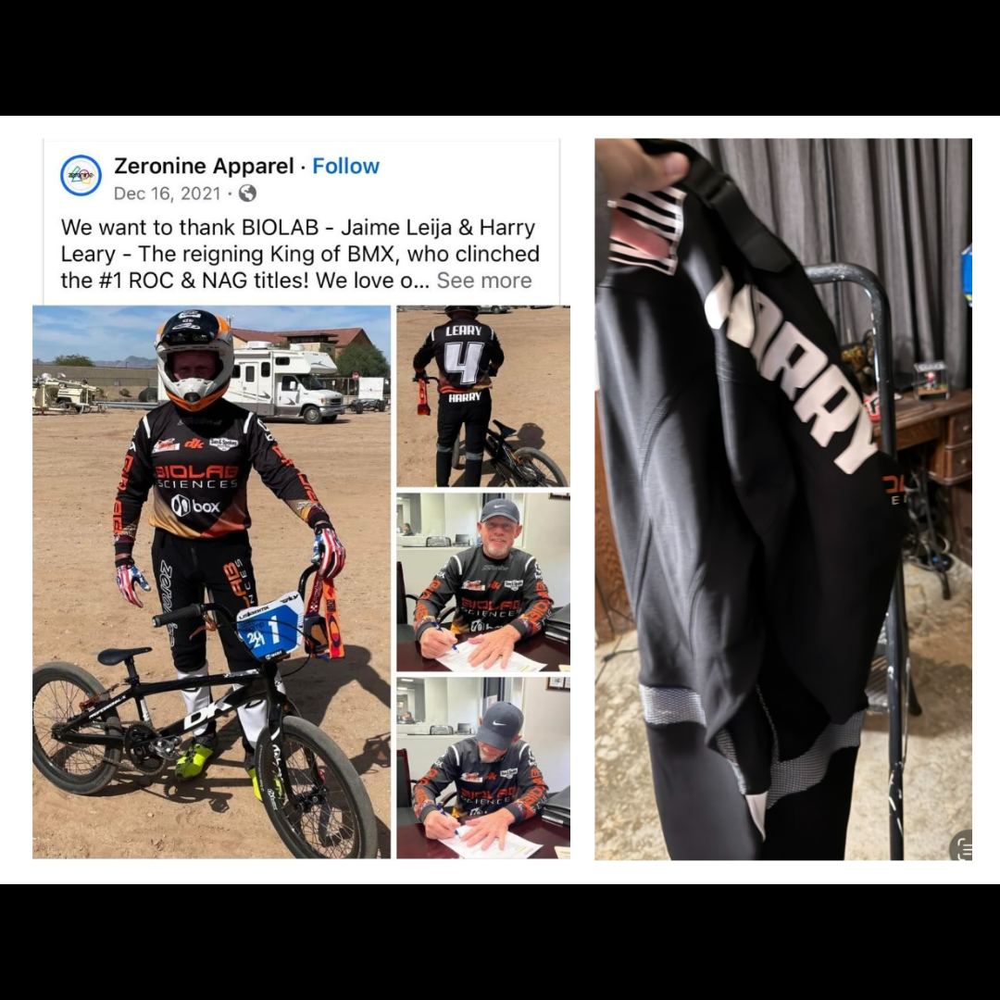

# 26.0076 — BIOLAB “Harry” Zeronine Pants

[← 26.0075](../26-0075-biolab-leary-4-zeronine-jersey/) · [Harry’s Room](../../README.md) · [26.0046 →](../26-0046-harry-leary-toolbox/)

> **Image status:** Context image only. A direct photograph of this artifact was not supplied for this release.

## The Rider’s Wardrobe

Jerseys, helmets and race identity.

## Artifact record

| Field | Record |
|---|---|
| Artifact ID | **26.0076** |
| Legacy ID | None recorded |
| Record type | racing pants |
| Holding status | Current holding as presented in the supplied LititzBMX.com collection pages |
| Room location | The Rider’s Wardrobe |
| Claim status | collection-attributed |
| People | Harry Leary |
| Organizations / brands | BIOLAB Sciences, Zeronine Apparel |

## Interpretive note

Matching BIOLAB / Zeronine racing pants paired by the collection with jersey 26.0075. The record is preserved now even though a direct photograph of the pants was not supplied.

## Provenance summary

Presented as part of the Harry Leary Collection; acquisition detail was not supplied in this source package.

## Evidence and qualification

- The supplied image is contextual and shows the matching jersey, not a direct photograph of the pants.
- A direct photograph of artifact 26.0076 remains the only image gap in this release.

## Source trail

- [Original LititzBMX.com collection source B](https://sites.google.com/view/lititzbmxinventorylist/collections/the-harry-leary-collection-1/harry-leary-collection-2)
- Preserved source image: [`26-0076-biolab-harry-zeronine-pants-context.png`](../../source/artifact-images/26-0076-biolab-harry-zeronine-pants-context.png)

## Related objects in Harry’s Room

- [26.0075 — BIOLAB “Leary 4” Zeronine Jersey](../26-0075-biolab-leary-4-zeronine-jersey/)
- [26.0023 — Harry Leary BIOLAB / Peak Performance ROC 1 Jersey](../26-0023-harry-leary-biolab-peak-performance-roc-1-jersey/)
- [26.0025 — Harry Leary Fasthouse “4” Jersey](../26-0025-harry-leary-fasthouse-4-jersey/)

---

[← 26.0075](../26-0075-biolab-leary-4-zeronine-jersey/) · [Harry’s Room](../../README.md) · [26.0046 →](../26-0046-harry-leary-toolbox/)
