# The Lititz BMX Jersey Collection
## The Digital Jersey Wall

> **Twenty-two accessioned jerseys. Five documented jerseys that continued their journey. Twenty-seven preserved records of BMX identity, sponsorship, friendship, exchange and community.**

The Lititz BMX Jersey Collection represents the evolution of BMX identity — where performance meets personality. From factory team gear to one-of-one race-worn and rider-associated pieces, these jerseys tell the stories of riders, teams, and eras that shaped the sport. Each item reflects not just competition, but culture — how BMX looked, felt, and expressed itself across generations.

**Compiled:** 2026-07-23  
**Collection version:** v1.0.0  
**Live collection:** [Lititz BMX Jersey Collection](https://sites.google.com/view/lititzbmxinventorylist/collections/jersey-collection)

## Learning note — Understanding BMX through jerseys

Jerseys are more than apparel — they represent sponsorship, identity, and progression within BMX. By studying changes in design, branding, materials, rider names, race numbers and team relationships, the collection helps trace the sport from grassroots racing to global competition.

## The accessioned wall

The permanent accession sequence is preserved below. The design follows the public collection’s three-column wall while every jersey links to a fuller artifact record.

<table>
<tr>
<td align="center" valign="top" width="33%">
 
<strong><a href="records/26-0017-autographed-dani-george-jersey/">26.0017 — Autographed Dani George Jersey</a></strong> 
<em>From the Leary Locker</em>
</td>
<td align="center" valign="top" width="33%">
<a href="records/26-0018-harry-leary-leary-81-redman-jersey/">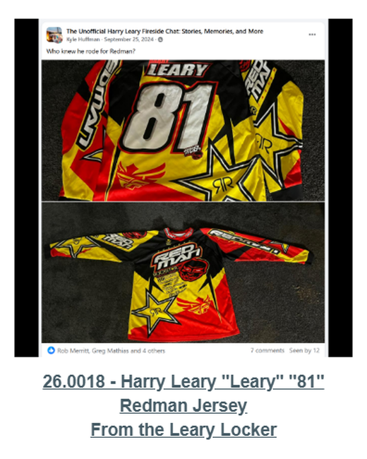</a> 
<strong><a href="records/26-0018-harry-leary-leary-81-redman-jersey/">26.0018 — Harry Leary “Leary” “81” Redman Jersey</a></strong> 
<em>From the Leary Locker</em>
</td>
<td align="center" valign="top" width="33%">
<a href="records/26-0019-connor-fields-signed-factory-misprint-jersey/">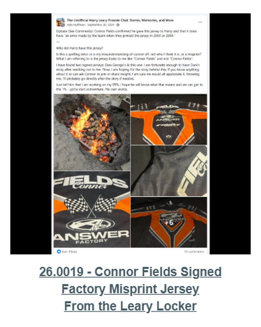</a> 
<strong><a href="records/26-0019-connor-fields-signed-factory-misprint-jersey/">26.0019 — Connor Fields Signed Factory Misprint Jersey</a></strong> 
<em>From the Leary Locker</em>
</td>
</tr>
<tr>
<td align="center" valign="top" width="33%">
<a href="records/26-0021-leary-thrill-roc-1-jersey/">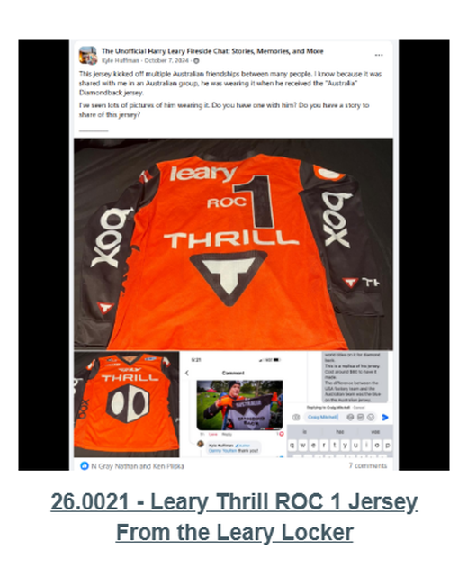</a> 
<strong><a href="records/26-0021-leary-thrill-roc-1-jersey/">26.0021 — Leary Thrill ROC 1 Jersey</a></strong> 
<em>From the Leary Locker</em>
</td>
<td align="center" valign="top" width="33%">
<a href="records/26-0022-greg-hill-ghp-jersey/">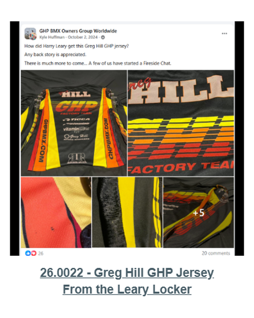</a> 
<strong><a href="records/26-0022-greg-hill-ghp-jersey/">26.0022 — Greg Hill GHP Jersey</a></strong> 
<em>From the Leary Locker</em>
</td>
<td align="center" valign="top" width="33%">
 
<strong><a href="records/26-0023-harry-leary-leary-biolab-roc-1-jersey/">26.0023 — Harry Leary “Leary” BIOLAB ROC 1 Jersey</a></strong> 
<em>From the Leary Locker</em>
</td>
</tr>
<tr>
<td align="center" valign="top" width="33%">
<a href="records/26-0024-greg-mathias-signed-team-usa-jersey/">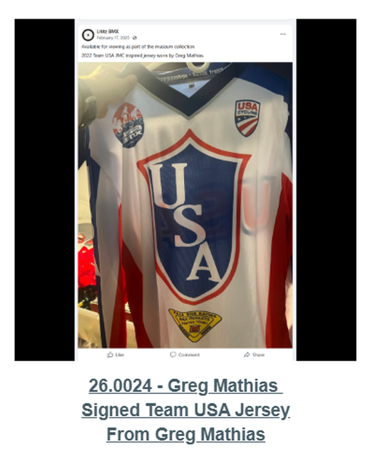</a> 
<strong><a href="records/26-0024-greg-mathias-signed-team-usa-jersey/">26.0024 — Greg Mathias Signed Team USA Jersey</a></strong> 
<em>From Greg Mathias</em>
</td>
<td align="center" valign="top" width="33%">
 
<strong><a href="records/26-0025-leary-fasthouse-4-jersey/">26.0025 — Leary Fasthouse “4” Jersey</a></strong> 
<em>From the Leary Locker</em>
</td>
<td align="center" valign="top" width="33%">
<a href="records/26-0026-ghp-jersey/">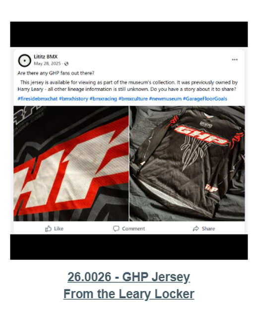</a> 
<strong><a href="records/26-0026-ghp-jersey/">26.0026 — GHP Jersey</a></strong> 
<em>From the Leary Locker</em>
</td>
</tr>
<tr>
<td align="center" valign="top" width="33%">
 
<strong><a href="records/26-0027-john-stancliff-jersey/">26.0027 — John Stancliff Jersey</a></strong> 
<em>From John Stancliff</em>
</td>
<td align="center" valign="top" width="33%">
 
<strong><a href="records/26-0035-jag-jersey/">26.0035 — JAG Jersey</a></strong> 
<em>Purchased from the BMX Museum</em>
</td>
<td align="center" valign="top" width="33%">
<a href="records/26-0063-harry-leary-dirtwerx-jersey/">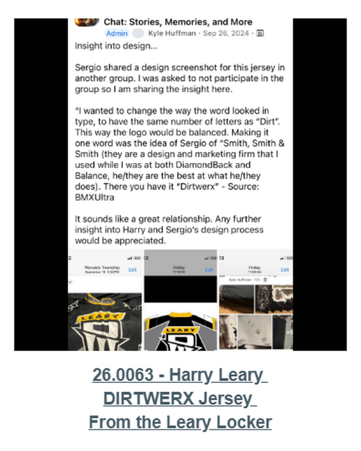</a> 
<strong><a href="records/26-0063-harry-leary-dirtwerx-jersey/">26.0063 — Harry Leary DIRTWERX Jersey</a></strong> 
<em>From the Leary Locker</em>
</td>
</tr>
<tr>
<td align="center" valign="top" width="33%">
<a href="records/26-0073-ace-jersey-given-to-harry-leary-in-australia/">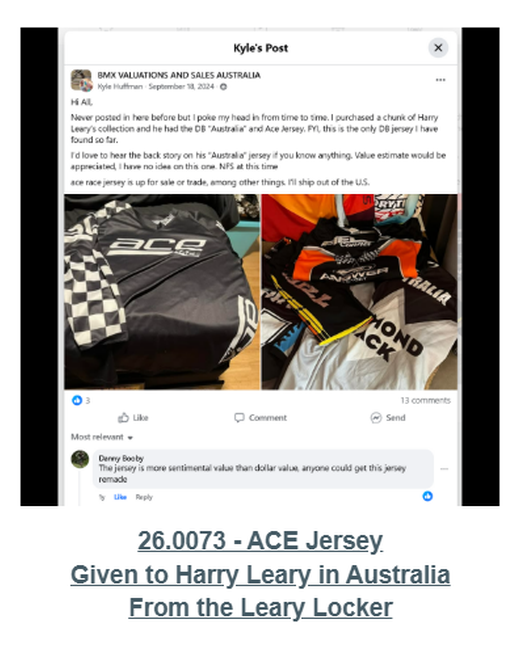</a> 
<strong><a href="records/26-0073-ace-jersey-given-to-harry-leary-in-australia/">26.0073 — ACE Jersey — Given to Harry Leary in Australia</a></strong> 
<em>From the Leary Locker</em>
</td>
<td align="center" valign="top" width="33%">
<a href="records/26-0074-peak-leary-jersey/">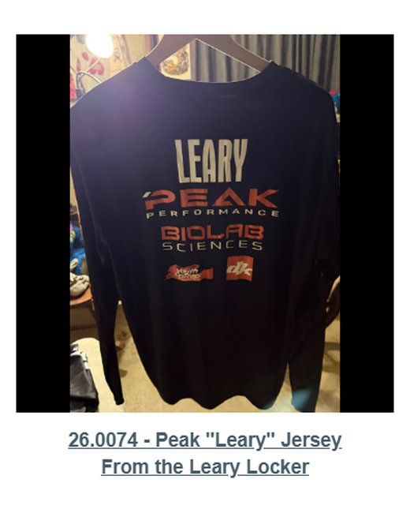</a> 
<strong><a href="records/26-0074-peak-leary-jersey/">26.0074 — Peak “Leary” Jersey</a></strong> 
<em>From the Leary Locker</em>
</td>
<td align="center" valign="top" width="33%">
<a href="records/26-0075-biolab-leary-4-zeronine-jersey/">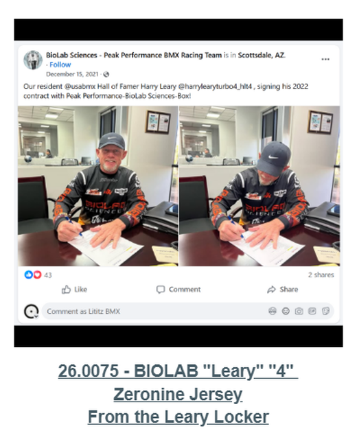</a> 
<strong><a href="records/26-0075-biolab-leary-4-zeronine-jersey/">26.0075 — BIOLAB “Leary” “4” Zeronine Jersey</a></strong> 
<em>From the Leary Locker</em>
</td>
</tr>
<tr>
<td align="center" valign="top" width="33%">
 
<strong><a href="records/26-0078-harry-leary-memorial-jersey/">26.0078 — Harry Leary Memorial Jersey</a></strong> 
<em>From Greg Mathias</em>
</td>
<td align="center" valign="top" width="33%">
<a href="records/26-0080-fall-risk-racing-leary-jersey/">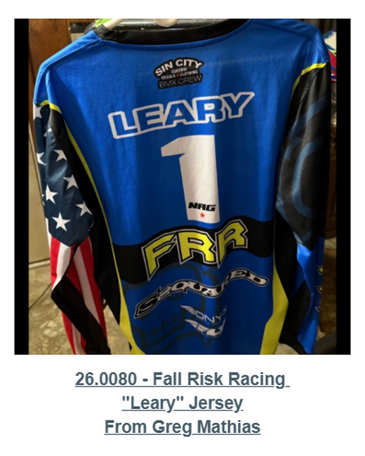</a> 
<strong><a href="records/26-0080-fall-risk-racing-leary-jersey/">26.0080 — Fall Risk Racing “Leary” Jersey</a></strong> 
<em>From Greg Mathias</em>
</td>
<td align="center" valign="top" width="33%">
<a href="records/26-0081-fall-risk-racing-mathias-jersey/">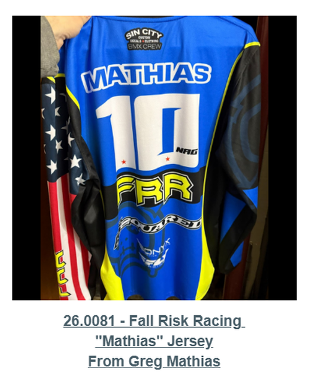</a> 
<strong><a href="records/26-0081-fall-risk-racing-mathias-jersey/">26.0081 — Fall Risk Racing “Mathias” Jersey</a></strong> 
<em>From Greg Mathias</em>
</td>
</tr>
<tr>
<td align="center" valign="top" width="33%">
 
<strong><a href="records/26-0082-specialized-jersey/">26.0082 — Specialized Jersey</a></strong> 
<em>From the Leary Locker</em>
</td>
<td align="center" valign="top" width="33%">
 
<strong><a href="records/26-0083-marzocchi-free-ride-team-jersey/">26.0083 — Marzocchi Free Ride Team Jersey</a></strong> 
<em>From the Leary Locker</em>
</td>
<td align="center" valign="top" width="33%">
 
<strong><a href="records/26-0085-auburn-jersey/">26.0085 — Auburn Jersey</a></strong> 
<em>Purchased online</em>
</td>
</tr>
<tr>
<td align="center" valign="top" width="33%">
<a href="records/26-0086-biolab-leary-25-jersey/">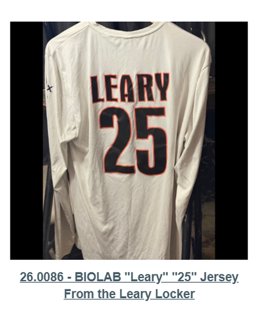</a> 
<strong><a href="records/26-0086-biolab-leary-25-jersey/">26.0086 — BIOLAB “Leary” “25” Jersey</a></strong> 
<em>From the Leary Locker</em>
</td>
<td width="33%"></td>
<td width="33%"></td>
</tr>
</table>

## Jerseys that continued their journey

These five jerseys remain part of the documentary wall but are **not presented as current Lititz BMX holdings**. Their transfers, gifts, returns and charitable use are part of the provenance story.

<table>
<tr>
<td align="center" valign="top" width="33%">
<a href="continued-journey/jer-tr-001-harry-leary-biolab-25-jersey/">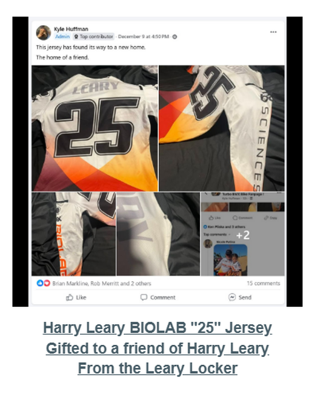</a> 
<strong><a href="continued-journey/jer-tr-001-harry-leary-biolab-25-jersey/">JER-TR-001 — Harry Leary BIOLAB “25” Jersey</a></strong> 
<em>Gifted to a friend of Harry Leary</em>
</td>
<td align="center" valign="top" width="33%">
<a href="continued-journey/jer-tr-002-harry-leary-dirtwerx-jersey/">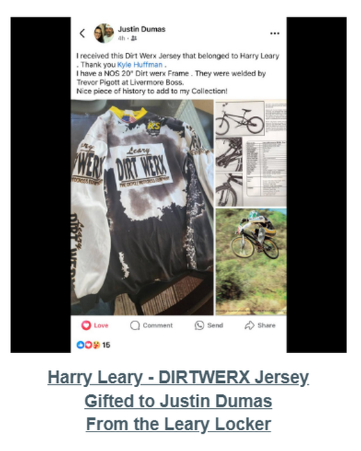</a> 
<strong><a href="continued-journey/jer-tr-002-harry-leary-dirtwerx-jersey/">JER-TR-002 — Harry Leary DIRTWERX Jersey</a></strong> 
<em>Gifted to Justin Dumas</em>
</td>
<td align="center" valign="top" width="33%">
<a href="continued-journey/jer-tr-003-harry-leary-biolab-roc-1-jersey-black-collar/">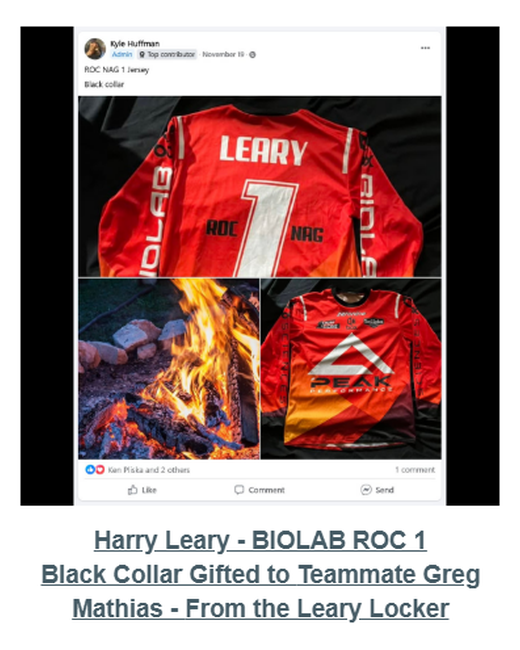</a> 
<strong><a href="continued-journey/jer-tr-003-harry-leary-biolab-roc-1-jersey-black-collar/">JER-TR-003 — Harry Leary BIOLAB ROC 1 Jersey — Black Collar</a></strong> 
<em>Gifted to teammate Greg Mathias</em>
</td>
</tr>
<tr>
<td align="center" valign="top" width="33%">
<a href="continued-journey/jer-tr-004-harry-leary-2017-team-usa-jersey/">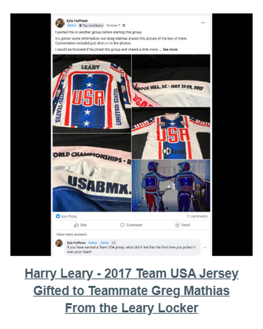</a> 
<strong><a href="continued-journey/jer-tr-004-harry-leary-2017-team-usa-jersey/">JER-TR-004 — Harry Leary 2017 Team USA Jersey</a></strong> 
<em>Gifted to teammate Greg Mathias</em>
</td>
<td align="center" valign="top" width="33%">
<a href="continued-journey/jer-tr-005-harry-leary-redman-jersey/">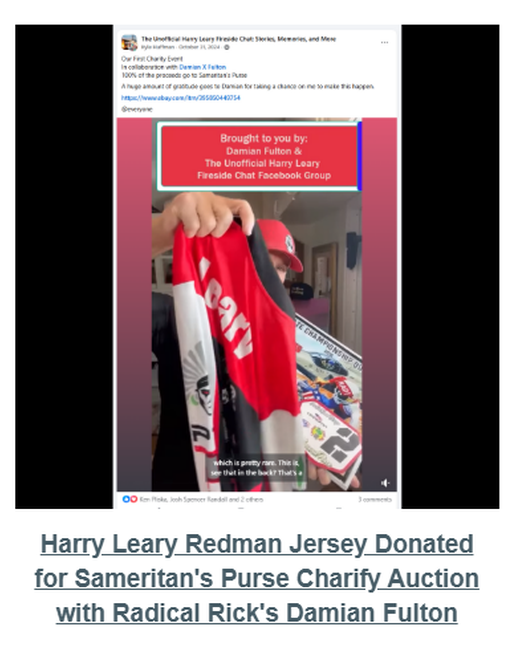</a> 
<strong><a href="continued-journey/jer-tr-005-harry-leary-redman-jersey/">JER-TR-005 — Harry Leary Redman Jersey</a></strong> 
<em>Donated for a Samaritan’s Purse charity auction with Damian Fulton</em>
</td>
<td width="33%"></td>
</tr>
</table>

## Read the wall by story

- [People and organizations index](docs/PEOPLE-ORGANIZATIONS-INDEX.md)
- [Teams and brands index](docs/TEAMS-BRANDS-INDEX.md)
- [Provenance index](docs/PROVENANCE-INDEX.md)
- [Jerseys that continued their journey](docs/CONTINUED-JOURNEY.md)
- [Known metadata discrepancies](docs/KNOWN-DISCREPANCIES.md)
- [Curatorial and claim-qualification notes](docs/CLAIM-QUALIFICATION-NOTES.md)

## Machine-readable access

- [Complete jersey register — JSON](data/jersey-register.json)
- [Complete jersey register — CSV](data/jersey-register.csv)
- [Wall groups — JSON](data/wall-groups.json)
- [JSON Schema](schema/jersey-record.schema.json)
- [Source inventory](docs/SOURCE-INVENTORY.csv)
- [Image manifest](docs/IMAGE-MANIFEST.csv)
- [SHA-256 fixity](SHA256SUMS.txt)

## Curatorial principle

The Digital Jersey Wall does not treat possession as the only form of preservation. A jersey can remain historically important after it has been returned, gifted, donated or carried into another collection. Current holdings and continued-journey records are therefore kept visibly distinct while remaining connected through provenance.

---

[← Collections](../README.md) · [Repository home](../../README.md) · [Live Lititz BMX Archive](https://lititzbmx.com)
