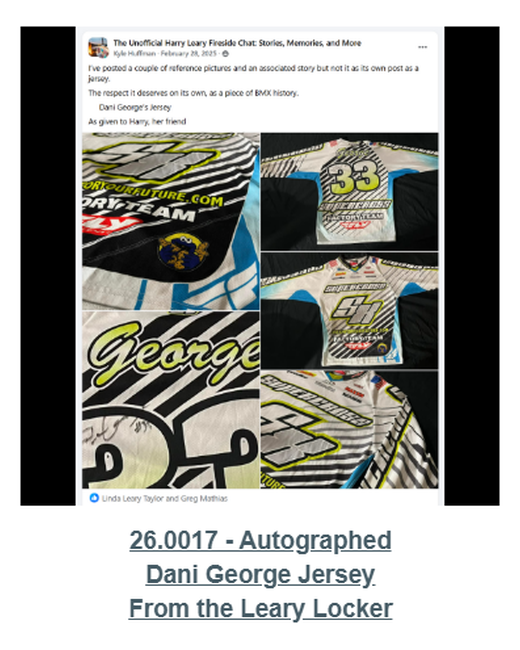
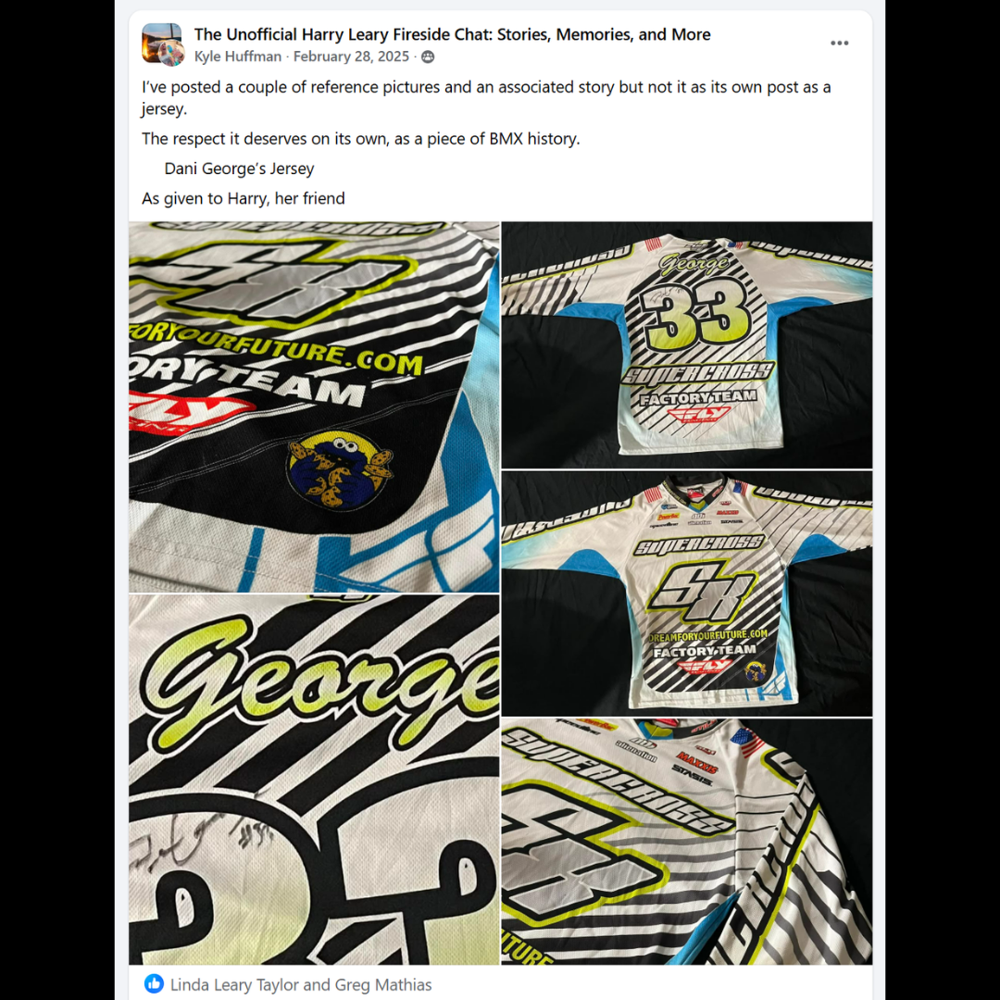

# 26.0017 — Autographed Dani George Jersey

> **CURRENT HOLDING — ACCESSIONED JERSEY**  
> This record is presented as part of the current Lititz BMX Jersey Collection.

## Museum label

**Autographed Dani George Jersey**  
*From the Leary Locker*

## Artifact record

| Field | Record |
|---|---|
| Record type | Accessioned jersey |
| Record ID | 26.0017 |
| Current wall status | Current Lititz BMX holding |
| Provenance | From the Leary Locker |
| Associated people | Dani George |
| Teams, brands & organizations | Supercross BMX |

## Why this jersey matters

Dani George is an elite BMX racer who has competed internationally and represented Supercross BMX, a performance-focused BMX racing brand founded by Bill Ryan. Riders on the Supercross team compete in major BMX racing events worldwide, helping represent the continued growth of elite women’s BMX racing.

## Additional context

Supercross BMX, founded by Bill Ryan, is known for producing high-performance BMX racing frames and supporting elite riders around the world. Athletes such as Dani George represent the continued growth and international presence of women competing at the highest levels of BMX racing.

## Evidence and source limits

- The public display title and provenance label follow the live Lititz BMX Jersey Collection and the curator-supplied record list.
- The wall-card image is a later archival access crop derived from the preserved Google Sites collection capture; the complete source page remains unchanged in `source/google-sites/`.
- Social-media captures document publication context and community research where available; they are not treated as independent certification of every statement visible within comments.

<strong>Preserved source-post evidence</strong>

## Live collection

[Open the Lititz BMX Jersey Collection on the public archive](https://sites.google.com/view/lititzbmxinventorylist/collections/jersey-collection)

---

[Digital Jersey Wall](../../README.md) · [26.0018 →](../26-0018-harry-leary-leary-81-redman-jersey/)
