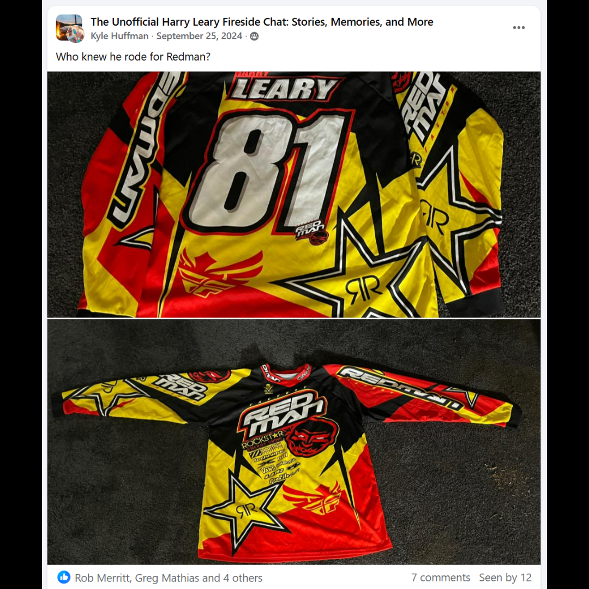

# 26.0018 — Harry Leary “Leary” “81” Redman Jersey

> **CURRENT HOLDING — ACCESSIONED JERSEY**  
> This record is presented as part of the current Lititz BMX Jersey Collection.

## Museum label

**Harry Leary “Leary” “81” Redman Jersey**  
*From the Leary Locker*

## Artifact record

| Field | Record |
|---|---|
| Record type | Accessioned jersey |
| Record ID | 26.0018 |
| Current wall status | Current Lititz BMX holding |
| Provenance | From the Leary Locker |
| Associated people | Harry Leary |
| Teams, brands & organizations | Redman BMX |

## Why this jersey matters

Redman BMX was a BMX racing brand active during the late 1970s and early 1980s. The company produced frames and racing apparel and was associated with riders such as Harry Leary, who competed on the Redman team during the early years of his career. Redman represents the era when small independent manufacturers helped shape the early development of organized BMX racing.

## Additional context

Early BMX brands such as Redman BMX were often small independent companies that supported local and regional racers during the formative years of the sport. Riders like Harry Leary helped bring visibility to these brands through competition and magazine coverage during the late 1970s and early 1980s.

## Evidence and source limits

- The public display title and provenance label follow the live Lititz BMX Jersey Collection and the curator-supplied record list.
- The wall-card image is a later archival access crop derived from the preserved Google Sites collection capture; the complete source page remains unchanged in `source/google-sites/`.
- Social-media captures document publication context and community research where available; they are not treated as independent certification of every statement visible within comments.

<strong>Preserved source-post evidence</strong>

## Live collection

[Open the Lititz BMX Jersey Collection on the public archive](https://sites.google.com/view/lititzbmxinventorylist/collections/jersey-collection)

---

[← 26.0017](../26-0017-autographed-dani-george-jersey/) · [Digital Jersey Wall](../../README.md) · [26.0019 →](../26-0019-connor-fields-signed-factory-misprint-jersey/)
