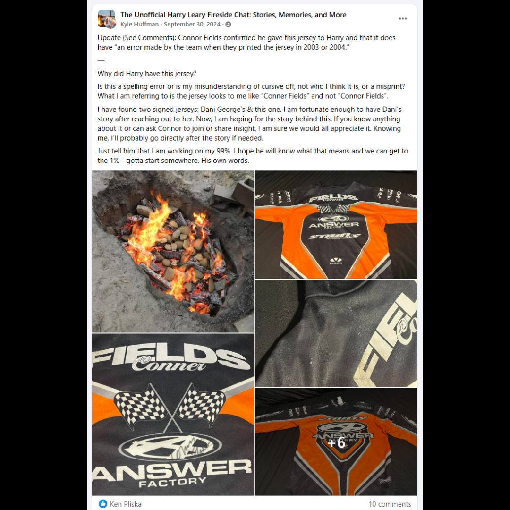

# 26.0019 — Connor Fields Signed Factory Misprint Jersey

> **CURRENT HOLDING — ACCESSIONED JERSEY**  
> This record is presented as part of the current Lititz BMX Jersey Collection.

## Museum label

**Connor Fields Signed Factory Misprint Jersey**  
*From the Leary Locker*

## Artifact record

| Field | Record |
|---|---|
| Record type | Accessioned jersey |
| Record ID | 26.0019 |
| Current wall status | Current Lititz BMX holding |
| Provenance | From the Leary Locker |
| Associated people | Connor Fields, Harry Leary |
| Teams, brands & organizations | Answer BMX |

## Why this jersey matters

This factory Answer BMX team jersey worn by Olympic champion Connor Fields is signed by the rider and carries a unique connection to BMX legend Harry Leary. The jersey was sent to Leary after he recognized it during a giveaway of items from Fields’ personal collection. The piece also features a rare factory misprint, with Fields’ name incorrectly spelled “Conner Fields,” making it a distinctive artifact linking two generations of BMX racing history.

## Additional context

This factory Answer BMX team jersey worn by Olympic champion Connor Fields is signed by the rider and carries a unique connection to BMX legend Harry Leary. The jersey was sent to Leary after he recognized it during a giveaway of items from Fields’ personal collection. The piece also features a rare factory misprint, with Fields’ name incorrectly spelled “Conner Fields,” making it a distinctive artifact linking two generations of BMX racing history.

## Evidence and source limits

- The public display title and provenance label follow the live Lititz BMX Jersey Collection and the curator-supplied record list.
- The wall-card image is a later archival access crop derived from the preserved Google Sites collection capture; the complete source page remains unchanged in `source/google-sites/`.
- Social-media captures document publication context and community research where available; they are not treated as independent certification of every statement visible within comments.

<strong>Preserved source-post evidence</strong>

## Live collection

[Open the Lititz BMX Jersey Collection on the public archive](https://sites.google.com/view/lititzbmxinventorylist/collections/jersey-collection)

---

[← 26.0018](../26-0018-harry-leary-leary-81-redman-jersey/) · [Digital Jersey Wall](../../README.md) · [26.0021 →](../26-0021-leary-thrill-roc-1-jersey/)
