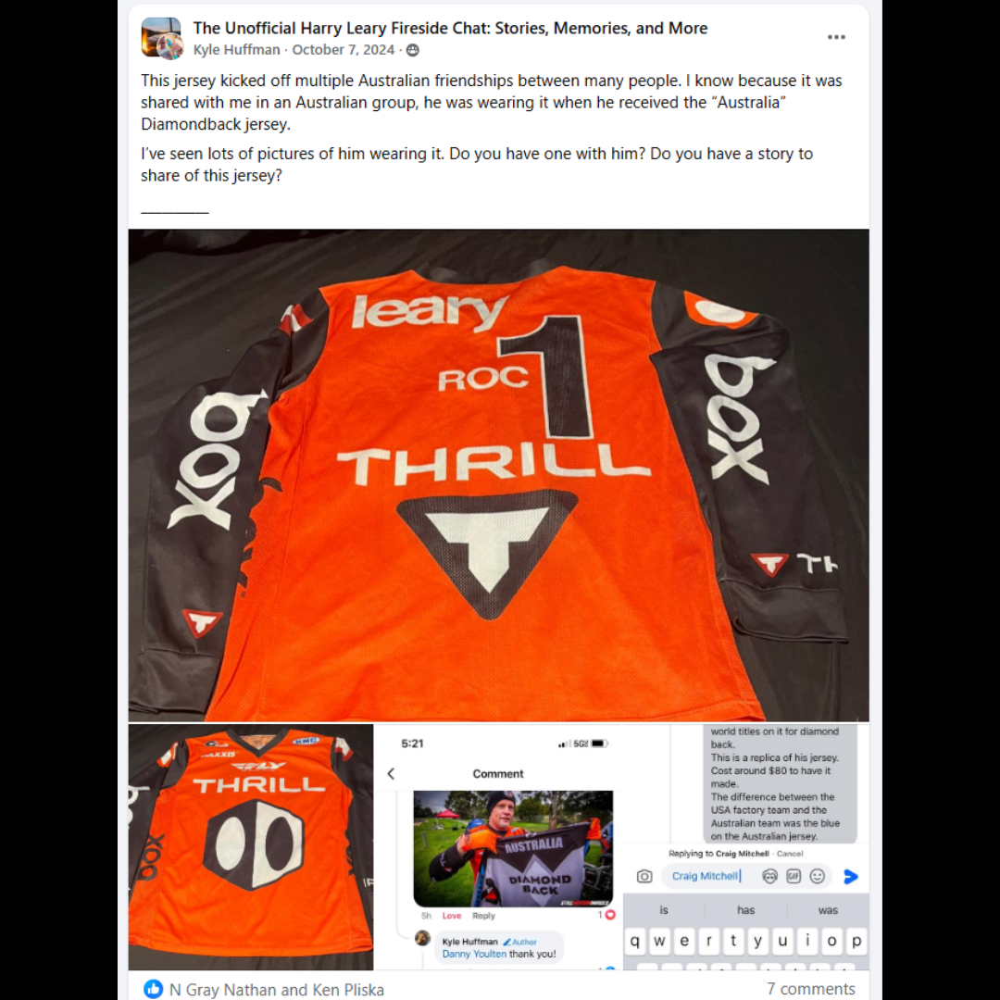

# 26.0021 — Leary Thrill ROC 1 Jersey

> **CURRENT HOLDING — ACCESSIONED JERSEY**  
> This record is presented as part of the current Lititz BMX Jersey Collection.

## Museum label

**Leary Thrill ROC 1 Jersey**  
*From the Leary Locker*

## Artifact record

| Field | Record |
|---|---|
| Record type | Accessioned jersey |
| Record ID | 26.0021 |
| Current wall status | Current Lititz BMX holding |
| Provenance | From the Leary Locker |
| Associated people | Harry Leary |
| Teams, brands & organizations | Thrill, Race of Champions |

## Why this jersey matters

This Thrill ROC #1 jersey was worn by BMX legend Harry Leary during his racing career. Jerseys like this represent the factory team identity and rider branding that helped define BMX racing culture during the sport’s early years.

## Additional context

The ROC #1 designation refers to the Race of Champions, one of the most prestigious events in BMX racing, where riders compete for the title against top competitors from across the sport. Winning the ROC allows the rider to carry the #1 plate designation, marking them as the event champion.

## Evidence and source limits

- The public display title and provenance label follow the live Lititz BMX Jersey Collection and the curator-supplied record list.
- The wall-card image is a later archival access crop derived from the preserved Google Sites collection capture; the complete source page remains unchanged in `source/google-sites/`.
- Social-media captures document publication context and community research where available; they are not treated as independent certification of every statement visible within comments.

<strong>Preserved source-post evidence</strong>

## Live collection

[Open the Lititz BMX Jersey Collection on the public archive](https://sites.google.com/view/lititzbmxinventorylist/collections/jersey-collection)

---

[← 26.0019](../26-0019-connor-fields-signed-factory-misprint-jersey/) · [Digital Jersey Wall](../../README.md) · [26.0022 →](../26-0022-greg-hill-ghp-jersey/)
