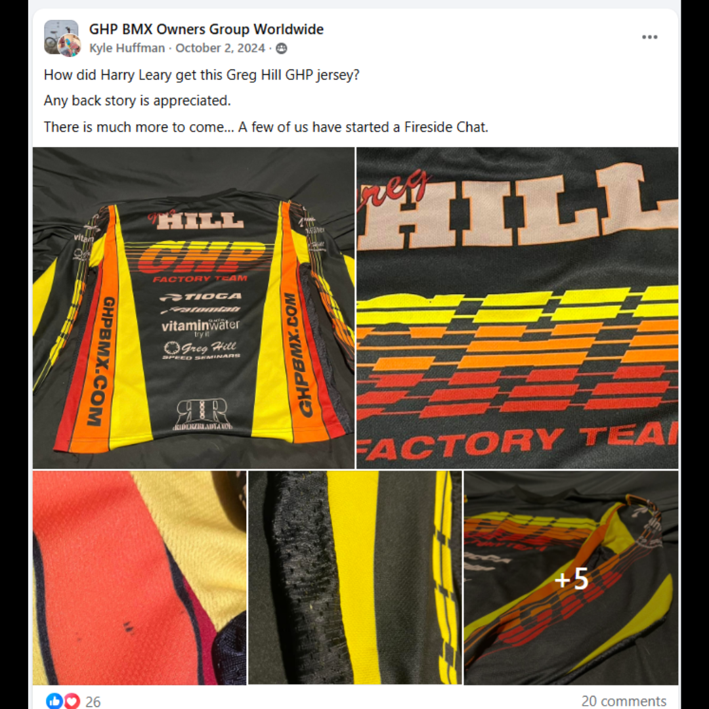

# 26.0022 — Greg Hill GHP Jersey

> **CURRENT HOLDING — ACCESSIONED JERSEY**  
> This record is presented as part of the current Lititz BMX Jersey Collection.

## Museum label

**Greg Hill GHP Jersey**  
*From the Leary Locker*

## Artifact record

| Field | Record |
|---|---|
| Record type | Accessioned jersey |
| Record ID | 26.0022 |
| Current wall status | Current Lititz BMX holding |
| Provenance | From the Leary Locker |
| Associated people | Greg Hill, Harry Leary |
| Teams, brands & organizations | GHP |

## Why this jersey matters

This GHP team jersey represents BMX champion Greg Hill and his brand Greg Hill Products (GHP). Hill was one of the most dominant BMX racers of the 1980s, winning multiple national titles and later founding GHP to produce BMX racing frames and equipment. Jerseys like this reflect the transition of elite riders into brand builders within the BMX industry.

## Additional context

GHP equipment and team apparel became closely associated with competitive BMX racing during the late 1980s and early 1990s, reflecting the influence of rider-driven companies within the sport.

## Evidence and source limits

- The public display title and provenance label follow the live Lititz BMX Jersey Collection and the curator-supplied record list.
- The wall-card image is a later archival access crop derived from the preserved Google Sites collection capture; the complete source page remains unchanged in `source/google-sites/`.
- Social-media captures document publication context and community research where available; they are not treated as independent certification of every statement visible within comments.

<strong>Preserved source-post evidence</strong>

## Live collection

[Open the Lititz BMX Jersey Collection on the public archive](https://sites.google.com/view/lititzbmxinventorylist/collections/jersey-collection)

---

[← 26.0021](../26-0021-leary-thrill-roc-1-jersey/) · [Digital Jersey Wall](../../README.md) · [26.0023 →](../26-0023-harry-leary-leary-biolab-roc-1-jersey/)
