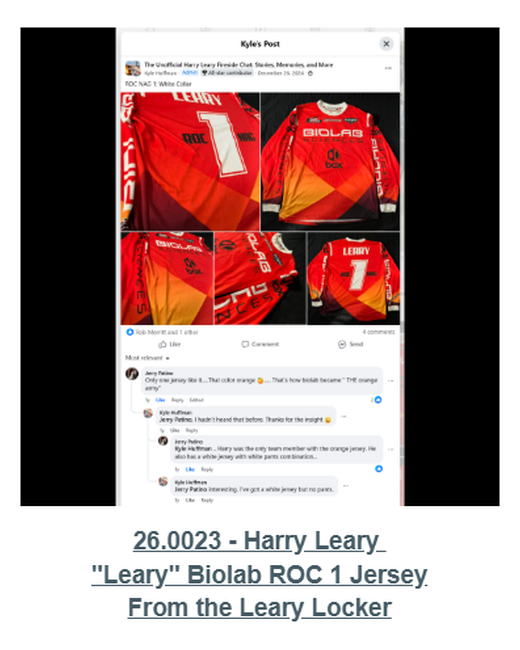
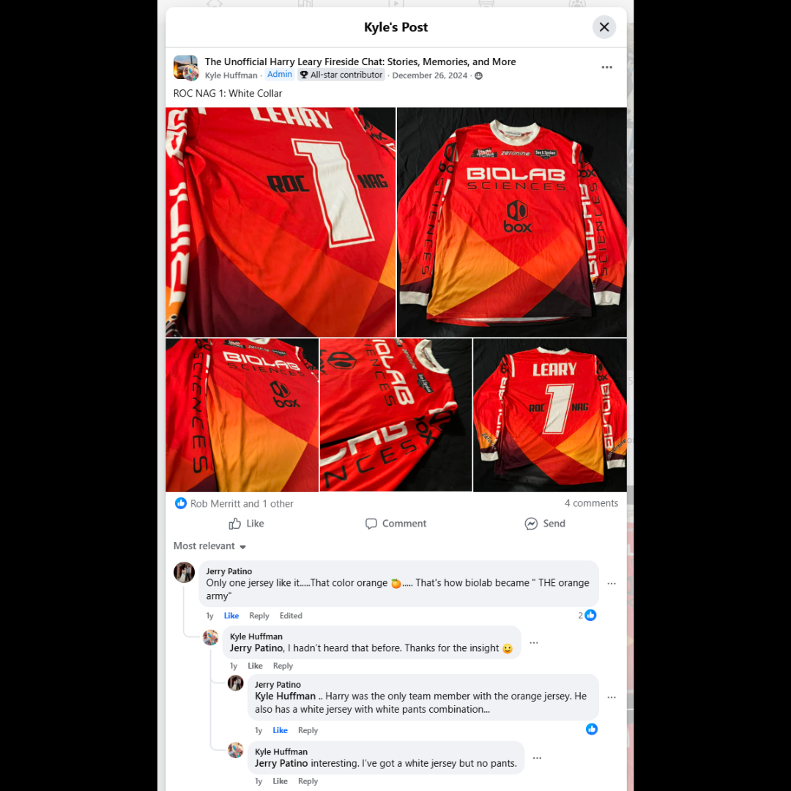

# 26.0023 — Harry Leary “Leary” BIOLAB ROC 1 Jersey

> **CURRENT HOLDING — ACCESSIONED JERSEY**  
> This record is presented as part of the current Lititz BMX Jersey Collection.

## Museum label

**Harry Leary “Leary” BIOLAB ROC 1 Jersey**  
*From the Leary Locker*

## Artifact record

| Field | Record |
|---|---|
| Record type | Accessioned jersey |
| Record ID | 26.0023 |
| Current wall status | Current Lititz BMX holding |
| Provenance | From the Leary Locker |
| Associated people | Harry Leary |
| Teams, brands & organizations | BIOLAB Sciences, Peak Performance, Race of Champions |

## Why this jersey matters

This BIOLAB ROC #1 jersey was worn by BMX pioneer Harry Leary during his racing career. Sponsored by BIOLAB/PEAK PERFORMANCE, jerseys like this represent the factory team sponsorships that became a key part of BMX racing during the sport’s early competitive years.

## Additional context

The red jersey color reflects the ROC championship designation, a tradition influenced by motocross where the #1 rider often wore red to signify championship status. Early BMX racing borrowed many visual and cultural elements from motocross, including champion colors and race presentation.

## Evidence and source limits

- The public display title and provenance label follow the live Lititz BMX Jersey Collection and the curator-supplied record list.
- The wall-card image is a later archival access crop derived from the preserved Google Sites collection capture; the complete source page remains unchanged in `source/google-sites/`.
- Social-media captures document publication context and community research where available; they are not treated as independent certification of every statement visible within comments.

<strong>Preserved source-post evidence</strong>

## Live collection

[Open the Lititz BMX Jersey Collection on the public archive](https://sites.google.com/view/lititzbmxinventorylist/collections/jersey-collection)

---

[← 26.0022](../26-0022-greg-hill-ghp-jersey/) · [Digital Jersey Wall](../../README.md) · [26.0024 →](../26-0024-greg-mathias-signed-team-usa-jersey/)
