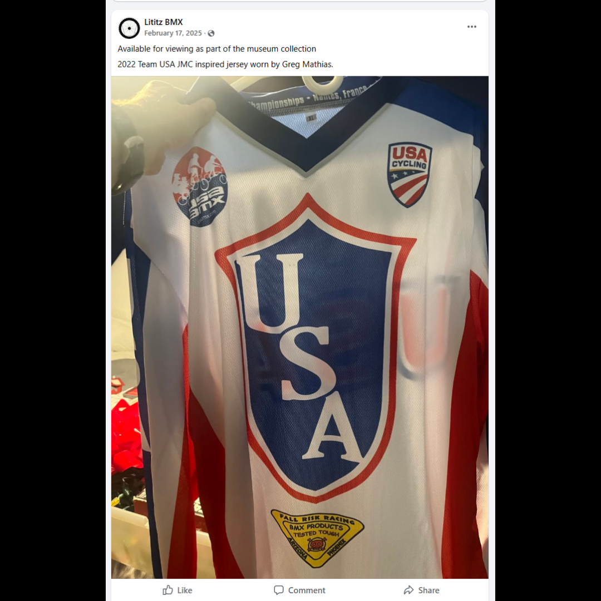

# 26.0024 — Greg Mathias Signed Team USA Jersey

> **CURRENT HOLDING — ACCESSIONED JERSEY**  
> This record is presented as part of the current Lititz BMX Jersey Collection.

## Museum label

**Greg Mathias Signed Team USA Jersey**  
*From Greg Mathias*

## Artifact record

| Field | Record |
|---|---|
| Record type | Accessioned jersey |
| Record ID | 26.0024 |
| Current wall status | Current Lititz BMX holding |
| Provenance | From Greg Mathias |
| Associated people | Greg Mathias |
| Teams, brands & organizations | Team USA, USA BMX, JMC Racing |

## Why this jersey matters

This Team USA jersey signed by Greg Mathias features a design inspired by the classic JMC Racing style associated with Mathias during his BMX racing career. Mathias was one of the top BMX racers of the early 1980s, and memorabilia like this jersey reflects his contributions to the sport and the enduring influence of the JMC brand in BMX racing history.

## Additional context

"USA BMX is stoked to reveal this year's Team USA jersey, which is a direct nod to the patriotic look of an iconic American BMX brand - JMC Racing ... specifically, with a salute to the stylish BMX Hall of Famer from Oregon, Darrell Young.

These jerseys will be worn by American racers attending the UCI World Championships in Nantes, France - held during July 26-31, 2022. Traditionally, at the end of each Worlds, attendees trade their jerseys with fellow competitors from other countries - and U.S. jerseys are always a much sought-after item. 

For those curious on their BMX history, research Team USA's classic look by googling JMC and Darrell Young. All of us hope to see this year's squad channel their inner-DY, and not only be as fast as him, but just as smooth."

## Evidence and source limits

- The public display title and provenance label follow the live Lititz BMX Jersey Collection and the curator-supplied record list.
- The wall-card image is a later archival access crop derived from the preserved Google Sites collection capture; the complete source page remains unchanged in `source/google-sites/`.
- Social-media captures document publication context and community research where available; they are not treated as independent certification of every statement visible within comments.

<strong>Preserved source-post evidence</strong>

## Live collection

[Open the Lititz BMX Jersey Collection on the public archive](https://sites.google.com/view/lititzbmxinventorylist/collections/jersey-collection)

---

[← 26.0023](../26-0023-harry-leary-leary-biolab-roc-1-jersey/) · [Digital Jersey Wall](../../README.md) · [26.0025 →](../26-0025-leary-fasthouse-4-jersey/)
