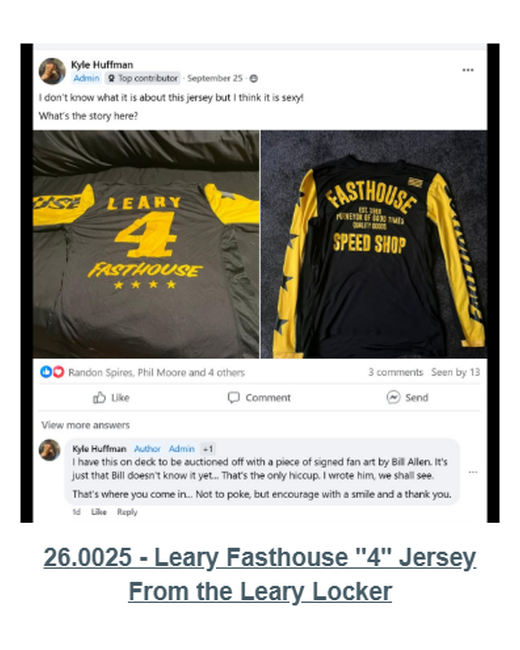
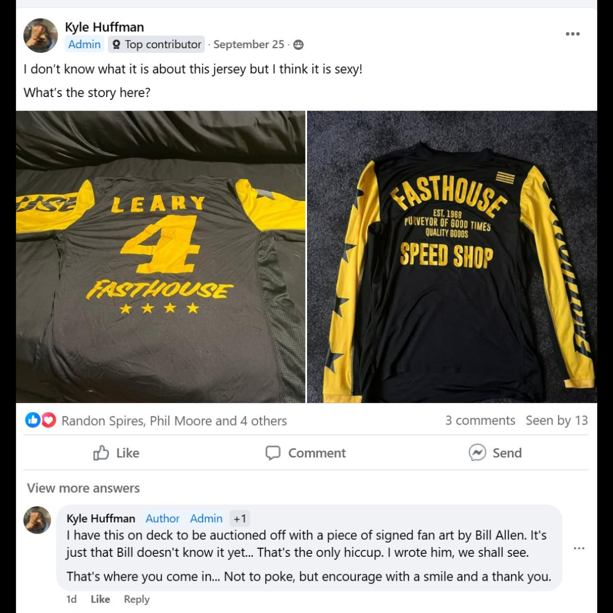

# 26.0025 — Leary Fasthouse “4” Jersey

> **CURRENT HOLDING — ACCESSIONED JERSEY**  
> This record is presented as part of the current Lititz BMX Jersey Collection.

## Museum label

**Leary Fasthouse “4” Jersey**  
*From the Leary Locker*

## Artifact record

| Field | Record |
|---|---|
| Record type | Accessioned jersey |
| Record ID | 26.0025 |
| Current wall status | Current Lititz BMX holding |
| Provenance | From the Leary Locker |
| Associated people | Harry Leary |
| Teams, brands & organizations | Fasthouse |

## Why this jersey matters

This Fasthouse jersey represents BMX pioneer Harry Leary and reflects the continued recognition of Leary’s legacy within BMX culture. Produced by Fasthouse, jerseys like this celebrate the influence of early BMX legends whose riding helped shape the sport’s development.

## Additional context

Fasthouse is a California motorsports apparel brand inspired by vintage motocross and BMX racing culture.

## Evidence and source limits

- The public display title and provenance label follow the live Lititz BMX Jersey Collection and the curator-supplied record list.
- The wall-card image is a later archival access crop derived from the preserved Google Sites collection capture; the complete source page remains unchanged in `source/google-sites/`.
- Social-media captures document publication context and community research where available; they are not treated as independent certification of every statement visible within comments.

<strong>Preserved source-post evidence</strong>

## Live collection

[Open the Lititz BMX Jersey Collection on the public archive](https://sites.google.com/view/lititzbmxinventorylist/collections/jersey-collection)

---

[← 26.0024](../26-0024-greg-mathias-signed-team-usa-jersey/) · [Digital Jersey Wall](../../README.md) · [26.0026 →](../26-0026-ghp-jersey/)
