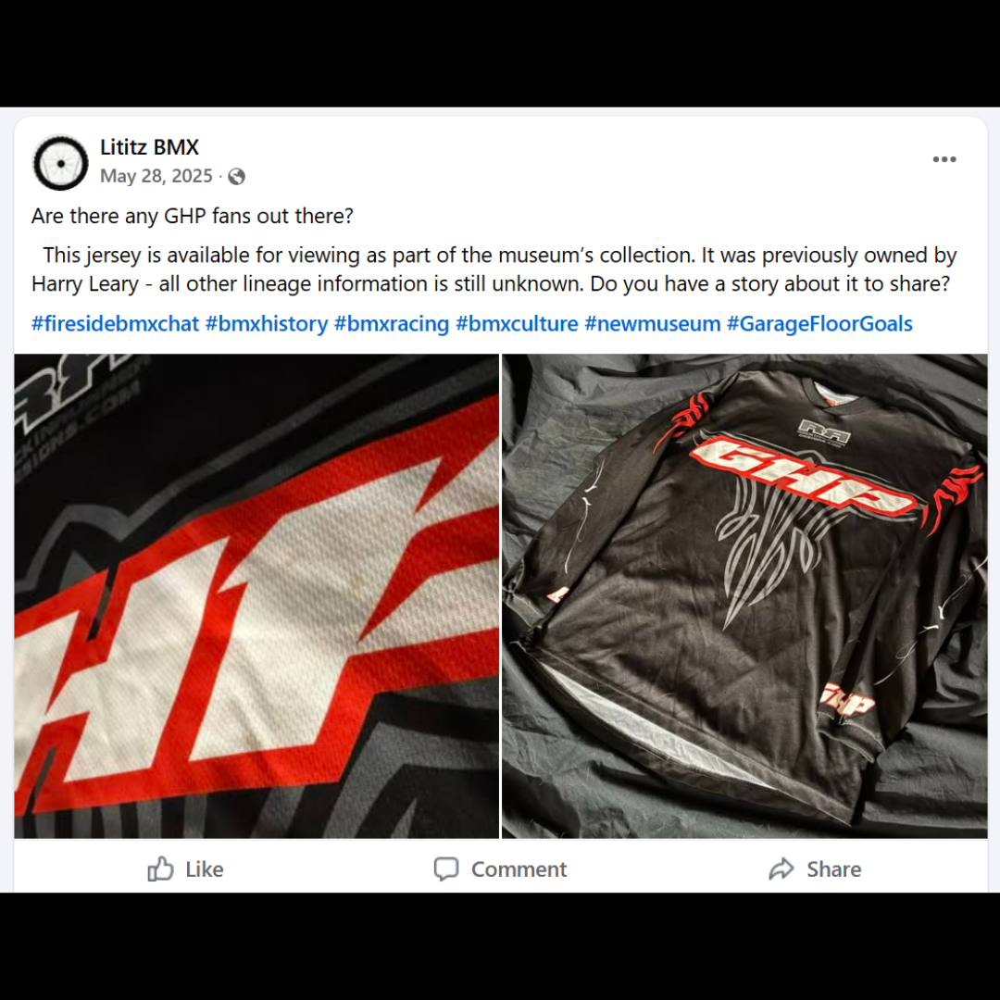

# 26.0026 — GHP Jersey

> **CURRENT HOLDING — ACCESSIONED JERSEY**  
> This record is presented as part of the current Lititz BMX Jersey Collection.

## Museum label

**GHP Jersey**  
*From the Leary Locker*

## Artifact record

| Field | Record |
|---|---|
| Record type | Accessioned jersey |
| Record ID | 26.0026 |
| Current wall status | Current Lititz BMX holding |
| Provenance | From the Leary Locker |
| Associated people | Harry Leary, Greg Hill |
| Teams, brands & organizations | GHP |

## Why this jersey matters

This GHP team jersey represents the BMX racing brand Greg Hill Products, founded by BMX champion Greg Hill. GHP became known for producing high-performance BMX racing frames and equipment, continuing Hill’s influence on the sport following his dominant racing career in the 1980s.

## Additional context

Greg Hill Products (GHP) was founded by BMX champion Greg Hill, one of the most dominant racers of the 1980s. Hill won numerous national championships and international titles, including the IBMXF World Championship in 1985, helping establish GHP as a respected name in BMX racing equipment and rider-driven design.

## Evidence and source limits

- The public display title and provenance label follow the live Lititz BMX Jersey Collection and the curator-supplied record list.
- The wall-card image is a later archival access crop derived from the preserved Google Sites collection capture; the complete source page remains unchanged in `source/google-sites/`.
- Social-media captures document publication context and community research where available; they are not treated as independent certification of every statement visible within comments.

<strong>Preserved source-post evidence</strong>

## Live collection

[Open the Lititz BMX Jersey Collection on the public archive](https://sites.google.com/view/lititzbmxinventorylist/collections/jersey-collection)

---

[← 26.0025](../26-0025-leary-fasthouse-4-jersey/) · [Digital Jersey Wall](../../README.md) · [26.0027 →](../26-0027-john-stancliff-jersey/)
