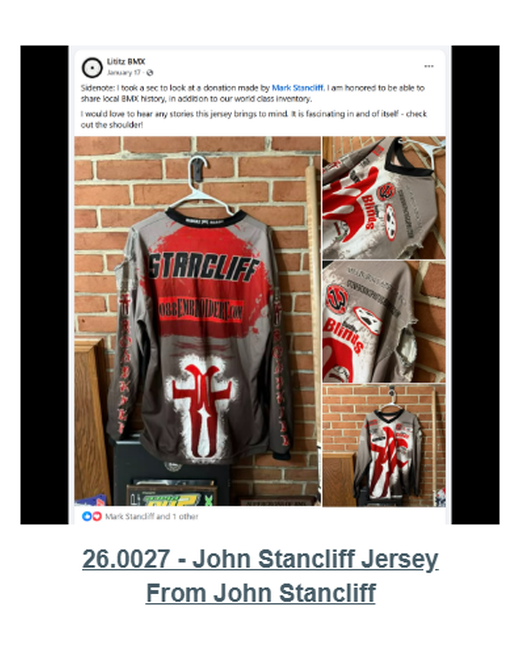

# 26.0027 — John Stancliff Jersey

> **CURRENT HOLDING — ACCESSIONED JERSEY**  
> This record is presented as part of the current Lititz BMX Jersey Collection.

## Museum label

**John Stancliff Jersey**  
*From John Stancliff*

## Artifact record

| Field | Record |
|---|---|
| Record type | Accessioned jersey |
| Record ID | 26.0027 |
| Current wall status | Current Lititz BMX holding |
| Provenance | From John Stancliff |
| Associated people | John Stancliff |
| Teams, brands & organizations | Grassroots BMX |

## Why this jersey matters

This BMX racing jersey belonged to local rider John Stancliff, representing the grassroots level of BMX competition that has always been the foundation of the sport. While professional racers often receive the most recognition, local riders like Stancliff played an important role in sustaining BMX racing communities through weekly track events and regional competitions. Artifacts such as this jersey help document the everyday racers who formed the backbone of BMX culture at local tracks.

## Additional context

Local Rider Jersey (John Stancliff): The original Lititz BMX track operated in Lititz, Pennsylvania during the early years of organized BMX racing in the region and helped introduce many local riders to the sport. Tracks like this were typically community-built facilities that formed the foundation of grassroots BMX racing before the sport became more widely organized under national sanctioning bodies.

## Evidence and source limits

- The public display title and provenance label follow the live Lititz BMX Jersey Collection and the curator-supplied record list.
- The wall-card image is a later archival access crop derived from the preserved Google Sites collection capture; the complete source page remains unchanged in `source/google-sites/`.
- Social-media captures document publication context and community research where available; they are not treated as independent certification of every statement visible within comments.

## Live collection

[Open the Lititz BMX Jersey Collection on the public archive](https://sites.google.com/view/lititzbmxinventorylist/collections/jersey-collection)

---

[← 26.0026](../26-0026-ghp-jersey/) · [Digital Jersey Wall](../../README.md) · [26.0035 →](../26-0035-jag-jersey/)
