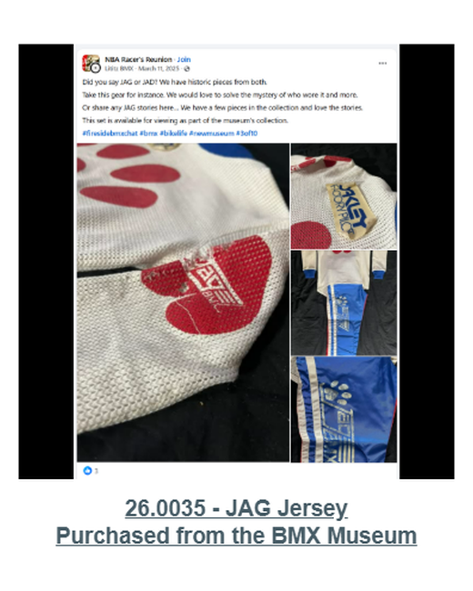

# 26.0035 — JAG Jersey

> **CURRENT HOLDING — ACCESSIONED JERSEY**  
> This record is presented as part of the current Lititz BMX Jersey Collection.

## Museum label

**JAG Jersey**  
*Purchased from the BMX Museum*

## Artifact record

| Field | Record |
|---|---|
| Record type | Accessioned jersey |
| Record ID | 26.0035 |
| Current wall status | Current Lititz BMX holding |
| Provenance | Purchased from the BMX Museum |
| Teams, brands & organizations | JAG BMX, BMX Museum |

## Why this jersey matters

The live Jersey Collection identifies this accession as a JAG jersey purchased from the BMX Museum. The current inventory CSV assigns 26.0035 to a JAG kit with an Oakley Factory Pilot decal. This public wall record follows the current Jersey Collection display while preserving the metadata conflict for resolution.

## Additional context

[Review the preserved 26.0035 metadata discrepancy.](../../docs/KNOWN-DISCREPANCIES.md)

## Evidence and source limits

- The public display title and provenance label follow the live Lititz BMX Jersey Collection and the curator-supplied record list.
- The wall-card image is a later archival access crop derived from the preserved Google Sites collection capture; the complete source page remains unchanged in `source/google-sites/`.
- Social-media captures document publication context and community research where available; they are not treated as independent certification of every statement visible within comments.
- Inventory metadata conflict: public Jersey Collection and current CSV describe different objects under 26.0035.

## Live collection

[Open the Lititz BMX Jersey Collection on the public archive](https://sites.google.com/view/lititzbmxinventorylist/collections/jersey-collection)

---

[← 26.0027](../26-0027-john-stancliff-jersey/) · [Digital Jersey Wall](../../README.md) · [26.0063 →](../26-0063-harry-leary-dirtwerx-jersey/)
