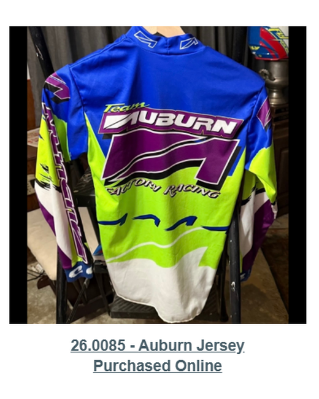

# 26.0085 — Auburn Jersey

> **CURRENT HOLDING — ACCESSIONED JERSEY**  
> This record is presented as part of the current Lititz BMX Jersey Collection.

## Museum label

**Auburn Jersey**  
*Purchased online*

## Artifact record

| Field | Record |
|---|---|
| Record type | Accessioned jersey |
| Record ID | 26.0085 |
| Current wall status | Current Lititz BMX holding |
| Provenance | Purchased online |
| Teams, brands & organizations | Auburn Bicycles |

## Why this jersey matters

This Auburn racing jersey represents the BMX brand Auburn Bicycles, known for producing high-performance BMX frames and equipment during the `908's and 1990s. Auburn played an important role in BMX racing during this period, supporting riders and contributing to the development of competitive BMX technology and team culture.

## Additional context

Racing jersey representing Auburn Bicycles, a BMX manufacturer known for producing high-performance frames and equipment during the late 1980s and 1990s. Auburn contributed to the development of competitive BMX technology and supported riders during a formative period of modern BMX racing.

## Evidence and source limits

- The public display title and provenance label follow the live Lititz BMX Jersey Collection and the curator-supplied record list.
- The wall-card image is a later archival access crop derived from the preserved Google Sites collection capture; the complete source page remains unchanged in `source/google-sites/`.
- Social-media captures document publication context and community research where available; they are not treated as independent certification of every statement visible within comments.

## Live collection

[Open the Lititz BMX Jersey Collection on the public archive](https://sites.google.com/view/lititzbmxinventorylist/collections/jersey-collection)

---

[← 26.0083](../26-0083-marzocchi-free-ride-team-jersey/) · [Digital Jersey Wall](../../README.md) · [26.0086 →](../26-0086-biolab-leary-25-jersey/)
