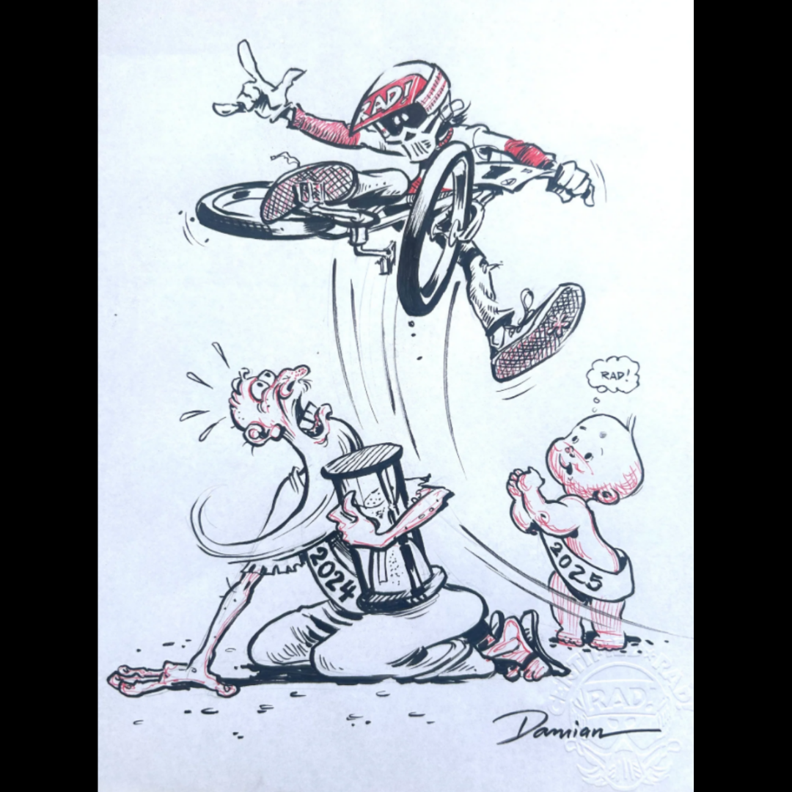

# Radical Rick 2025 New Year’s Drawing — Original 1 of 1

**Artifact ID:** `26.0042`  
**Volume:** One — *From Page to Artifact*  
**Issue:** 2 — *From Damian’s Hand*  
**Reading order:** 5  
**Record type:** original-artwork  
**Accession status:** accessioned

> **Source-page title:** Radical Rick 2025 New Years Drawing Original 1 of 1

## The story

This original Radical Rick New Year’s 2025 drawing was created by BMX artist Damian Fulton, whose Radical Rick comic strip helped define the visual culture of BMX during the 1980s. Fulton traditionally creates a special illustration each year celebrating the arrival of the new year, featuring Radical Rick launching into the future with his signature BMX energy. This hand-signed piece is drawn in Fulton’s classic style and represents the continued legacy of Radical Rick within BMX art and culture.

## Inside the panel

- Original drawing created for New Year 2025.
- Signed by Damian Fulton.
- The imagery marks the transition from 2024 to 2025.

## How it entered the collection

Source recorded as Damian Fulton in the Lititz BMX inventory.

## What remains qualified

The annual-tradition description is sourced from the inventory record.

## Record details

| Field | Record |
|---|---|
| Creator / association | Damian X. Fulton |
| Edition / date | Original 1 of 1 |
| Category | Art |
| Original collection source | [LititzBMX.com Radical Rick Collection](https://sites.google.com/view/lititzbmxinventorylist/collections/the-radical-rick-collection) |
| Machine-readable metadata | [metadata.json](metadata.json) |

## Related records

- No separate repository record has yet been linked.

---

[← Previous panel](../26-0001/) · [Volume One contents](../../volumes/volume-1/) · [Next panel →](../26-0057/)
