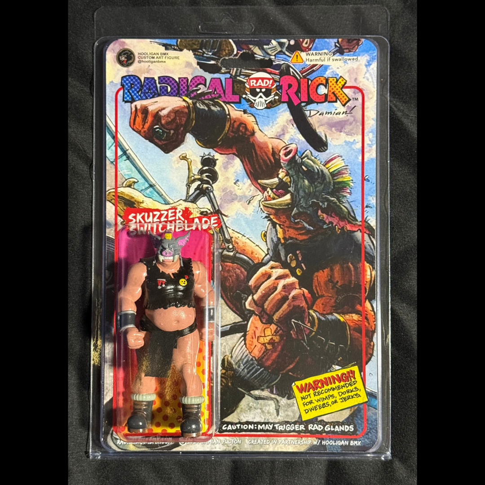

# Hooligan BMX Skuzzer Switchblade Figure

**Artifact ID:** `26.0131`  
**Volume:** One — *From Page to Artifact*  
**Issue:** 3 — *The Cast Steps Off the Page*  
**Reading order:** 10  
**Record type:** custom-figure  
**Accession status:** accessioned

> **Source-page title:** Hooligan BMX Skuzzer Switchblade

## The story

A packaged custom figure of Skuzzer Switchblade, preserving one of Radical Rick’s supporting characters as a contemporary physical collectible. The figure and illustrated card are documented together as the complete presentation.

## Inside the panel

- Figure remains photographed in custom blister-card packaging.
- Package label identifies the character as Skuzzer Switchblade.
- Visible card art and branding are retained as evidence.

## How it entered the collection

Current Lititz BMX holding; acquisition details were not supplied in the artifact entry.

## What remains qualified

No edition size, production date or material description was supplied.

## Record details

| Field | Record |
|---|---|
| Creator / association | Hooligan BMX; character art associated with Damian X. Fulton |
| Edition / date | Not supplied |
| Category | Figure |
| Original collection source | [LititzBMX.com Radical Rick Collection](https://sites.google.com/view/lititzbmxinventorylist/collections/the-radical-rick-collection) |
| Machine-readable metadata | [metadata.json](metadata.json) |

## Related records

- [Custom Hooligan BMX Radical Rick figure unboxing dossier](../../../../record-collection/collections/unboxing/records/unb-hooligan-radical-rick-figure/README.md)

---

[← Previous panel](../26-0130/) · [Volume One contents](../../volumes/volume-1/) · [Next panel →](../26-0132/)
