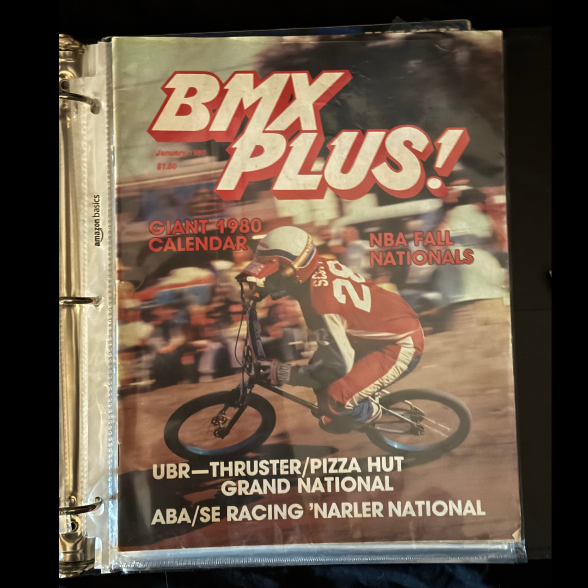

# BMX Plus! — Radical Rick Premier Issue

**Artifact ID:** `26.0133`  
**Volume:** One — *From Page to Artifact*  
**Issue:** 1 — *The Printed World*  
**Reading order:** 1  
**Record type:** publication  
**Accession status:** accessioned

> **Source-page title:** BMX Plus! Radical Rick Premier

## The story

A January 1980 issue of BMX Plus! identified in the Lititz BMX inventory as the Radical Rick premier issue. The cover date is directly visible in the supplied photograph; the premiere attribution is preserved as the collection’s published identification and remains open to bibliographic verification.

## Inside the panel

- Cover date visible as January 1980.
- Preserved in a protective binder sleeve.
- The words “Radical Rick” are not visible on the photographed cover.

## How it entered the collection

Current Lititz BMX holding; acquisition details were not supplied in the source record.

## What remains qualified

The “premier issue” designation is an attributed inventory statement, not independently verified by the cover photograph.

## Record details

| Field | Record |
|---|---|
| Creator / association | BMX Plus! |
| Edition / date | January 1980 issue (date visible on cover) |
| Category | Magazine |
| Original collection source | [LititzBMX.com Radical Rick Collection](https://sites.google.com/view/lititzbmxinventorylist/collections/the-radical-rick-collection) |
| Machine-readable metadata | [metadata.json](metadata.json) |

## Related records

- No separate repository record has yet been linked.

---

[← Previous panel](../../volumes/volume-1/) · [Volume One contents](../../volumes/volume-1/) · [Next panel →](../26-0056/)
