# The Radical Rick Collection

## Volume One — *From Page to Artifact*

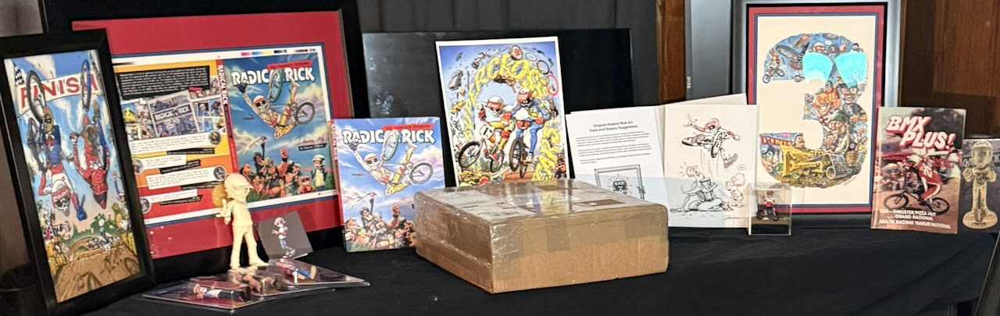

> **ARCHIVAL NOTE:** This is a digital graphic-novel exhibition built entirely from authentic collection photographs, original artwork, publication images, campaign evidence and existing archive records. No generated or replacement artwork is used.

Radical Rick began on the printed page, but the character’s story did not remain there. Original artwork, publications, figures, collaborations, restoration campaigns, racing artifacts and continuing discoveries now form a living archival record.

Volume One documents the first published selection from the Radical Rick holdings preserved by Lititz BMX. It is a complete reading experience, but it does **not** claim to be the complete physical collection. Additional artifacts may enter the master registry, expand this volume when context requires it or form a future Volume Two.

| Volume status | Record |
|---|---|
| Accessioned artifacts | **13** |
| Pending-accession records | **1** — Super Rad Artifact to Unbox |
| Connected campaign records | **1** — #RebuildRadicalRick |
| Narrative panels | **15** |
| Authentic source images preserved | **18** |
| Generated artwork | **None** |

## Table of contents

- [Issue 1 — The Printed World](#issue-1-the-printed-world)
- [Issue 2 — From Damian’s Hand](#issue-2-from-damians-hand)
- [Issue 3 — The Cast Steps Off the Page](#issue-3-the-cast-steps-off-the-page)
- [Issue 4 — Rebuilt, Not Replaced](#issue-4-rebuilt-not-replaced)
- [Issue 5 — The Story Keeps Riding](#issue-5-the-story-keeps-riding)
- [To Be Continued…](#to-be-continued)

## ISSUE 1: THE PRINTED WORLD

> **CAPTION BOX:** Radical Rick first reached riders through printed BMX culture. These records preserve the publication layer: a magazine issue identified as the character’s premiere, a production proof for the collected episodes and a limited Supercross anniversary print.

<table>
<tr><td width="33%" valign="top" align="center"> <a href="../../records/26-0133/"><strong>26.0133 — BMX Plus! — Radical Rick Premier Issue</strong></a> <small>Magazine</small></td><td width="33%" valign="top" align="center"><a href="../../records/26-0056/">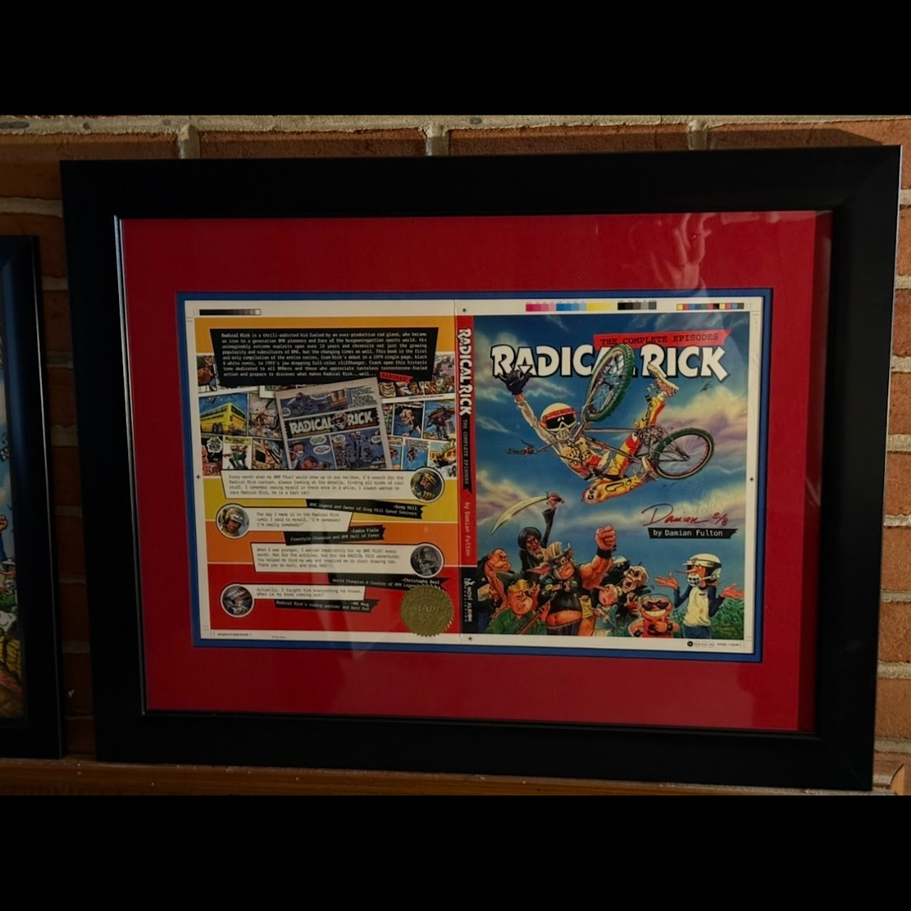</a> <a href="../../records/26-0056/"><strong>26.0056 — Radical Rick: The Complete Episodes — Soft-Cover Proof 2 of 8</strong></a> <small>Art / Publication proof</small></td><td width="33%" valign="top" align="center"><a href="../../records/26-0041/">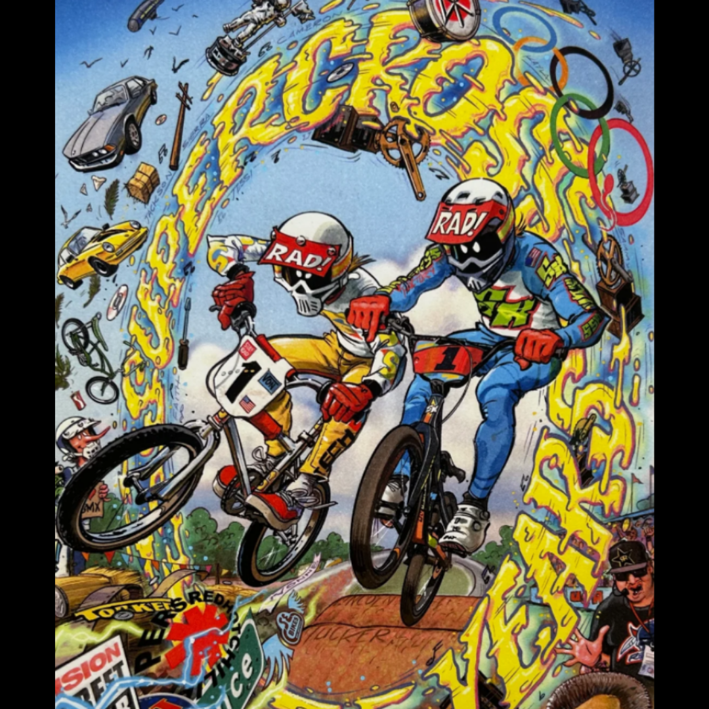</a> <a href="../../records/26-0041/"><strong>26.0041 — 35-Year Supercross Damian Fulton Signed Print — 27 of 35</strong></a> <small>Art</small></td></tr>
</table>

## ISSUE 2: FROM DAMIAN’S HAND

> **CAPTION BOX:** Original and limited-edition art keeps the creator’s hand visible. These panels follow Damian Fulton’s continued work—from Dirty Fest and New Year drawings to collaborations, charity art and signed editions.

<table>
<tr><td width="33%" valign="top" align="center"><a href="../../records/26-0001/">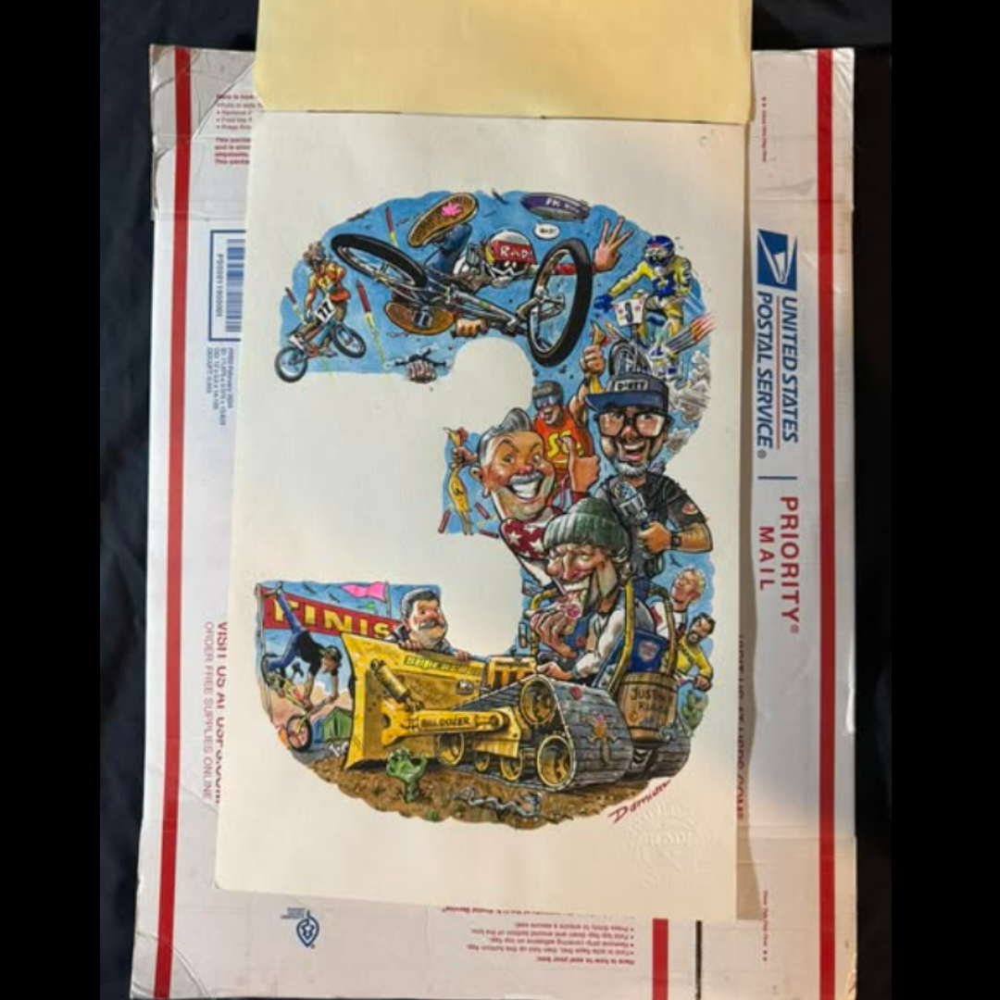</a> <a href="../../records/26-0001/"><strong>26.0001 — Dirty Fest 3 Original Watercolor Painting</strong></a> <small>Art</small></td><td width="33%" valign="top" align="center"> <a href="../../records/26-0042/"><strong>26.0042 — Radical Rick 2025 New Year’s Drawing — Original 1 of 1</strong></a> <small>Art</small></td><td width="33%" valign="top" align="center"><a href="../../records/26-0057/">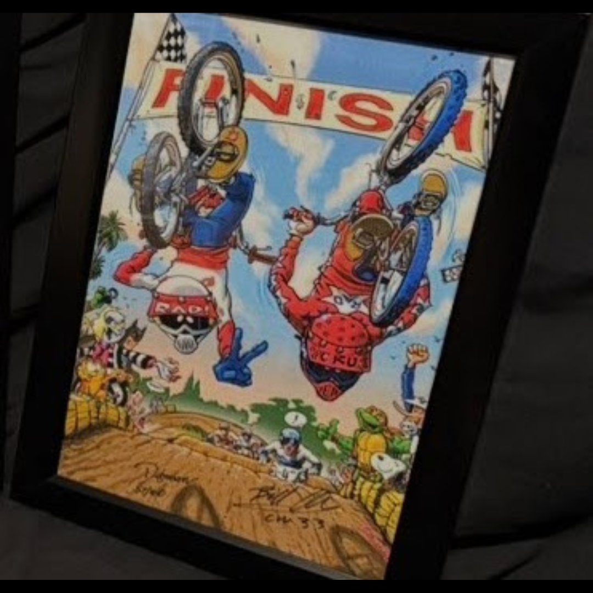</a> <a href="../../records/26-0057/"><strong>26.0057 — Radical Rick and Bill Allen Signed Print by Damian Fulton — 57 of 100</strong></a> <small>Art</small></td></tr><tr><td width="33%" valign="top" align="center"><a href="../../records/26-0072/">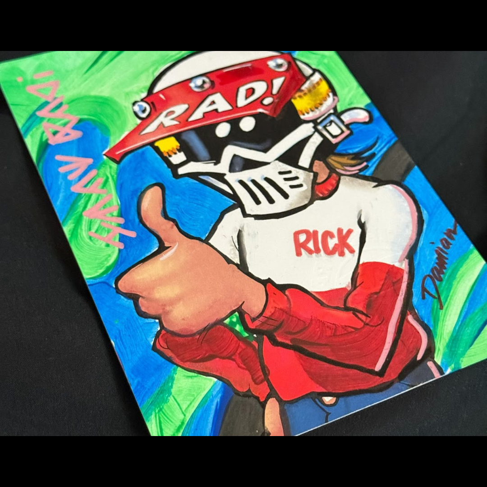</a> <a href="../../records/26-0072/"><strong>26.0072 — Radical Rick Self-Portrait for NoWear BMX — 1 of 45</strong></a> <small>Art</small></td><td width="33%"></td><td width="33%"></td></tr>
</table>

## ISSUE 3: THE CAST STEPS OFF THE PAGE

> **CAPTION BOX:** The characters step off the page through custom figures, scale scenes and a modern anniversary bobblehead. Packaging, card art and collaboration credits remain part of each object’s record.

<table>
<tr><td width="33%" valign="top" align="center"><a href="../../records/26-0129/">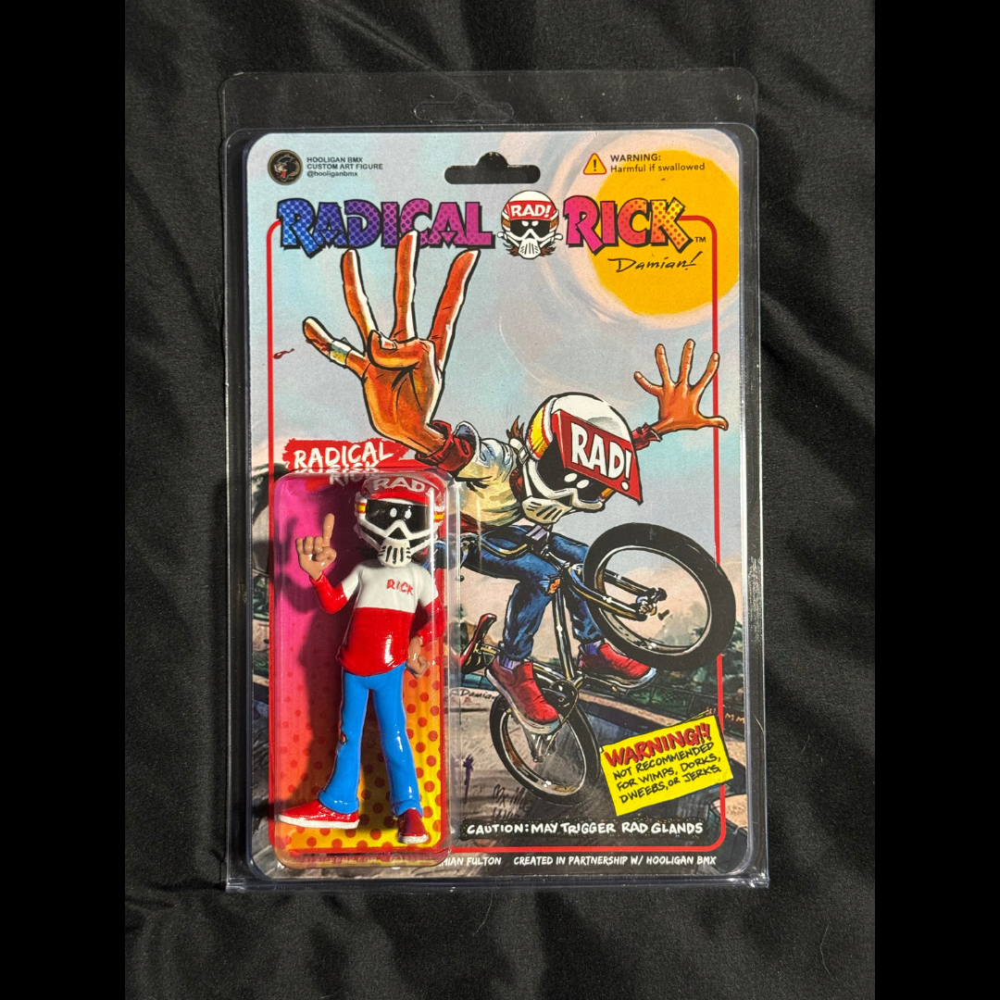</a> <a href="../../records/26-0129/"><strong>26.0129 — Hooligan BMX Radical Rick Figure</strong></a> <small>Figure</small></td><td width="33%" valign="top" align="center"><a href="../../records/26-0130/">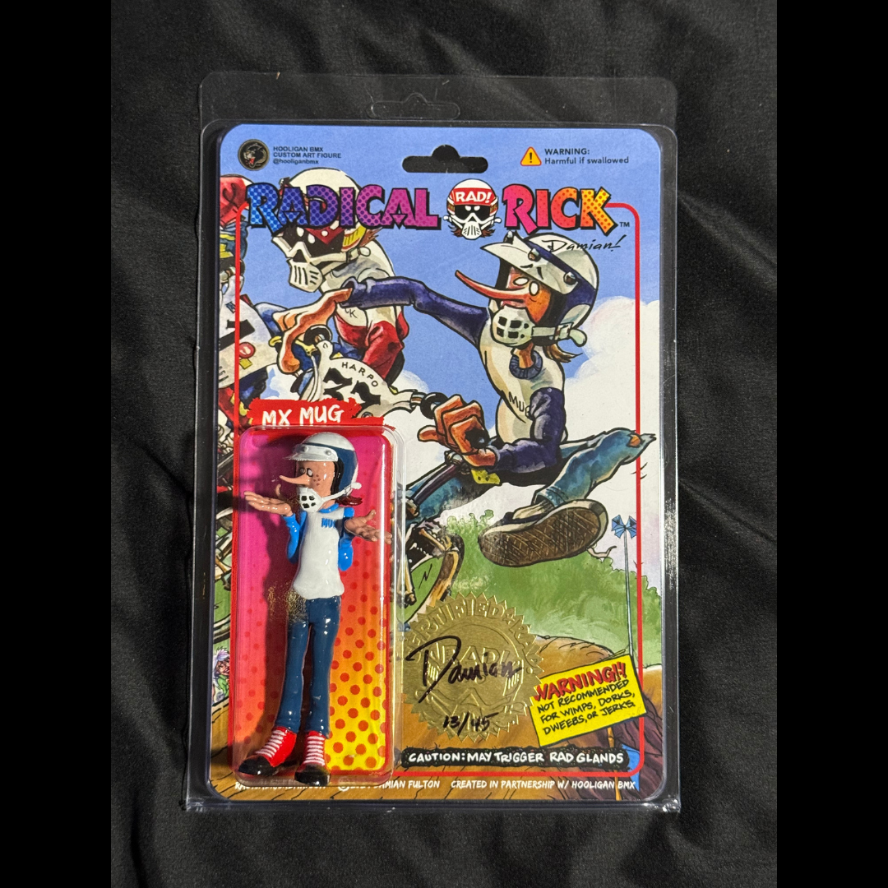</a> <a href="../../records/26-0130/"><strong>26.0130 — Hooligan BMX MX Mug Figure</strong></a> <small>Figure</small></td><td width="33%" valign="top" align="center"> <a href="../../records/26-0131/"><strong>26.0131 — Hooligan BMX Skuzzer Switchblade Figure</strong></a> <small>Figure</small></td></tr><tr><td width="33%" valign="top" align="center"><a href="../../records/26-0132/">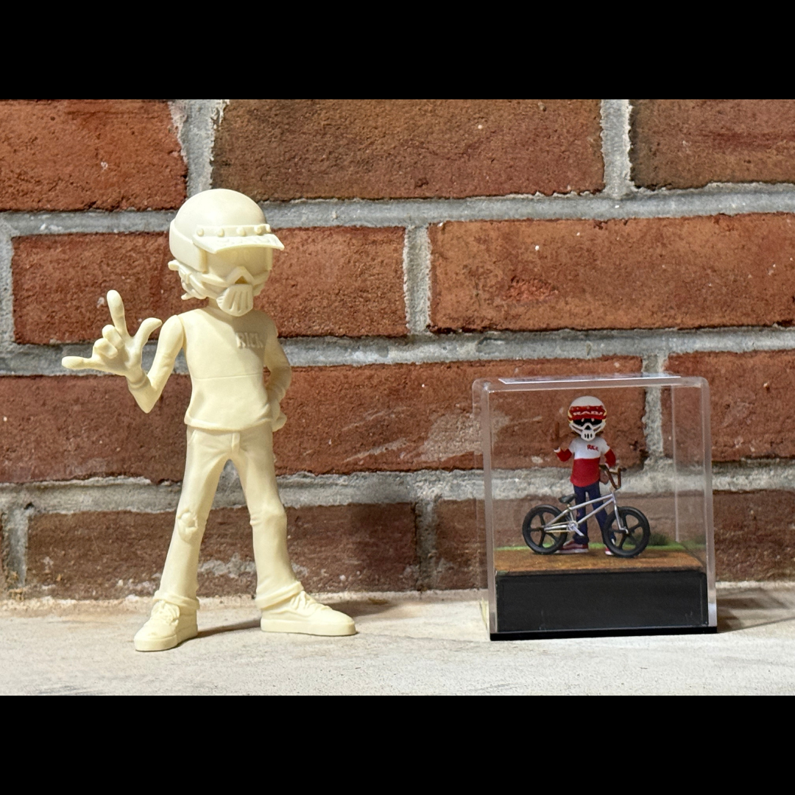</a> <a href="../../records/26-0132/"><strong>26.0132 — Hooligan BMX / Gap Hill Speed Shop 1:24 Radical Rick Figure and Scene</strong></a> <small>Figure / Scene</small></td><td width="33%" valign="top" align="center"><a href="../../records/26-0058/">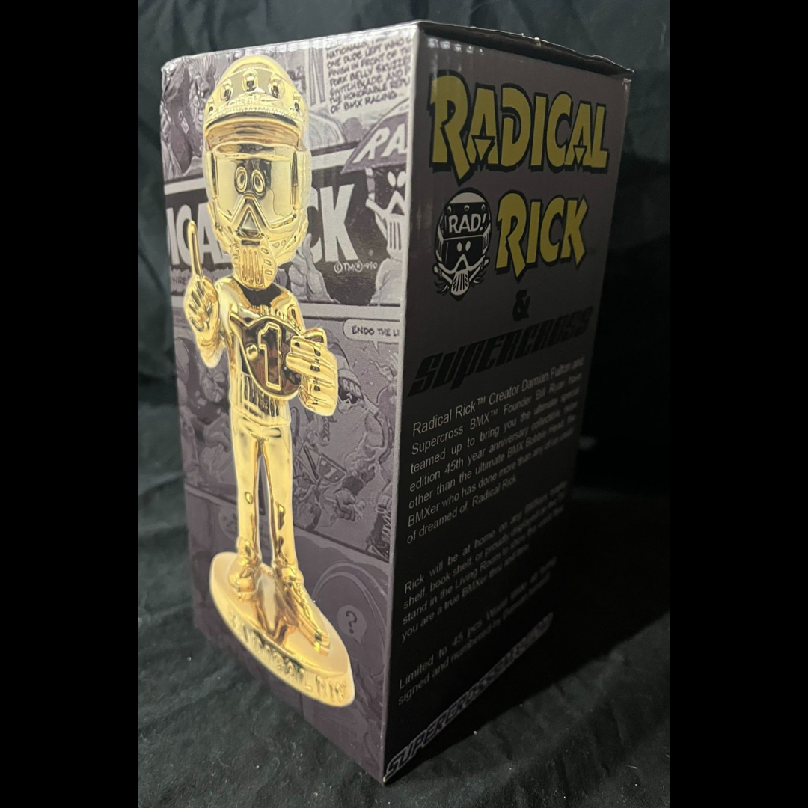</a> <a href="../../records/26-0058/"><strong>26.0058 — Gold Radical Rick Supercross Bobblehead</strong></a> <small>Bobblehead</small></td><td width="33%"></td></tr>
</table>

## ISSUE 4: REBUILT, NOT REPLACED

> **CAPTION BOX:** The collection’s serialized preservation story is already a complete campaign archive. Volume One treats it as a major issue while directing readers to the canonical 19-position episode record.

<table>
<tr><td width="33%"></td><td width="33%" valign="top" align="center"><a href="../../records/campaign/">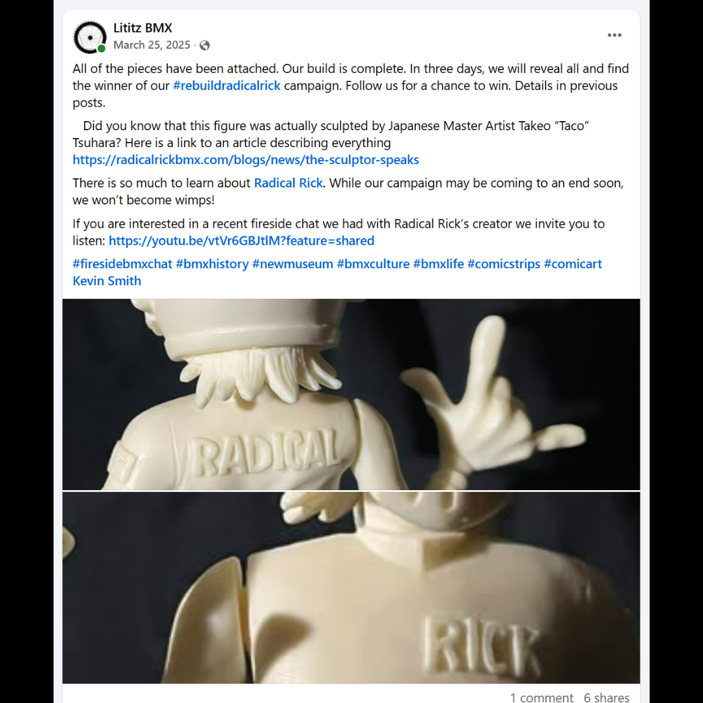</a> <a href="../../records/campaign/"><strong>#RebuildRadicalRick Campaign</strong></a> <small>Campaign archive</small></td><td width="33%"></td></tr>
</table>

[Open the complete canonical #RebuildRadicalRick campaign archive](../../../../campaigns/rebuild-radical-rick/)
## ISSUE 5: THE STORY KEEPS RIDING

> **CAPTION BOX:** Radical Rick continues through racing awards, oral history, discovery recordings and objects still waiting to be identified. The last panel is intentionally open: the archive continues without pretending the current volume is the entire physical collection.

<table>
<tr><td width="33%" valign="top" align="center"> <a href="../../records/26-0037/"><strong>26.0037 — Cactus Park BMX State Qualifier “1st” Place — Radical Rick Plaque</strong></a> <small>Awards</small></td><td width="33%" valign="top" align="center"><a href="../../records/pending/">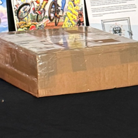</a> <a href="../../records/pending/"><strong>Super Rad Artifact to Unbox</strong></a> <small>Pending accession</small></td><td width="33%"></td></tr>
</table>

### Continuing media trail

- [Fireside BMX Chat — Damian X. Fulton](../../../../record-collection/collections/fireside-bmx-chat/records/fbc-001-damian-x-fulton/README.md)
- [Custom Hooligan BMX Radical Rick 1:24 Figure unboxing](../../../../record-collection/collections/unboxing/records/unb-hooligan-radical-rick-figure/README.md)
- [Possible Early Radical Rick Artwork with Brandon Hetrick](../../../../record-collection/collections/unboxing/records/unb-possible-early-radical-rick-art/README.md)
- [Radical Rick Sticker-Pack Mystery Envelope](../../../../record-collection/collections/unboxing/records/unb-radical-rick-sticker-pack/README.md)

## TO BE CONTINUED…

The final package in Volume One remains unnumbered and unidentified. More Radical Rick material also remains outside the current inventory. The archive preserves that reality openly: a finished volume does not require the larger story to be over.

Future handling follows three rules:

1. Corrections, stronger photographs and provenance discoveries can improve an existing record without rewriting the volume’s history.
2. Newly accessioned artifacts enter the collection-wide registry as soon as they are documented.
3. A substantial later body of material can become **Volume Two** while Volume One remains preserved as the first published edition.

---

[Return to The Radical Rick Collection series page](../../README.md)
