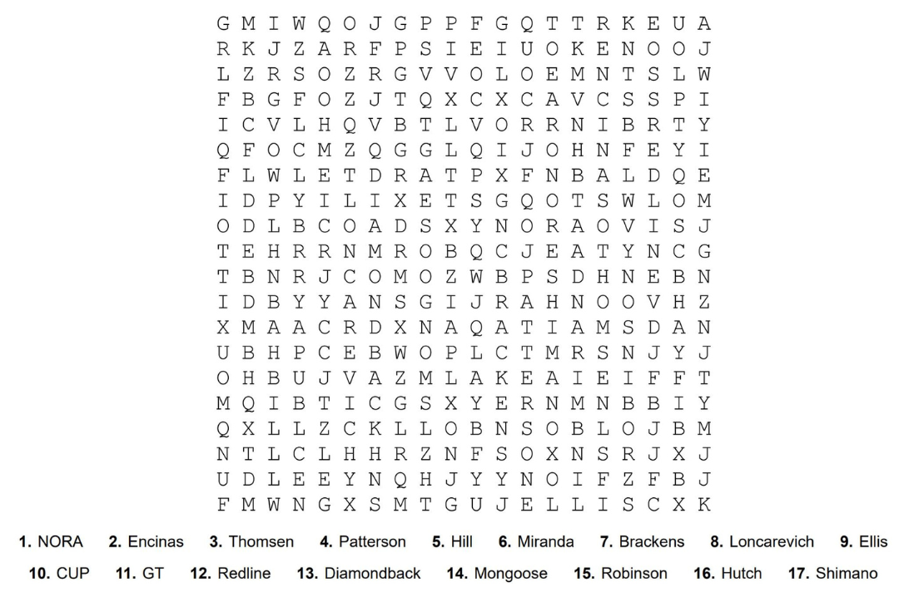

# Lititz BMX Learning Resources

This directory contains interactive educational materials produced by Lititz BMX to connect puzzles, profiles, images, artifacts, and historical subjects with the broader archive.

---

## Current Learning Resources

### [Interactive BMX Word Search](word-search/)

A 20 × 20 BMX-history word search with 17 published terms. Each term now opens a complete visual archive record containing the preserved learning-page text, source image, full public-page capture, puzzle verification, and documentation links.

**Status:** Active learning resource / archived package v1.0 / visual display v1.1

[Open the Interactive BMX Word Search archive](word-search/)

---

### [BMX History Quiz Series](quizzes/)

An eleven-part BMX history quiz series covering the Early Days through 1986. Each entry preserves the published quiz, its supporting BMX Action source article, transcriptions, question-level documentation, known discrepancies, and source images.

**Status:** Complete archived sequence through 1986 / archived package v1.0

[Open the BMX History Quiz Series archive](quizzes/)
