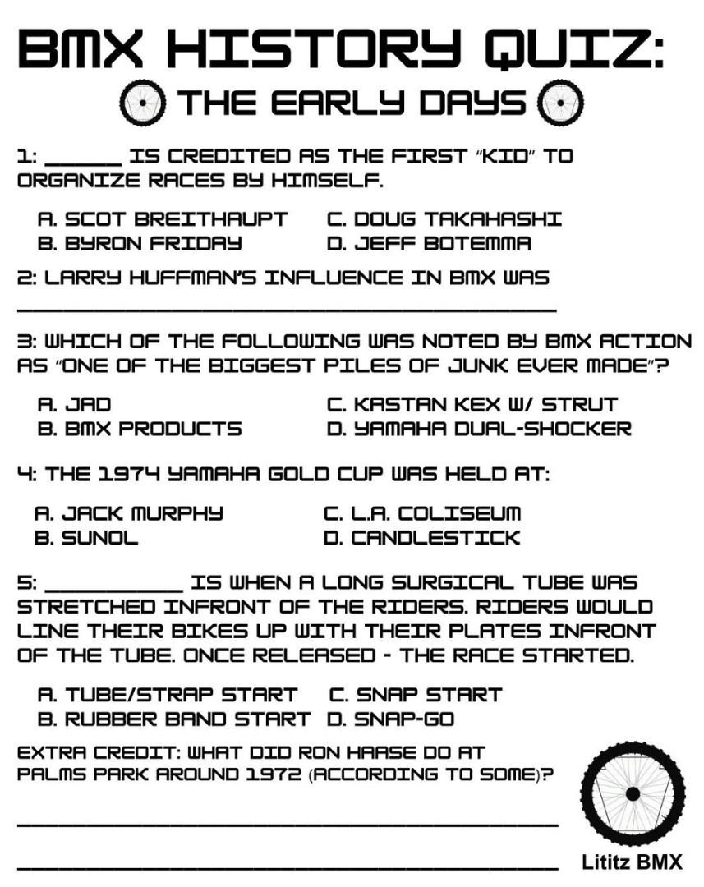
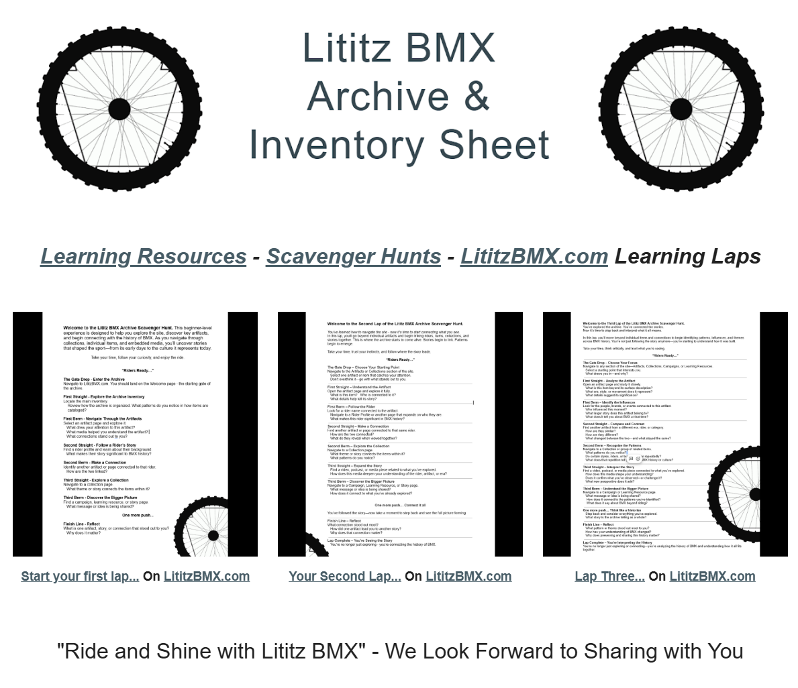

# Lititz BMX Learning Resources

This directory contains interactive educational materials produced by Lititz BMX to connect puzzles, profiles, images, artifacts, and historical subjects with the broader archive.

---

## Current Learning Resources

### [Interactive BMX Word Search](word-search/)

A 20 × 20 BMX-history word search with 17 published terms. Each term now opens a complete visual archive record containing the preserved learning-page text, source image, full public-page capture, puzzle verification, and documentation links.

**Status:** Active learning resource / archived package v1.0 / visual display v1.1

[Open the Interactive BMX Word Search archive](word-search/)

---

### [BMX History Quiz Series](quizzes/)

A chronological learning series pairing eleven published BMX history quizzes—from **The Early Days** through **1986**—with their supporting historical article sources, exact transcriptions, verified answer ledgers, documented discrepancies, source images, page captures, and fixity records.

**Status:** Complete archived sequence through 1986 / archived package v1.1

[Open the BMX History Quiz Series archive](quizzes/)
---

### [Scavenger Hunts and LititzBMX.com Learning Laps](scavenger-hunts/)

A three-stage site-learning series that guides visitors from introductory archive exploration, through connecting riders and artifacts, to interpreting patterns, influences, and themes across BMX history. The archive preserves the original PDFs, worksheet images, accessible text, live-page captures, source notes, and fixity records.

**Status:** Active learning resource / archived package v1.0

[Open the Scavenger Hunts archive](scavenger-hunts/)
