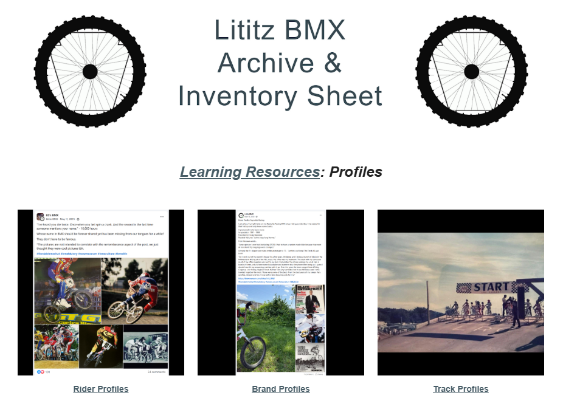
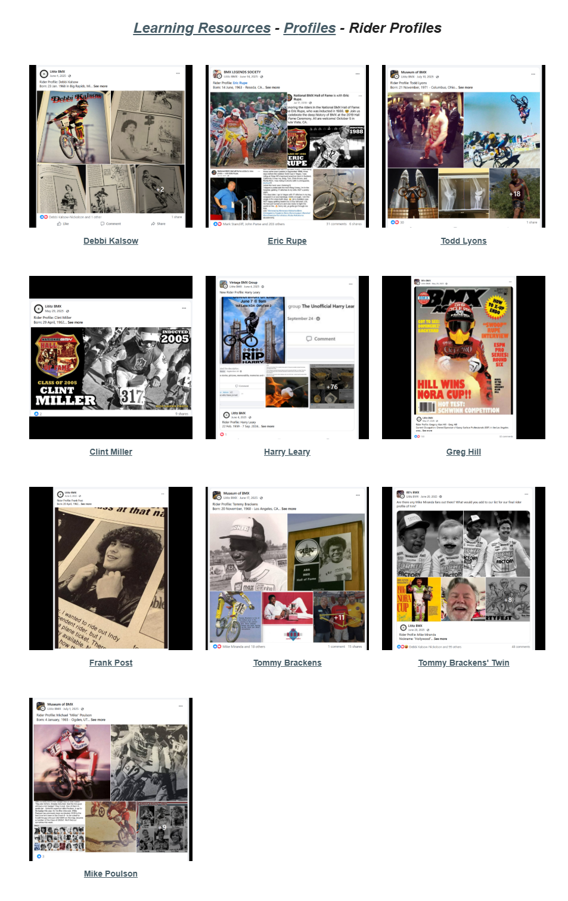
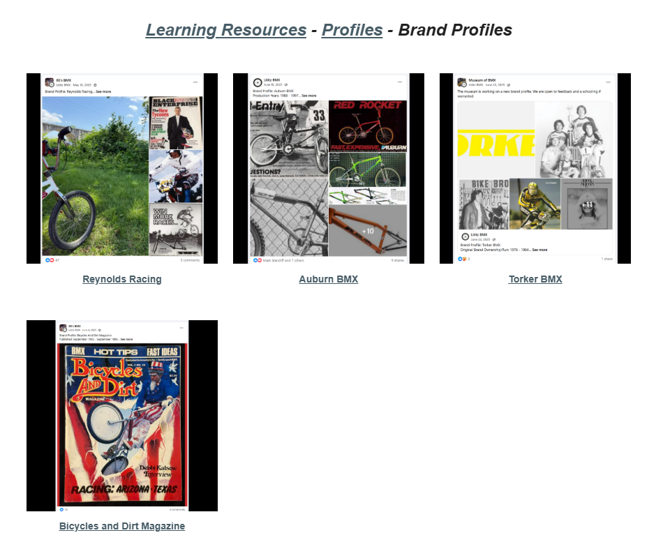

# Lititz BMX Profiles

## People, Makers and Places — A Visual Learning Atlas

Lititz BMX Profiles preserves public learning records about BMX riders, brands/publications and tracks. The archive keeps the source image and text together, distinguishes catalog identity from contextual relationships and leaves unknown material visibly unknown.

<table>
<tr>
<td align="center" width="33%"><a href="riders/"> <strong>Rider Profiles</strong></a> 10 independent profiles with exact transcriptions, source images and qualification notes.</td>
<td align="center" width="33%"><a href="brands/"> <strong>Brand Profiles</strong></a> 4 independent brand/publication records preserving source wording and uncertainty.</td>
<td align="center" width="33%"><a href="tracks/"> <strong>Track Profiles</strong></a> A complete ten-page visual atlas preserving 150 published track entries and 20 source captures.</td>
</tr>
</table>

## Archive status

| Record class | Defined records | Source-complete | Pending source capture |
|---|---:|---:|---:|
| Rider profiles | 10 | 10 | 0 |
| Brand/publication profiles | 4 | 4 | 0 |
| Track source pages | 10 | 10 | 0 |
| Track visual entries | 150 | 150 | 0 |
| Supplied source images preserved | 37 | 37 | 0 |

## How to read the archive

- **Catalog identity** answers what the record itself is.
- **Visual/content appearance** documents that a subject appears inside another source.
- **Contextual link** helps a reader continue through the archive without claiming shared provenance or ownership.

A Bicycles & Dirt Magazine profile and a Debbi Kalsow rider profile therefore remain independent records even though the supplied magazine cover features Kalsow. The connection is documented; the catalogs are not collapsed.

The Track Profiles wing is an existence-and-image archive. Its 150 entries preserve the published track labels, locations, order and accompanying imagery; they do not independently establish track dates, ownership, operators, sanctioning histories, rider participation or event histories.

## Research and preservation files

- [Rider register](data/rider-register.json)
- [Brand register](data/brand-register.json)
- [Track page register](data/track-page-register.json)
- [Track entry register](data/track-entry-register.json)
- [Image manifest](data/image-manifest.csv)
- [Relationship policy](docs/RELATIONSHIP-POLICY.md)
- [Source qualification rules](docs/SOURCE-QUALIFICATION.md)
- [Known gaps and source limitations](docs/KNOWN-GAPS.md)

## Original public source

[Open the LititzBMX.com Profiles landing page](https://sites.google.com/view/lititzbmxinventorylist/learning-resources/profiles)

---

[← Back to Learning Resources](../)
