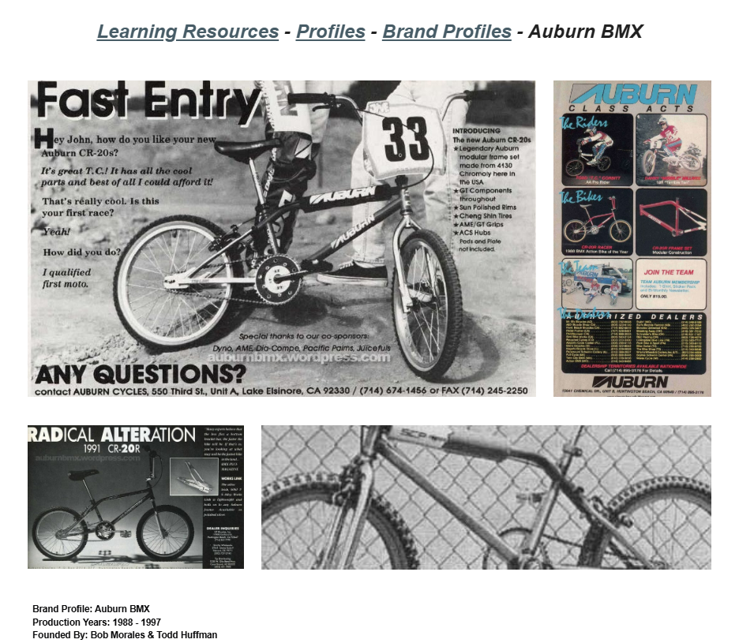

# Auburn BMX

**Lititz BMX Brand Profile**

Published brand profile documenting Auburn’s origin, modular-frame development, ownership history, production eras, rider list and Lititz BMX holdings.

## Profile at a glance

| Field | Published record |
|---|---|
| Production years | 1988–1997 |
| Founded by | Bob Morales & Todd Huffman |
| Original concept | Developed as a Honda proposal before adoption of the Auburn name |

## Archival treatment

This independent publication/brand record preserves the supplied source image, exact text, uncertainty language and attribution. It is not merged with a rider, artifact or collection merely because a person or object appears in its imagery.

- Uncertain measurements, model-year interpretations and relaunch controversy are preserved as source-qualified observations rather than resolved facts.
- The Lititz BMX holdings paragraph is a collection-status statement and remains separate from the brand-history record.

## Preserved source

- [Read the exact supplied transcription](source/PUBLISHED-TEXT.md)
- [Open the original LititzBMX.com profile](https://sites.google.com/view/lititzbmxinventorylist/learning-resources/profiles/brand-profiles/auburn-bmx-brand-profiles)
- Stable local source image: `source/page.png`

---

[← Reynolds Racing](../reynolds-racing/) · [Brand Profiles](../) · [Torker BMX →](../torker-bmx/)
