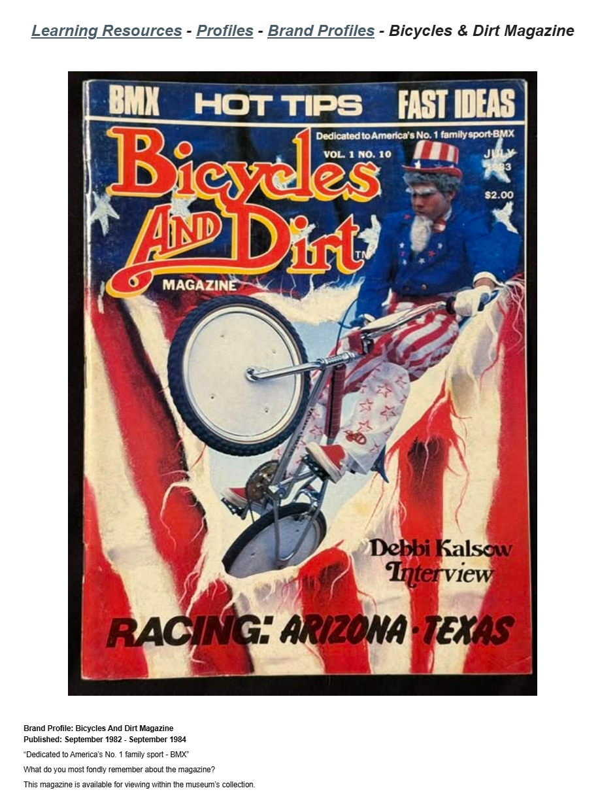

# Bicycles & Dirt Magazine

**Lititz BMX Brand Profile**

Independent publication profile preserving the magazine’s published run, tagline and museum-access note.

## Profile at a glance

| Field | Published record |
|---|---|
| Published | September 1982 – September 1984 |
| Tagline | “Dedicated to America’s No. 1 family sport - BMX” |
| Archive access | Magazine available for viewing within the museum’s collection |

## Archival treatment

This independent publication/brand record preserves the supplied source image, exact text, uncertainty language and attribution. It is not merged with a rider, artifact or collection merely because a person or object appears in its imagery.

- This is an independent publication/brand record. It is not merged with Debbi Kalsow’s rider profile.
- The supplied cover creates a visual/content-appearance link because Debbi Kalsow appears on the cover; that relationship does not establish shared catalog identity, provenance or ownership.

## Preserved source

- [Read the exact supplied transcription](source/PUBLISHED-TEXT.md)
- [Open the original LititzBMX.com profile](https://sites.google.com/view/lititzbmxinventorylist/learning-resources/profiles/brand-profiles/bicycles-and-dirt-magazine-brand-profiles)
- Stable local source image: `source/page.png`

---

[← Torker BMX](../torker-bmx/) · [Brand Profiles](../)
