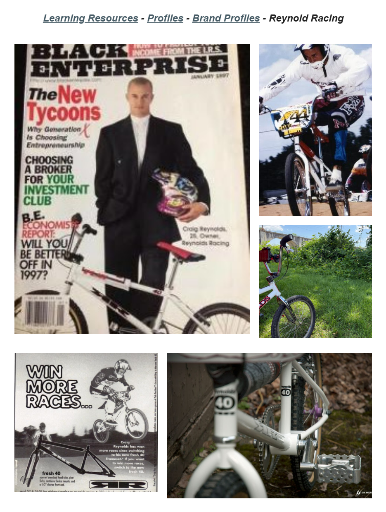

# Reynolds Racing

**Lititz BMX Brand Profile**

Published brand profile preserving Craig Reynolds’ account of the Fresh 40, custom long-frame geometry and the home-based early years of Reynolds Racing.

## Profile at a glance

| Field | Published record |
|---|---|
| In operation | 1991–1999 |
| Founded by | Craig Reynolds |
| Notable feature | “some crazy long frames” |

## Archival treatment

This independent publication/brand record preserves the supplied source image, exact text, uncertainty language and attribution. It is not merged with a rider, artifact or collection merely because a person or object appears in its imagery.

- The live Google Sites slug uses “reynold-racing”; the published title and record name use “Reynolds Racing.”
- Craig Reynolds’ first-person account is preserved as attributed source testimony.

## Preserved source

- [Read the exact supplied transcription](source/PUBLISHED-TEXT.md)
- [Open the original LititzBMX.com profile](https://sites.google.com/view/lititzbmxinventorylist/learning-resources/profiles/brand-profiles/reynold-racing-brand-profiles)
- Stable local source image: `source/page.png`

---

[Brand Profiles](../) · [Auburn BMX →](../auburn-bmx/)
