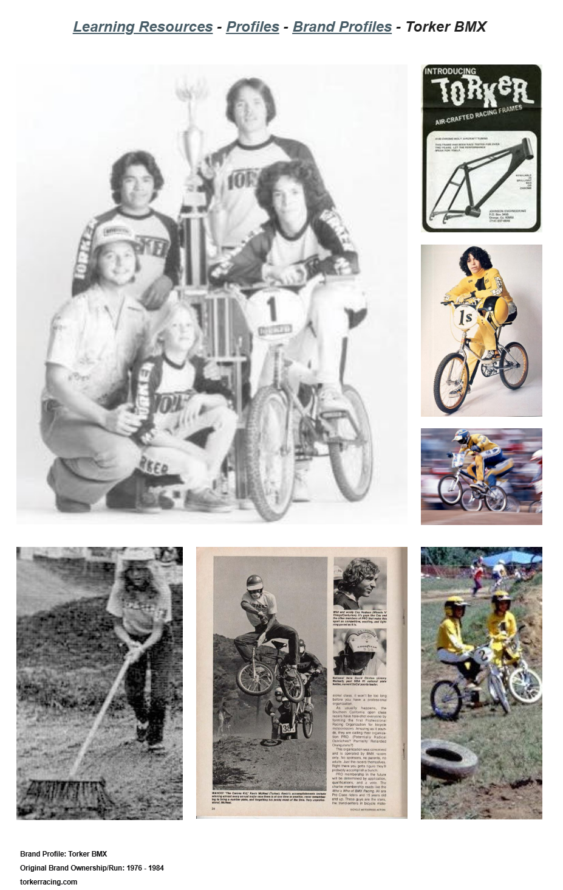

# Torker BMX

**Lititz BMX Brand Profile**

Published brand profile tracing Torker’s Johnson-family origins, early innovation, sponsored riders, bankruptcy and later name ownership.

## Profile at a glance

| Field | Published record |
|---|---|
| Original brand run | 1976–1984 |
| Origins | Texon → Johnson Engineering → Torker |
| Family roles | John, Steve, Doug and Doris Johnson |

## Archival treatment

This independent publication/brand record preserves the supplied source image, exact text, uncertainty language and attribution. It is not merged with a rider, artifact or collection merely because a person or object appears in its imagery.

- The quoted overview credited to Copilot is retained as AI-supplied source commentary, not independent verification.
- Later ownership and relaunch statements are preserved as time-bound published source content.

## Preserved source

- [Read the exact supplied transcription](source/PUBLISHED-TEXT.md)
- [Open the original LititzBMX.com profile](https://sites.google.com/view/lititzbmxinventorylist/learning-resources/profiles/brand-profiles/torker-bmx-brand-profiles)
- Stable local source image: `source/page.png`

---

[← Auburn BMX](../auburn-bmx/) · [Brand Profiles](../) · [Bicycles & Dirt Magazine →](../bicycles-and-dirt-magazine/)
